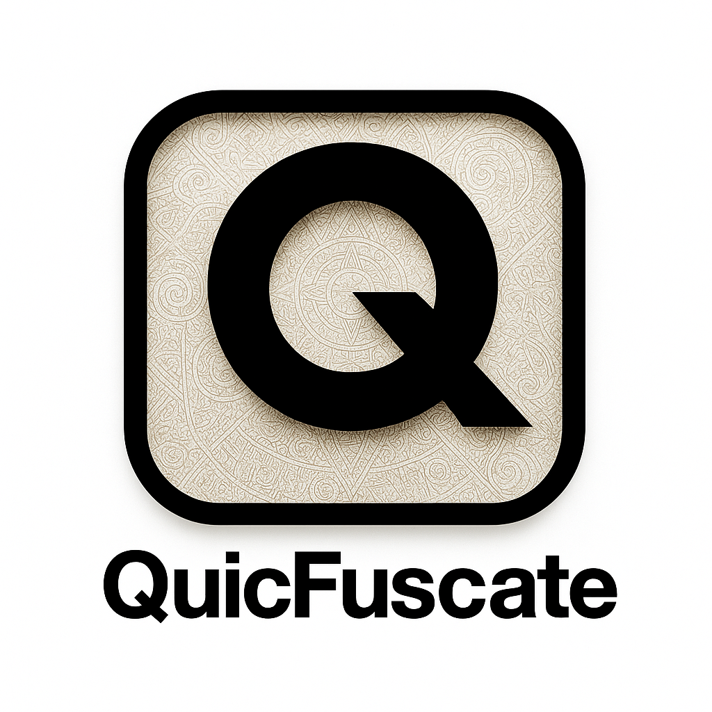

# QuicFuscate

<div align="center">
  
  
  [](https://datatracker.ietf.org/doc/html/rfc9000)
  [](https://en.wikipedia.org/wiki/HTTP/3)
  [](https://www.rust-lang.org/)
  [](https://isocpp.org/)
  [](https://en.wikipedia.org/wiki/SIMD)
  [](https://en.wikipedia.org/wiki/AEGIS)
  [](https://en.wikipedia.org/wiki/MORUS_(cipher))
  [](https://en.wikipedia.org/wiki/Forward_error_correction)
  [](https://en.wikipedia.org/wiki/Cross-platform_software)
</div>

## 🚀 Next-Generation Stealth VPN Technology

QuicFuscate represents the pinnacle of privacy-focused networking, combining cutting-edge encryption, adaptive error correction, and advanced traffic obfuscation to create an impenetrable communication channel. Built on the QUIC protocol with HTTP/3 support, it delivers both speed and security without compromise.

> **Note:** This project is currently in active development, being refactored from C++ to Rust for enhanced performance and security.

## ✨ Core Features

### 🛡️ Advanced Stealth Technology
- **uTLS Fingerprinting Protection**: Mimics browser TLS fingerprints to evade deep packet inspection
- **Fake TLS Handshake**: Implements TLS handshakes that appear legitimate to network inspection while encapsulating the real traffic
- **Domain Fronting**: Masks traffic by routing through trusted CDN providers
- **HTTP/3 Masquerading**: Disguises traffic as standard HTTP/3 web traffic
- **Traffic Obfuscation**: XOR-based packet transformation to defeat pattern recognition
- **Spin Bit Randomization**: Prevents network analysis through QUIC protocol fingerprinting

### 🔒 Military-Grade Encryption
- **AEGIS-128L/X**: Authenticated encryption with hardware acceleration
- **MORUS-1280-128**: Lightweight cipher for resource-constrained environments
- **Perfect Forward Secrecy**: Ephemeral key exchange for maximum security
- **Post-Quantum Ready**: Designed to resist quantum computing attacks

### ⚡ Performance Optimizations
- **SIMD Acceleration**: ARM NEON and x86 AVX2/AVX-512 optimizations
- **Zero-Copy Architecture**: Minimizes memory allocations for maximum throughput
- **Adaptive FEC**: TETRYS-based Forward Error Correction with dynamic redundancy
- **Connection Multiplexing**: Multiple streams over a single connection
- **0-RTT Handshake**: Reduced latency for subsequent connections

### 🔄 Adaptive Error Correction
- **TETRYS FEC Implementation**: Advanced coding scheme for lossy networks
- **Dynamic Redundancy**: Automatically adjusts to network conditions
- **Packet Recovery**: Up to 30% packet loss tolerance
- **Bandwidth-Efficient**: Minimal overhead compared to traditional FEC

## 🏗️ Project Status

This project is currently being refactored from C++ to Rust to leverage modern language features and safety guarantees. The core functionality is being preserved while improving performance and security.

### Current Implementation (C++)
- QUIC protocol stack
- Basic VPN functionality
- Core encryption modules
- Initial stealth features

### In Progress (Rust)
- Complete protocol rewrite
- Enhanced security features
- Performance optimizations
- Expanded platform support

## 🛠️ Technical Specifications

| Component           | Technology                          |
|---------------------|-------------------------------------|
| Transport Protocol  | QUIC v1 / HTTP/3                   |
| Encryption         | AEGIS-128L/X, MORUS-1280-128       |
| Key Exchange       | X25519, X448                       |
| Error Correction   | TETRYS FEC                         |
| Obfuscation       | XOR-based, Traffic Shaping, Fake TLS |
| Platforms          | Linux, macOS, Windows (planned)     |
| Architecture       | x86_64, ARM64                      |
| Performance        | Multi-Gigabit capable              |

## 🔧 Build Instructions

This repository uses a Git submodule to include a patched QUIC library.
After cloning the project, initialize the submodule with:

```bash
git submodule update --init --recursive libs/quiche-patched
```

If the command fails with a missing commit error, the upstream
`quiche` repository might not contain the pinned revision
`5700a7c74927d2c4912ac95e904c6ad3642b6868`. In that case, update the
submodule URL to a mirror that includes this commit and retry:

```bash
git submodule set-url libs/quiche-patched <mirror-url>
git submodule update --init libs/quiche-patched
```

### Building quiche

Compile the patched **quiche** library using Cargo:

```bash
cd libs/quiche-patched
cargo build --release
cd ../..
```

### Building with CMake

Generate the project and build all binaries:

```bash
mkdir build && cd build
cmake ..
cmake --build .
```

### Running the tests

After building, execute the unit tests with CTest:

```bash
cd build
ctest --output-on-failure
```

## 🖥️ Command-Line Usage

The project provides several binaries once built:

- **quicfuscate_demo** – feature-rich demo tool with many options.
- **quicfuscate_client** – minimal client accepting `<host> <port>` arguments.
- **quicfuscate_server** – placeholder server without arguments.

Run `quicfuscate_demo --help` to see all available options. Important flags include:

```
  -s, --server <host>        Server hostname (default: example.com)
  -p, --port <port>          Server port (default: 443)
  -f, --fingerprint <name>   Browser fingerprint (chrome, firefox, safari, ...)
      --no-utls              Disable uTLS and use regular TLS
      --verify-peer          Enable certificate validation
      --ca-file <path>       CA file for peer verification
  -v, --verbose              Verbose logging
      --debug-tls            Show TLS debug information
      --list-fingerprints    List available browser fingerprints
```

## 🔄 Continuous Integration

The repository includes a GitHub Actions workflow that builds the project and
runs the tests on every push or pull request. You can find the workflow in
`.github/workflows/ci.yml`. To reproduce the CI steps locally run:

```bash
git submodule update --init --recursive
cd libs/quiche-patched && cargo build --release && cd ../..
mkdir -p build && cd build
cmake .. && cmake --build .
ctest --output-on-failure
```

## 📜 License

This software is provided under a custom license that allows:
- Private, non-commercial use
- Modification and personal use
- Educational purposes

Commercial use, distribution, or incorporation into commercial products is strictly prohibited without explicit permission.

## ⚠️ Important Notice

This software is provided "as is" without any warranties. The developers assume no responsibility for any damage caused by the use of this software. Use at your own risk.

---

*QuicFuscate - The last line of defense for your digital privacy.*
