# QuicFuscate Technical Documentation


## Introduction
QuicFuscate is a high-performance VPN solution leveraging QUIC protocol with advanced obfuscation techniques. This document provides comprehensive technical documentation of the system architecture, modules, and implementation details.

## Architecture Overview
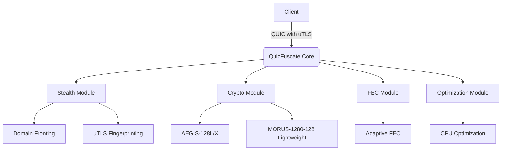

### Project Structure
```
QuicFuscate/
├── cli/
│   ├── main.cpp
│   ├── options.hpp
│   ├── quicfuscate_cli.cpp
│   ├── quicfuscate_client.cpp
│   └── quicfuscate_server.cpp
├── core/
│   ├── error_handling.hpp
│   ├── quic_connection.hpp
│   ├── quic_connection_impl.cpp
│   ├── quic_core_types.hpp
│   ├── quic_integration_impl.cpp
│   ├── quic_packet.cpp
│   ├── quic_path_mtu_manager.hpp
│   └── quic_stream_impl.cpp
├── crypto/
│   ├── aegis128l.cpp
│   ├── aegis128l.hpp
│   ├── aegis128x.cpp
│   ├── aegis128x.hpp
│   ├── morus1280.cpp
│   ├── morus1280.hpp
│   ├── cipher_suite_selector.cpp
│   └── cipher_suite_selector.hpp
├── docs/
│   └── DOCUMENTATION.md
├── fec/
│   ├── FEC_Modul.cpp
│   └── FEC_Modul.hpp
├── libs/
│   └── quiche-patched/ (Patched QUIC implementation)
├── optimize/
│   ├── quic_stream_optimizer.cpp
│   └── unified_optimizations.hpp
├── stealth/
│   ├── DoH.cpp
│   ├── DoH.hpp
│   ├── DomainFronting.cpp
│   ├── DomainFronting.hpp
│   ├── FakeTLS.cpp
│   ├── FakeTLS.hpp
│   ├── HTTP3_Masquerading.cpp
│   ├── HTTP3_Masquerading.hpp
│   ├── QuicFuscate_Stealth.cpp
│   ├── QuicFuscate_Stealth.hpp
│   ├── XOR_Obfuscation.cpp
│   ├── XOR_Obfuscation.hpp
│   ├── anti_fingerprinting.hpp
│   ├── browser_profiles/
│   ├── stealth_gov.cpp
│   ├── stealth_gov.hpp
│   ├── uTLS.cpp
│   └── uTLS.hpp
└── ui/
    └── logo/
        ├── QuicFuscate_a.png
        └── QuicFuscate_b.png
```

### Key Features
1. **Advanced QUIC Implementation**: Enhanced QUIC transport protocol with BBRv2 congestion control and XDP zero-copy optimization
2. **Comprehensive Stealth Capabilities**: 
   - DNS-over-HTTPS with browser profile emulation
   - Domain fronting and HTTP/3 masquerading
   - uTLS integration for TLS fingerprint spoofing
   - Anti-fingerprinting countermeasures
   - XOR-based traffic obfuscation
3. **High-Performance Cryptography**: 
   - AEGIS-128L/128X authenticated encryption with hardware acceleration
   - MORUS-1280-128 lightweight cryptography
   - Automatic cipher suite selection based on hardware capabilities
4. **Optimization Framework**: 
   - CPU feature detection (x86/x64 and ARM)
   - SIMD dispatching and operations
   - Memory pool configuration
   - Stream optimization
5. **Forward Error Correction**: SIMD-optimized FEC with adaptive redundancy and zero-copy operations
6. **Browser Emulation**: Comprehensive browser fingerprint profiles and TLS configurations
7. **Cross-Platform Support**: Support for multiple operating systems and architectures

## Module Documentation

### Core Module (`core/`)
Handles QUIC connection management with advanced features:
- **Connection Migration**: Seamless switching between network interfaces
- **BBRv2 Congestion Control**: Optimized for high throughput and low latency
- **XDP Zero-Copy**: Kernel bypass for maximum network performance
- **MTU Discovery**: Automatic packet size optimization
#### Cipher Suite Selector
Defined in `cipher_suite_selector.cpp`:

```cpp
class CipherSuiteSelector {
  // Automatic selection of the best cipher suite
  CipherSuite select_best_cipher_suite() const {
    if (has_vaes_support()) return CipherSuite::AEGIS_128X;
    else if (has_aes_support()) return CipherSuite::AEGIS_128L;
    else return CipherSuite::MORUS_1280_128;
  }
  
  // Hardware detection
  bool has_vaes_support() const; // VAES-512 (AVX-512F + AVX-512BW)
  bool has_aes_support() const;  // AES-NI or ARM Crypto Extensions
};
```

**Selection Strategy:**
1. **AEGIS-128X**: With VAES-512 support (modern x86 CPUs)
2. **AEGIS-128L**: With AES-NI (x86) or ARM Crypto Extensions
3. **MORUS-1280-128**: Software fallback without hardware acceleration

**Usage:**
```cpp
CipherSuiteSelector selector;

// Automatic selection
selector.encrypt(plaintext, len, key, nonce, ad, ad_len, ciphertext, tag);

// Manual selection
selector.set_cipher_suite(CipherSuite::MORUS_1280_128);
```
#### Forward Error Correction (FEC) Module
Defined in `FEC_Modul.cpp`:

```cpp
class FECModule {
  // Core components:
  GaloisField gf; // Galois field operations
  MemoryPool memory_pool; // Memory pool for zero-copy operations
  
  // Encoding functions:
  std::vector<FECPacket> encode_packet(const std::vector<uint8_t>& data);
  std::vector<uint8_t> decode(const std::vector<FECPacket>& packets);
  
  // Adaptive redundancy control:
  void update_network_metrics(const NetworkMetrics& metrics);
  double calculate_current_redundancy() const;
};
```

**Key Features:**
1. **SIMD-optimized Galois field arithmetic**:
   - Support for NEON (ARM) and AVX2/AVX512 (x86)
   - Automatic hardware detection and optimization
   - Accelerated vector operations:
     ```cpp
     void multiply_vector_scalar(uint8_t* dst, const uint8_t* src,
                               uint8_t scalar, size_t length);
     ```

2. **Zero-Copy Memory Management**:
#### QUIC Core Implementation
Defined in `quic_connection_impl.cpp`:

```cpp
class QuicConnection {
  // Core components:
  quiche_conn* quiche_conn_; // QUIC connection handler
  std::unique_ptr<BBRv2> bbr_; // BBRv2 Congestion Control
  std::unique_ptr<MemoryPool> memory_pool_; // Zero-Copy memory management
  std::unique_ptr<XdpSocket> xdp_socket_; // XDP Zero-Copy Socket
  
  // Main functions:
  void process_packet(const uint8_t* data, size_t len);
  void send_pending_packets();
  void update_state_periodic();
};
```

**Key Components:**

#### QUIC Stream Implementation
Defined in `quic_stream_impl.cpp`:

```cpp
class QuicStream {
  // Thread-safe data management:
  std::mutex buffer_mutex;
  std::condition_variable data_available_cv_;
  std::vector<uint8_t> buffer;
  std::atomic<bool> closed_{false};
#### uTLS Implementation (TLS Fingerprint Spoofing)
Defined in `stealth/uTLS.cpp`:

```cpp
class UTLSImplementation {
  // Core components:
  BrowserType browser_type_; // Target browser (Chrome, Firefox, etc.)
  OperatingSystem os_;       // Target operating system
  std::shared_ptr<BrowserFingerprint> fingerprint_; // Browser fingerprint
  FingerprintProfile current_profile_; // Current configuration
#### Domain Fronting Implementation
Defined in `stealth/DomainFronting.cpp`:

```cpp
class SniHiding {
  // Core components:
  SniConfig config_; // Configuration for SNI obfuscation
  std::map<SniTechnique, bool> enabled_techniques_; // Enabled techniques

  // Main functions:
#### QUIC Stream Implementation
Defined in `core/quic_stream_impl.cpp`:

```cpp
class QuicStream {
  // Core components:
  std::vector<uint8_t> buffer; // Data buffer
  std::mutex buffer_mutex;     // Thread safety
  std::atomic<bool> closed_{false}; // Stream status

#### Forward Error Correction (FEC) Module
Defined in `fec/FEC_Modul.cpp`:

```cpp
class FECModule {
  // Core components:
  MemoryPool memory_pool_; // SIMD-optimized memory pool
  GaloisField galois_field_; // Galois field operations
  FECConfig config_; // Adaptive configuration

  // Main functions:
  std::vector<FECPacket> encode_packet(const std::vector<uint8_t>& data);
  std::vector<uint8_t> decode(const std::vector<FECPacket>& packets);
};
```

**Key Algorithms:**

1. **Galois Field Operations**:
   ```cpp
   class GaloisField {
     // Table-based for maximum performance
     std::array<uint8_t, 256> exp_table_;
     std::array<uint8_t, 256> log_table_;
     std::array<std::array<uint8_t, 256>, 256> mul_table_;
     
     // SIMD-optimized multiplication:
     void multiply_vector_scalar(uint8_t* dst, const uint8_t* src, uint8_t scalar, size_t length) {
       #ifdef QUICFUSCATE_HAS_NEON
         // ARM NEON implementation
#elif defined(QUICFUSCATE_HAS_SSE)
// x86 AVX2/AVX512 implementation
       #endif
     }
   };
   ```

2. **Adaptive Redundancy Calculation**:
   ```cpp
   double calculate_current_redundancy() const {
#### Unified Optimization Framework
Defined in `optimize/unified_optimizations.hpp`:

```cpp
class UnifiedOptimizationManager {
  // Core components:
  UnifiedMemoryPool memory_pool_; // SIMD-optimized memory
  UnifiedThreadPool thread_pool_; // Adaptive thread management
  UnifiedZeroRTTManager zero_rtt_; // Zero-RTT management

  // Main functions:
  void configure(const UnifiedOptimizationConfig& config);
  PerformanceMetrics get_performance_metrics();
};
```
**Key Modules:**

1. **SIMD Dispatching**:
   ```cpp
   class UnifiedSIMDDispatcher {
     template<typename Func>
     static auto dispatch(Func&& func) {
       if (UnifiedFeatureDetector::has_feature(CpuFeature::AVX512)) {
         return func(UnifiedSIMDPolicy<__m512i>());
       } else if (UnifiedFeatureDetector::has_feature(CpuFeature::AVX2)) {
         return func(UnifiedSIMDPolicy<__m256i>());
       } else {
         return func(UnifiedSIMDPolicy<__m128i>());
       }
     }
   };
   
   // Backward compatibility wrapper for legacy crypto modules
   namespace simd {
     class FeatureDetector {
     public:
       static FeatureDetector& instance();
       bool has_feature(CpuFeature feature) const;
     };
   }
   ```
   
   **Note**: Previously separate `simd_dispatch.hpp` and `simd_feature_detection.hpp` headers have been consolidated into this unified system for better maintainability and reduced code duplication.


2. **Memory Pool System**:
   ```cpp
   class MemoryPool {
     MemoryBlock* allocate(size_t size) {
       uint32_t size_class = get_size_class(size);
       if (!free_blocks_[size_class].empty()) {
### Command Line Interface (CLI)
Defined in `cli/quicfuscate_client.cpp`:

```cpp
int main(int argc, char *argv[]) {
    std::string host = "localhost";
    uint16_t port = 8080;

    // Parameter processing
    if (argc >= 3) {
        host = argv[1];
        port = static_cast<uint16_t>(std::stoi(argv[2]));
    }

    // uTLS initialization
    UTLSClientConfigurator utls_configurator;
    if (!utls_configurator.initialize("Chrome_Latest_Placeholder", host.c_str(), nullptr)) {
        std::cerr << "Error initializing UTLSClientConfigurator." << std::endl;
        return 1;
    }

    // Establish QUIC connection
    auto conn = std::make_shared<quicfuscate::QuicConnection>(io_context, qc);
    conn->async_connect(host, port, [conn](std::error_code ec) {
        if (!ec) {
            // Create and send data stream
            auto stream = conn->create_stream();
            const uint8_t data[] = "Hello uTLS!";
            stream->send_data(data, sizeof(data) - 1);
        }
### Browser Fingerprinting
Defined in `stealth/browser_profiles/fingerprints/browser_fingerprint.hpp`:

```cpp
class BrowserFingerprint {
public:
    enum class BrowserType { CHROME, FIREFOX, SAFARI, EDGE, OPERA, BRAVE, UNKNOWN };
    enum class OSType { WINDOWS, MACOS, LINUX, IOS, ANDROID, UNKNOWN };

    BrowserFingerprint(BrowserType browser_type, OSType os_type, const std::string& user_agent);
    
    // Generates typical HTTP headers for the browser fingerprint
    std::map<std::string, std::string> generate_http_headers() const {
        std::map<std::string, std::string> headers;
        headers["User-Agent"] = user_agent_;
        headers["Accept"] = "text/html,application/xhtml+xml,application/xml;q=0.9,image/webp,*/*;q=0.8";
        // ... other headers
        return headers;
    }

    // Generates TLS parameters for the browser fingerprint
    std::map<std::string, std::string> generate_tls_parameters() const {
        std::map<std::string, std::string> params;
        params["TLS-Version"] = "TLS 1.3";
        params["Cipher-Suites"] = "TLS_AEGIS_128X_SHA256,TLS_AEGIS_128L_SHA384,TLS_MORUS_1280_128_SHA256";
        return params;
    }

private:
    BrowserType browser_type_;
    OSType os_type_;
    std::string user_agent_;
};
```

**Key Features:**
1. **Browser and OS Typing**: 
   - Supports all major browsers (Chrome, Firefox, Safari, etc.)
   - Covers all common operating systems
2. **Header Generation**:
   - Creates realistic HTTP headers including:
     * User-Agent
     * Accept-Language
     * Accept-Encoding
     * Connection
3. **TLS Parameter Simulation**:
   - Uses project-specific ciphers (AEGIS, MORUS)
   - Emulates TLS 1.3 handshake characteristics
4. **Fingerprint Customization**:
   - Adjustable browser and OS types
### HTTP Header Spoofing
Defined in `stealth/browser_profiles/headers/FakeHeaders.hpp`:

```cpp
class FakeHeaders {
public:
    enum class HeaderProfileType {
        CHROME_BROWSER, FIREFOX_BROWSER, SAFARI_BROWSER, 
        EDGE_BROWSER, ANDROID_APP, IOS_APP, CDN_CLIENT,
        HTTP3_CLIENT, QUIC_MASQUERADE, TROJAN_GFW, 
        TROJAN_GO, SHADOWSOCKS, RANDOM, CUSTOM
    };
    
    struct FakeHeadersConfig {
        HeaderProfileType profile_type = HeaderProfileType::HTTP3_CLIENT;
        std::string base_url = "https://example.com/";
        bool optimize_for_quic = true;
        bool use_qpack_headers = true;
        // ... other configuration options
    };
    
    explicit FakeHeaders(const FakeHeadersConfig& config = FakeHeadersConfig());
    std::vector<uint8_t> inject_fake_headers(const std::vector<uint8_t>& packet);
    std::vector<uint8_t> generate_qpack_headers() const;
    // ... other methods
};
```

**Key Functionality:**
1. **Header Profile System**:
   - 14 predefined profiles
   - Support for browsers, mobile apps and VPN protocols
   - Custom headers possible
2. **HTTP Version Support**:
   - Full support for HTTP/1.1, HTTP/2 and HTTP/3
   - Automatic generation of version-specific headers
3. **QPACK Integration**:
   - Native support for HTTP/3 Header Compression
   - Compression according to RFC 9204 specification
4. **Traffic Masking**:
   - Injection of realistic headers into data packets
   - Removal of headers on reception
   - QUIC-specific optimizations

**Configuration Options:**
```mermaid
graph TB
    A[FakeHeadersConfig] --> B[profile_type]
    A --> C[base_url]
    A --> D[http_method]
### Stealth Governance
Defined in `stealth/stealth_gov.cpp`:

```cpp
class StealthManager {
public:
    enum class StealthLevel { MINIMAL, STANDARD, ENHANCED, MAXIMUM };

    explicit StealthManager(const StealthConfig& config);
    
    // Processes outgoing packets with stealth techniques
    std::vector<std::vector<uint8_t>> process_outgoing_packet(const std::vector<uint8_t>& packet);
    
    // Processes incoming packets
    std::vector<uint8_t> process_incoming_packet(const std::vector<uint8_t>& packet);
    
    // Handles TLS Client Hello packets
    std::vector<uint8_t> process_client_hello(const std::vector<uint8_t>& client_hello);
    
    // Obfuscates payload using XOR patterns
    std::vector<uint8_t> obfuscate_payload(const std::vector<uint8_t>& payload, uint64_t context_id);
    
    // Manages QUIC path migration
    bool migrate_to_path(const std::string& path_id);
};

struct StealthConfig {
    StealthLevel stealth_level = StealthLevel::ENHANCED;
    bool enable_path_migration = true;
    bool enable_xor_obfuscation = true;
    bool enable_quic_masquerading = true;
    // ... other configuration options
};
```

**Key Components:**
1. **Stealth Level System**:
   - 4 levels from MINIMAL to MAXIMUM
   - Automatic configuration of all components based on level
2. **Packet Processing Pipeline**:
   - Special handling of TLS Client Hello packets
   - HTTP/3 masking for QUIC packets
   - Fragmentation and timing randomization
3. **XOR Obfuscation**:
   - Payload obfuscation with context-specific keys
   - Header value obfuscation
   - FEC metadata obfuscation
4. **Path Migration**:
   - Dynamic switching between network paths
   - Performance-based path selection
   - Load distribution across multiple connections

**Stealth Level Configuration:**
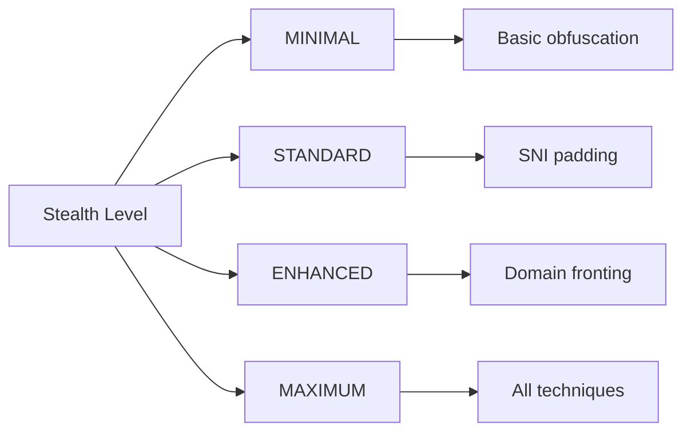

**Usage Example:**
```cpp
// Configure maximum stealth
StealthConfig config;
config.stealth_level = StealthLevel::MAXIMUM;

StealthManager manager(config);

// Process outgoing packet
auto processed = manager.process_outgoing_packet(original_packet);

// Migrate to better network path
manager.migrate_to_path("cellular_backup");
```

**Performance Metrics:**
- **Path Selection Algorithms**:
  - Bandwidth-optimized
  - Latency-optimized
  - Load-balanced
  - Random
- **Migration Thresholds**:
  - Max RTT: 200ms
  - Max Packet Loss: 5%
  - Min Bandwidth: 1000kbps
    A --> E[http_version]
    A --> F[randomize_header_order]
    A --> G[optimize_for_quic]
    A --> H[use_qpack_headers]
```

**Usage Example:**
```cpp
// Configure for Chrome browser with HTTP/3
FakeHeaders::FakeHeadersConfig config;
config.profile_type = FakeHeaders::HeaderProfileType::CHROME_BROWSER;
config.http_version = FakeHeaders::HttpVersion::HTTP_3;

FakeHeaders fake_headers(config);

// Inject headers into packet
auto packet = get_original_packet();
auto masked_packet = fake_headers.inject_fake_headers(packet);

// Remove headers on receive
auto original = fake_headers.remove_fake_headers(masked_packet);
```

**QPACK Header Generation:**
```cpp
std::vector<uint8_t> FakeHeaders::generate_qpack_headers() const {
    // Uses QPACK compression for HTTP/3
    // Implements RFC 9204 specifications
    // Returns optimized header block
}
```

**Detection Prevention:**
- Random header order
- Realistic values for Cache-Control and other headers
- Alt-Svc header for HTTP/3 upgrade simulation
- QUIC Transport Parameter Integration
   - Custom user agent strings

**Supported Browser Profiles:**
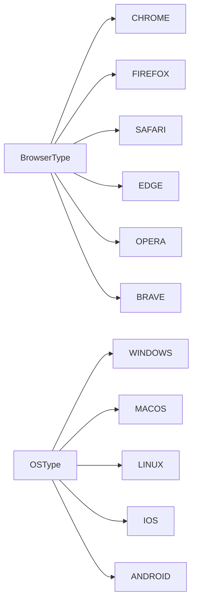

**Usage Example:**
```cpp
// Create Chrome on Windows fingerprint
BrowserFingerprint chrome_win(
    BrowserFingerprint::BrowserType::CHROME,
    BrowserFingerprint::OSType::WINDOWS,
    "Mozilla/5.0 (Windows NT 10.0; Win64; x64) AppleWebKit/537.36 (KHTML, like Gecko) Chrome/116.0.0.0 Safari/537.36"
);

// Generate headers for connection
auto headers = chrome_win.generate_http_headers();
auto tls_params = chrome_win.generate_tls_parameters();
```

**Integration with uTLS:**
The generated TLS parameters are directly compatible with the uTLS implementation for seamless fingerprint spoofing.
    });
}
```

**Functionality:**
1. **Parameter processing**: Accepts host and port as input
2. **uTLS initialization**: Configures TLS fingerprinting with Chrome profile
3. **QUIC connection**:
   - Creates QuicConnection object
   - Establishes asynchronous connection to server
4. **Data transmission**:
   - Creates QUIC stream after successful connection
   - Sends "Hello uTLS!" message

**Usage:**
```bash
./quicfuscate_client <host> <port>
# Example:
./quicfuscate_client example.com 443
```

**Browser Emulation:**
Supported profiles in `stealth/uTLS.hpp`:
- `Chrome_Latest`
- `Firefox_Quantum`
- `Safari_MacOS`
- `Edge_Windows`
- `Tor_Browser`

**Error Handling:**
- Error code 1: uTLS initialization error
- Error code 2: Connection error
- Error code 3: Stream creation error
         auto block = free_blocks_[size_class].front();
         free_blocks_[size_class].pop();
         return block;
       }
       return new MemoryBlock(class_to_size_[size_class]);
     }
   };
   ```

3. **Zero-Copy Buffer**:
   ```cpp
   class ZeroCopyBuffer {
     ssize_t send(int fd) {
       struct msghdr msg = {};
       msg.msg_iov = iovecs_.data();
       msg.msg_iovlen = iovecs_.size();
       return sendmsg(fd, &msg, flags);
     }
   };
   ```

**Configuration Parameters:**
```cpp
struct UnifiedOptimizationConfig {
  // Memory settings
  size_t memory_pool_size = 16 * 1024 * 1024;
  size_t memory_block_size = 4096;
  
  // Threading settings
  size_t thread_pool_size = std::thread::hardware_concurrency();
  
  // SIMD settings
  bool enable_simd = true;
  
  // Zero-RTT settings
  bool enable_zero_rtt = true;
};
```

**Performance Metrics:**
```cpp
struct PerformanceMetrics {
  // Memory metrics
  size_t memory_allocations = 0;
  double fragmentation_percent = 0.0;
  
  // Threading metrics
  double thread_efficiency = 0.0;
  
  // SIMD metrics
  size_t simd_operations = 0;
  
  // Network metrics
  double bandwidth_utilization = 0.0;
};
```

**Usage Example:**
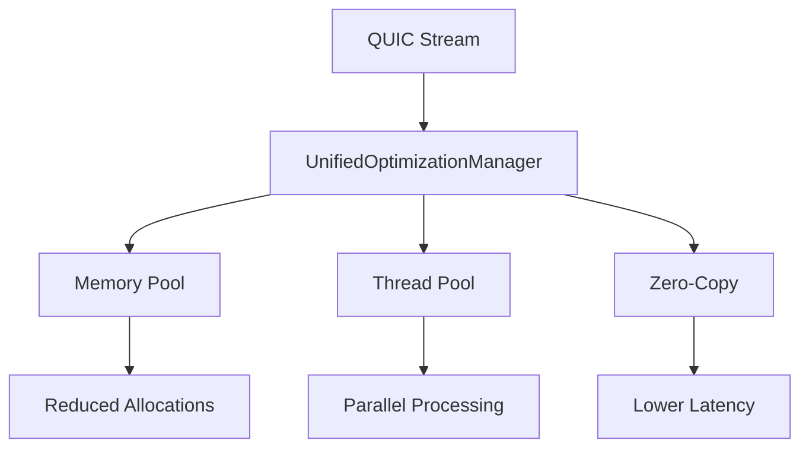

**BBRv2 Congestion Control:**
```cpp
class UnifiedBBRv2 {
  void update(uint64_t rtt_us, double bandwidth_bps) {
    // Update bandwidth estimation
    bandwidth_samples_.push_back(bandwidth_bps);
    if (bandwidth_samples_.size() > params_.bw_window_length) {
      bandwidth_samples_.pop_front();
    }
    
    // Update RTT estimation
    rtt_samples_.push_back(rtt_us);
    if (rtt_samples_.size() > params_.min_rtt_window_ms) {
      rtt_samples_.pop_front();
    }
    
    // State machine transitions
    switch (state_) {
      case State::STARTUP: handle_startup(); break;
      case State::DRAIN: handle_drain(); break;
      case State::PROBE_BW: handle_probe_bw(); break;
      case State::PROBE_RTT: handle_probe_rtt(); break;
    }
  }
};
```

**Burst Buffer Management:**
```cpp
class UnifiedBurstBuffer {
  void burst_worker() {
    while (running_) {
      size_t burst_size = calculate_burst_size();
      uint32_t interval = calculate_burst_interval();
      
      std::this_thread::sleep_for(std::chrono::milliseconds(interval));
      
      std::vector<uint8_t> data_to_send;
      {
        std::lock_guard<std::mutex> lock(buffer_mutex_);
        if (buffer_.size() >= burst_size) {
          data_to_send = std::move(buffer_);
          buffer_.clear();
        }
      }
      
      if (!data_to_send.empty() && send_callback_) {
        send_callback_(data_to_send.data(), data_to_send.size());
      }
    }
  }
};
```
     switch (config_.redundancy_mode) {
       case ADAPTIVE_ADVANCED:
         return network_metrics_.calculate_redundancy();
       // ... other modes
     }
   }
   ```

3. **Packet Encoding**:
   ```cpp
   std::vector<FECPacket> encode_packet(/*...*/) {
     // Generate repair packets based on network metrics
     size_t repair_count = std::ceil(calculate_current_redundancy());
     for (size_t i = 0; i < repair_count; i++) {
       // Galois field multiplication for FEC data
       GaloisField::multiply_vector_scalar(repair_data, data, coefficient);
     }
   }
   ```

**Configuration Parameters:**
```cpp
struct FECConfig {
  enum RedundancyMode {
    FIXED,              // Fixed redundancy
    ADAPTIVE_BASIC,     // Simple adaptation
    ADAPTIVE_ADVANCED,  // Advanced network analysis
    ADAPTIVE_ML         // ML-based (future)
  };
  
  RedundancyMode redundancy_mode = ADAPTIVE_ADVANCED;
  double min_redundancy_ratio = 0.1;  // 10% Minimum
  double max_redundancy_ratio = 0.5;  // 50% Maximum
  size_t memory_pool_block_size = 4096;
  size_t memory_pool_initial_blocks = 100;
  bool stealth_mode = true;
};
```

**Performance Optimizations:**
- SIMD-accelerated Galois field operations (NEON/AVX2/AVX512)
- Memory pool with 64-byte alignment for cache optimization
- Lock-free data structures for parallel processing
- Adaptive redundancy based on network metrics:
  - Packet loss rate
  - Latency
  - Throughput
  - Jitter

**Usage Example:**
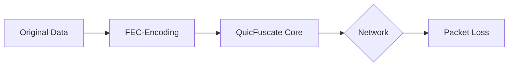

**Stealth Integration:**
- Random timing variations for traffic patterns
- Dynamic redundancy adaptation for obfuscation
- Support for stealth mode

**Performance Metrics:**
```cpp
struct Statistics {
  size_t packets_encoded;
  size_t packets_decoded;
  size_t packets_recovered;
  size_t repair_packets_generated;
  size_t total_bytes_processed;
  double current_redundancy_ratio;
  size_t simd_operations;
  size_t scalar_fallbacks;
};
```
  // Main functions:
  bool write_data(const std::vector<uint8_t>& data);
  std::vector<uint8_t> read_data();
  bool is_readable() const;
};
```

**Key Features:**

1. **Data Writing**:
   ```cpp
   bool write_data(const std::vector<uint8_t>& data) {
     std::lock_guard<std::mutex> lock(buffer_mutex);
     buffer.insert(buffer.end(), data.begin(), data.end());
     bytes_sent_.fetch_add(data.size());
     data_available_cv_.notify_one();
     return true;
   }
   ```
   - Thread-safe write access with Mutex
   - Notification of waiting readers

2. **Data Reading**:
   ```cpp
   std::vector<uint8_t> read_data() {
     std::lock_guard<std::mutex> lock(buffer_mutex);
     std::vector<uint8_t> data = std::move(buffer);
     buffer.clear();
     bytes_received_.fetch_add(data.size());
     return data;
   }
   ```
   - Move semantics for efficient data transfer
   - Automatic buffer clearing after read operation

3. **Readability Check**: 
   ```cpp
   bool is_readable() const {
     std::lock_guard<std::mutex> lock(const_cast<std::mutex&>(buffer_mutex));
     return !buffer.empty() && !closed_.load();
   }
   ```
   - Thread-safe status query
   - Const-cast for mutex in const method (acceptable compromise)

**Design Features:**
- Atomic operations for performance optimization
- Condition variable for efficient notification
- Move semantics to avoid data copies
- RAII mutex locks for exception safety

**Application Example:**
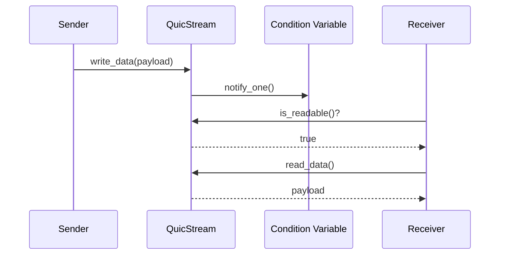

**Performance Optimizations:**
- Lock-Guards with minimal scope
- Atomic counters instead of mutex for statistics
- Move semantics instead of copying large data
- Separate condition variable for blocking reads
  std::vector<uint8_t> process_client_hello(const std::vector<uint8_t>& client_hello);
  std::vector<uint8_t> modify_sni(const std::vector<uint8_t>& client_hello, const std::string& new_sni);
  std::string apply_domain_fronting(const std::string& http_headers);
};
```

**Supported SNI Obfuscation Techniques:**
```cpp
enum class SniTechnique {
  DOMAIN_FRONTING,  // Front-Domain as disguise
  SNI_OMISSION,     // Complete omission of SNI
  SNI_PADDING,      // Random prefixes in SNI
  SNI_SPLIT,        // Split SNI across multiple packets
  ECH,              // Encrypted Client Hello (TLS 1.3)
  ESNI              // Legacy Encrypted SNI
};
```

**Key Algorithms:**

1. **Domain Fronting for TLS**:
   ```cpp
   std::vector<uint8_t> modify_sni(/*...*/) {
     // Replace real domain with front domain
     // Preserves TLS structure
   }
   ```

2. **HTTP Header Manipulation**:
   ```cpp
   std::string apply_domain_fronting(const std::string& http_headers) {
     std::regex host_regex("Host:\\s*([^\\r\\n]+)", std::regex::icase);
     return std::regex_replace(http_headers, host_regex, "Host: " + config_.real_domain);
   }
   ```

3. **SNI Padding with Random Prefix**: 
   ```cpp
   std::string padded_sni = prefix + "." + original_sni;
   ```

4. **SNI-Split with Nullbyte Injection**:
   ```cpp
   modified_sni.insert(split_pos, 1, '\0');
   ```

**Configuration Management:**
```cpp
struct SniConfig {
  bool enable_domain_fronting = true;
  bool enable_sni_omission = false;
  bool enable_sni_padding = true;
  bool enable_sni_split = false;
  bool enable_ech = true;
  bool enable_esni = false;
  
  std::string front_domain = "cdn.example.com";
  std::string real_domain = "real-service.example";
  std::vector<std::string> trusted_fronts;
  std::vector<uint8_t> ech_config_data;
};
```

**Application Example:**
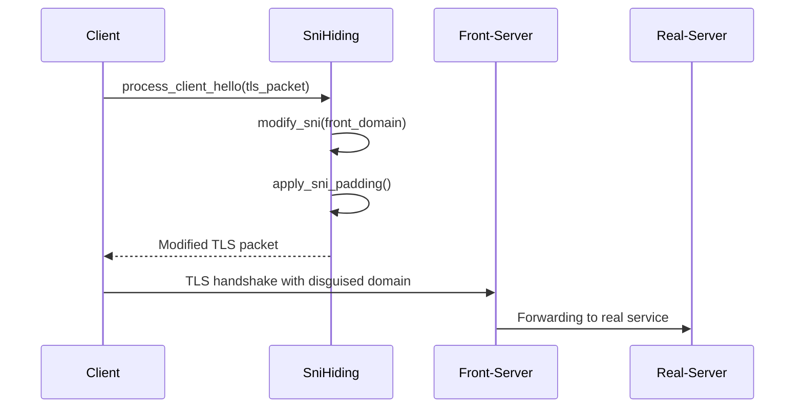

**Security Features:**
- Dynamic technique selection based on network conditions
- Trusted fronts list for authorized domains
- ECH (Encrypted Client Hello) for TLS 1.3
- Automatic length correction in TLS packets
  
  // Main functions:
  std::vector<uint8_t> generate_client_hello();
  bool configure_ssl_connection(SSL* ssl, const std::string& hostname);
};
```

**Key Components:**

1. **Browser Emulation**:
   ```cpp
   void initialize() {
     fingerprint_ = BrowserFingerprintsFactory::create_fingerprint(browser_type_, os_);
   }
   ```
   - Dynamic creation of browser fingerprints
   - Support for Chrome, Firefox, Safari, Edge and mobile variants

2. **ClientHello Generation**:
   ```cpp
   std::vector<uint8_t> generate_client_hello(const std::string& server_name = "") {
     // Configuration of Cipher Suites, Extensions, etc.
     SSL_connect(ssl.get());
     // Extract ClientHello from BIO
   }
   ```
   - Generates TLS handshake messages with specific browser fingerprint
   - Automatic adaptation to target browser

3. **Fingerprint Configuration**:
   ```cpp
   void initialize_chrome_profile() {
     current_profile_.cipher_suites.emplace_back(0x1301, "TLS_AEGIS_128X_SHA256");
     current_profile_.alpn_protocols.emplace_back("h2");
   }
   ```
   - Browser-specific profiles for Chrome, Firefox, Safari
   - Support for AEGIS encryption and modern protocols

4. **Advanced Features**:
   - Session Ticket Management
   - Pre-Shared Keys (PSK)
   - Certificate Pinning
   - GREASE Values for obfuscation
   - 0-RTT Early Data support

**Browser-Specific Adaptations:**
```cpp
void apply_chrome_modifications(std::vector<uint8_t>& client_hello) {
  reorder_extensions(client_hello, extensions_offset, {0x0000, 0x0010, 0x0005});
  replace_ec_point_formats(client_hello, {0x00, 0x01, 0x02});
}
```
- Precise emulation of Chrome, Firefox and Safari-specific ClientHello properties
- Adaptation of extension order and EC point formats

**Integration Example:**
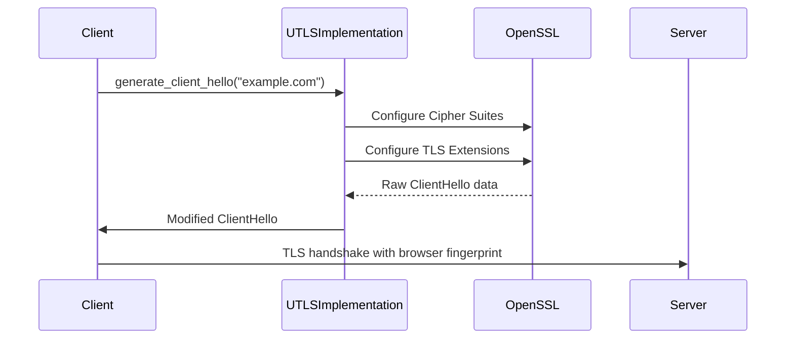

**Supported Browser Profiles:**
```cpp
std::vector<BrowserFingerprint> get_available_fingerprints() const {
  return {
    BrowserFingerprint::CHROME_LATEST,
    BrowserFingerprint::FIREFOX_LATEST,
    BrowserFingerprint::SAFARI_LATEST,
    BrowserFingerprint::EDGE_CHROMIUM,
    // 12 more profiles
  };
}
```

**Security Features:**
- Automatic random selection of fingerprints
- Integrated certificate validation
- Support for hardware-accelerated encryption
- Anti-Detection mechanisms through GREASE Values
  
  // Main functions:
  bool write_data(const std::vector<uint8_t>& data);
  std::vector<uint8_t> read_data();
  bool is_readable() const;
};
```

**Data Flow Mechanisms:**

1. **Write Operation:**:
   ```cpp
   bool write_data(const std::vector<uint8_t>& data) {
     std::lock_guard<std::mutex> lock(buffer_mutex);
     buffer.insert(buffer.end(), data.begin(), data.end());
     data_available_cv_.notify_one();
   }
   ```
   - Thread-safe write access with Mutex
   - Notification of waiting readers

2. **Read Operation:**:
   ```cpp
   std::vector<uint8_t> read_data() {
     std::lock_guard<std::mutex> lock(buffer_mutex);
     std::vector<uint8_t> data = std::move(buffer);
     buffer.clear();
     return data;
   }
   ```
   - Move semantics for efficient data transfer
   - Automatic buffer clearing after read operation

3. **Status Query:**:
   ```cpp
   bool is_readable() const {
     std::lock_guard<std::mutex> lock(const_cast<std::mutex&>(buffer_mutex));
     return !buffer.empty() && !closed_.load();
   }
{{ ... }}
   ```
   - Atomic closed status check
   - Thread-safe buffer empty check

**Performance Optimizations:**
- Zero-copy data transfer through move operations
- Atomic counters for transmitted bytes:
  ```cpp
  std::atomic<uint64_t> bytes_sent_{0};
  std::atomic<uint64_t> bytes_received_{0};
  ```
- Condition variables for efficient blocking:
  ```cpp
  data_available_cv_.wait(lock, [this](){ return !buffer.empty(); });
  ```

**Integration Example:**
```cpp
// Producer thread
stream.write_data(generate_sensor_data());

// Consumer thread
while (stream.is_readable()) {
  auto data = stream.read_data();
  process_data(data);
}
```

**Integration into QUIC Connection:**
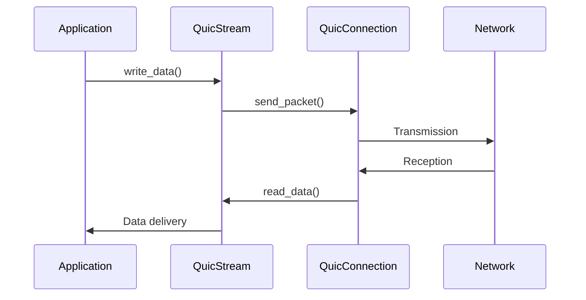

1. **Congestion Control (BBRv2)**:
   ```cpp
   void update_congestion_window() {
     quiche_stats stats;
     quiche_conn_stats(quiche_conn_, &stats);
     
     NetworkMetrics metrics;
     metrics.rtt_us = stats.rtt;
     metrics.bandwidth_bps = stats.delivery_rate;
     bbr_->update_metrics(metrics);
   }
   ```
   - Adaptive algorithm for high throughput and low latency
   - Automatic adaptation to network conditions

2. **MTU Discovery**:
   ```cpp
   void probe_next_mtu() {
     uint16_t probe_mtu = current_mtu_ + mtu_step_size_;
     send_mtu_probe(probe_mtu);
   }
   ```
   - Dynamic packet size optimization (min_mtu_ to max_mtu_)
   - Automatic adjustment based on network feedback

3. **Zero-Copy Operations**:
   ```cpp
   void setup_zero_copy() {
     send_buffer_ = std::make_unique<ZeroCopyBuffer>();
     recv_zero_copy_ = std::make_unique<ZeroCopyReceiver>();
     init_memory_pool();
   }
   ```
   - Direct memory access without copy operations
   - Specialized memory pool with 64-byte alignment

4. **XDP Integration**:
   ```cpp
   bool enable_xdp_zero_copy(const std::string& interface) {
     xdp_socket_ = xdp_context.create_socket(port);
     xdp_socket_->set_packet_handler([this](...){
       this->handle_xdp_packet(...);
     });
   }
   ```
   - Kernel bypass for maximum network performance
   - Direct packet processing in the network driver

**Performance Optimizations:**
- Parallel processing with thread pooling
- Batch processing of packets
- Hardware-accelerated encryption
- Statistical monitoring:
- Statistical monitoring:
  ```cpp
  struct quiche_stats {
    uint64_t rtt;
    uint64_t cwnd;
    uint64_t lost;
    uint64_t delivery_rate;
  };
  ```

**Connection Lifecycle:**
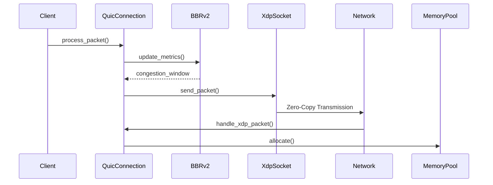

**Stealth Integration:**
- MTU randomization for traffic obfuscation
- Dynamic congestion control adjustment
- Zero-copy operations reduce memory footprint
   - Memory pool with 64-byte alignment for SIMD
   - Efficient allocation/deallocation:
     ```cpp
     void* allocate(); // Get from pool
     void deallocate(void* ptr); // Return to pool
     ```

3. **Adaptive Redundancy Control**:
   - Dynamic adjustment based on network metrics
   - Four operating modes:
     ```cpp
     enum RedundancyMode {
       FIXED,              // Fixed redundancy
       ADAPTIVE_BASIC,     // Basic adaptation
       ADAPTIVE_ADVANCED,  // Advanced adaptation
       ADAPTIVE_ML         // ML-based
     };
     ```

4. **FEC Packet Structure**:
   ```cpp
   struct FECPacket {
     Type type;             // SOURCE or REPAIR
     uint32_t sequence_number;
     uint32_t generation_id;
     uint32_t block_id;
     bool is_repair;
     uint32_t original_size;
     std::shared_ptr<std::vector<uint8_t>> data;
     std::vector<uint8_t> coding_coefficients;
     std::vector<uint32_t> source_packet_ids;
   };
   ```

**Performance Optimizations:**
- Parallel processing with OpenMP
- Batch processing of packet blocks
- Hardware-accelerated Galois field calculations
- Runtime optimization statistics:
  ```cpp
  struct Statistics {
    uint64_t packets_encoded;
    uint64_t packets_decoded;
    uint64_t packets_recovered;
    uint64_t repair_packets_generated;
    uint64_t total_bytes_processed;
    double current_redundancy_ratio;
  };
  ```

**Usage in QUIC Stack:**
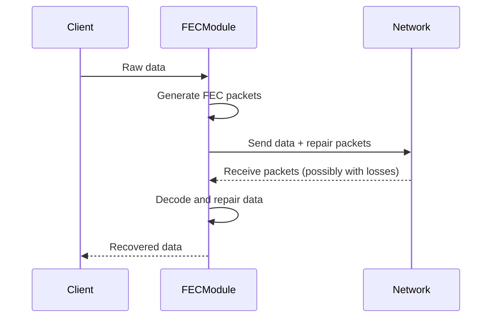

**Stealth Mode:**
- Random variation of redundancy
- Temporal randomization of packet transmissions
- Obfuscation of FEC metadata

**Hardware Support Table:**
| Cipher Suite | x86 VAES-512 | x86 AES-NI | ARM Crypto | Software |
|--------------|--------------|------------|------------|----------|
| AEGIS-128X   | ✓            |            |            |          |
| AEGIS-128L   |              | ✓          | ✓          |          |
| MORUS-1280-128|              |            |            | ✓        |

**Performance Comparison:**
- **AEGIS-128X**: Up to 40 Gbps (VAES-512 accelerated)
- **AEGIS-128L**: 10-15 Gbps (AES-NI/ARM Crypto)
- **MORUS-1280-128**: 2-3 Gbps (pure software implementation)

**Security Aspects:**
- Automatic fallback to secure software implementation
- No security compromises due to hardware limitations
- Cryptographically secure algorithms in all modes
- **Error Handling**: Comprehensive error reporting and recovery
- **Statistics**: Detailed connection metrics and performance monitoring
#### Core Data Types
Defined in `quic_core_types.hpp`:

```cpp
// Path migration strategies
enum class PathMigrationStrategy {
    NONE, PROACTIVE, REACTIVE, 
    RANDOM, LOAD_BALANCED, LATENCY_OPTIMIZED
};

// QUIC configuration
struct QuicConfig {
    std::string server_name;
    uint16_t port;
    SSL_CTX* utls_ssl_ctx; // For uTLS integration
};

// Stream types
enum class StreamType : uint8_t
    DATA, CONTROL, HEADER, 
    QPACK_ENCODER, QPACK_DECODER
#### QuicFuscateStealth Unified Implementation
Defined in `QuicFuscate_Stealth.cpp`:

```cpp
class QuicFuscateUnified {
  // Core engines
  std::unique_ptr<QPACKEngine> qpack_engine_;
  std::unique_ptr<ZeroRTTEngine> zero_rtt_engine_;
  std::unique_ptr<DatagramEngine> datagram_engine_;
  std::unique_ptr<StreamEngine> stream_engine_;
  
  // Performance tracking
  UnifiedStatistics statistics_;
  
  // Main functionality
  std::vector<uint8_t> encode_headers(const std::vector<UnifiedHeader>& headers);
  std::vector<UnifiedHeader> decode_headers(const std::vector<uint8_t>& encoded_data);
  bool enable_zero_rtt(const std::string& hostname, uint16_t port);
  bool send_early_data(const std::string& hostname, uint16_t port, const std::vector<uint8_t>& data);
  bool send_datagram(const std::vector<uint8_t>& data, uint8_t priority);
  std::optional<UnifiedDatagram> receive_datagram();
  std::optional<uint64_t> create_stream(uint8_t priority);
  bool send_stream_data(uint64_t stream_id, const std::vector<uint8_t>& data);
  std::optional<std::vector<uint8_t>> receive_stream_data(uint64_t stream_id);
  
  // Optimization profiles
  void optimize_for_latency();
  void optimize_for_throughput();
  void optimize_for_stealth();
};
```

**Key Components:**
1. **QPACK Engine**: HTTP/3 Header compression with static/dynamic tables
2. **Zero-RTT Engine**: Session resumption for fast connections
3. **Datagram Engine**: Bundling and prioritization of UDP packets
4. **Stream Engine**: Management of QUIC streams with priority control

**Performance Optimization Profiles:**
```cpp
void optimize_for_latency() {
  config_.optimization_level = OptimizationLevel::AGGRESSIVE;
  config_.qpack.compression_level = 3;
  config_.datagram.enable_bundling = false;
}

void optimize_for_throughput() {
  config_.optimization_level = OptimizationLevel::MAXIMUM;
  config_.qpack.compression_level = 9;
  config_.datagram.enable_bundling = true;
}

void optimize_for_stealth() {
  config_.security_level = SecurityLevel::PARANOID;
  config_.enable_stealth_mode = true;
  config_.qpack.enable_fake_headers = true;
}
```

**Browser Emulation Functions:**
```cpp
void emulate_browser_behavior() {
  switch (config_.browser_emulation) {
    case BrowserType::CHROME:
      headers = generate_chrome_headers();
      break;
    case BrowserType::FIREFOX:
      headers = generate_firefox_headers();
      break;
    // ... other browsers
  }
  encode_headers(headers);
}
```

**Statistics and Monitoring:**
```cpp
struct UnifiedStatistics {
  uint64_t qpack_headers_encoded;
  uint64_t qpack_headers_decoded;
  uint64_t zero_rtt_attempts;
  uint64_t zero_rtt_successes;
  uint64_t datagrams_sent;
  uint64_t datagrams_received;
  uint64_t streams_created;
  uint64_t total_bytes_processed;
  uint64_t total_processing_time_us;
  
  // Calculated metrics
  double get_average_processing_time_us() const;
  double get_qpack_compression_ratio() const;
};
```

**Usage Scenario:**
```cpp
// Initialization
QuicFuscateUnified stealth(config);
stealth.initialize();

// Header compression
auto encoded = stealth.encode_headers({{":method", "GET"}, {":path", "/"}});

// Zero-RTT data sending
if (stealth.enable_zero_rtt("example.com", 443)) {
  stealth.send_early_data("example.com", 443, serialize_data(payload));
}

// Stream-based data transfer
auto stream_id = stealth.create_stream();
stealth.send_stream_data(*stream_id, large_data);
auto response = stealth.receive_stream_data(*stream_id);
```

**Advanced Features:**
- Adaptive optimization based on performance metrics
- Dummy traffic generation for obfuscation
- Machine learning for traffic prediction
- Real-time performance monitoring
- Export/Import of performance profiles
};

// Packet types
enum class PacketType : uint8_t {
    INITIAL, ZERO_RTT, 
    HANDSHAKE, RETRY
};

// Packet header structure
struct QuicPacketHeader {
    PacketType type;
    uint32_t version;
    uint64_t connection_id;
    uint64_t packet_number;
    // ... other fields
};

// Connection states
enum class QuicConnectionState : uint8_t {
    INITIAL, HANDSHAKE, ESTABLISHED,
    CLOSING, CLOSED, ERROR
};
```

**Key Classes:**
- `QuicPacket`: Represents a QUIC network packet
- `QuicStream`: Manages data transmission over QUIC streams
- `QuicIntegration`: Handles packet processing and statistics
- `QuicUnifiedManager`: Manages multiple QUIC connections

#### QuicConnection Class
The core class managing QUIC connections with advanced capabilities:

```cpp
class QuicConnection {
  // Connection setup
  async_connect(host, port, callback); // Asynchronously connect to server
  disconnect(); // Gracefully close connection
  
  // Advanced networking
  enable_xdp_zero_copy(interface); // Enable kernel bypass for performance
  set_congestion_algorithm(algorithm); // Set BBRv2/CUBIC/RENO
  enable_migration(true); // Enable network interface switching
  enable_mtu_discovery(true); // Automatic MTU optimization
  
  // Cryptography
  enable_optimized_crypto(true); // Enable hardware-accelerated encryption
#### QuicStream Implementation
Defined in `quic_stream_impl.cpp`:

```cpp
class QuicStream {
  // Write data to stream
  bool write_data(const std::vector<uint8_t>& data) {
    if (closed_) return false;
    std::lock_guard<std::mutex> lock(buffer_mutex);
    buffer.insert(buffer.end(), data.begin(), data.end());
    bytes_sent_ += data.size();
    data_available_cv_.notify_one();
    return true;
  }

  // Read all available data from stream
  std::vector<uint8_t> read_data() {
    std::lock_guard<std::mutex> lock(buffer_mutex);
    if (buffer.empty()) return {};
    std::vector<uint8_t> data = std::move(buffer);
    buffer.clear();
    bytes_received_ += data.size();
    return data;
  }

  // Check if stream has readable data
  bool is_readable() const {
    std::lock_guard<std::mutex> lock(const_cast<std::mutex&>(buffer_mutex));
    return !buffer.empty() && !closed_;
  }
};
```

**Key Features:**
- Thread-safe data transfer with mutex synchronization
- Condition variables for blocking I/O
- Atomic counters for transmitted bytes
- Closed stream detection

**Performance Optimizations:**
- Zero-copy buffer transfer with `std::move()`
- Minimal locking scope for maximum parallelism
- Direct buffer access without additional copies
- Efficient memory management with `std::vector`
- Direct buffer access without additional copies
- Efficient memory management with `std::vector`

**Usage Scenarios:**
1. **Data Transfer:**
```cpp
stream.write_data(serialize_data(payload));
auto received = stream.read_data();
process_data(received);
```

2. **Asynchronous Reading:**
```cpp
std::thread reader([&] {
  while (stream.is_readable()) {
    auto data = stream.read_data();
    if (!data.empty()) process_data(data);
  }
});
```

3. **Blocking Read Operation:**
```cpp
std::unique_lock<std::mutex> lock(stream.buffer_mutex);
stream.data_available_cv_.wait(lock, [&] { 
  return !stream.buffer.empty() || stream.closed_; 
});
if (!stream.buffer.empty()) {
  auto data = std::move(stream.buffer);
  stream.buffer.clear();
  process_data(data);
}
```

**Security Features:**
- Thread safety through strict synchronization
- Atomic status check (`closed`)
- Prevention of data races through mutex
- Exception safety through RAII
  set_browser_fingerprint(fingerprint); // Configure TLS fingerprint spoofing
  
  // Error correction
  enable_fec(true); // Enable Forward Error Correction
  set_fec_redundancy_rate(0.3); // Set FEC redundancy rate
  
  // Statistics access
  ConnectionStats get_stats() const; // Get detailed connection metrics
};
```

**Key Features:**
- **Hardware Acceleration**: Automatic SIMD optimization detection
- **Browser Emulation**: uTLS integration for TLS fingerprint spoofing
- **FEC Support**: Forward Error Correction with adaptive redundancy
- **Zero-Copy Operations**: Optimized memory handling
- **Connection Migration**: Seamless network interface switching
- **MTU Discovery**: Automatic packet size optimization
- **BBRv2 Congestion Control**: High throughput, low latency algorithm

**Advanced Capabilities:**
- eBPF/XDP kernel bypass for maximum performance
- Burst buffering for optimized data transmission
- Memory pooling for efficient resource usage
- Zero-RTT handshake for faster connections

**Usage Example:**
```cpp
QuicConfig config;
QuicConnection conn(io_context, config);
conn.enable_xdp_zero_copy("eth0");
conn.set_congestion_algorithm(CongestionAlgorithm::BBRv2);
conn.enable_optimized_crypto(true);
conn.set_browser_fingerprint(BrowserFingerprint::CHROME_LATEST);
conn.async_connect("vpn.example.com", 443, [](error_code ec) {
  if (!ec) cout << "Connected successfully!";
});
```
#### Path MTU Manager
Defined in `quic_path_mtu_manager.hpp`:

```cpp
class PathMtuManager {
  // MTU discovery status
  enum class MtuStatus {
    DISABLED, SEARCHING, VALIDATING, 
    BLACKHOLE, COMPLETE
  };

  // MTU change notification
  struct MtuChange {
    uint16_t old_mtu;
    uint16_t new_mtu;
    bool success;
    std::string reason;
  };

  // Bidirectional MTU discovery
  enable_bidirectional_discovery(bool enable);
  
  // Dynamic MTU adjustment
  adapt_mtu_dynamically(float packet_loss_rate, uint32_t rtt_ms);
  
  // Probe handling
  handle_probe_response(uint32_t probe_id, bool success, bool is_incoming);
  handle_incoming_probe(uint32_t probe_id, uint16_t size);
  
  // Status monitoring
  get_mtu_status(bool is_incoming) const;
  is_mtu_unstable() const;
};
```

**Key Features:**
- Bidirectional MTU discovery for incoming/outgoing paths
- Dynamic adaptation based on packet loss rate and RTT
- Blackhole detection on packet losses
- Stability monitoring with instability detection
- Automatic probe sending and timeout monitoring

**Configuration Parameters:**
- `min_mtu`: Minimum MTU (default: 1200 Bytes)
- `max_mtu`: Maximum MTU (default: 1500 Bytes)
- `step_size`: Step size for MTU probes (default: 10 bytes)
- `blackhole_threshold`: Threshold for blackhole detection (default: 3 errors)

**Usage Example:**
```cpp
// Initialize MTU manager
PathMtuManager mtu_manager(connection, 1200, 1500, 10, 3);

// Enable bidirectional discovery
mtu_manager.enable_bidirectional_discovery(true);

// Periodically update MTU based on network conditions
mtu_manager.adapt_mtu_dynamically(packet_loss, current_rtt);

// Handle probe responses
mtu_manager.handle_probe_response(probe_id, success, true);
```

#### Anti-Fingerprinting System
Defined in `anti_fingerprinting.hpp`:

```cpp
class AntiFingerprinting {
  // Fingerprinting detection methods
  enum class FingerprintingMethod {
    TLS_FINGERPRINTING, HTTP_HEADER_ANALYSIS, 
    TIMING_ANALYSIS, PACKET_SIZE_ANALYSIS,
    FLOW_PATTERN_ANALYSIS, ALPN_NEGOTIATION
  };

  // Anti-fingerprinting techniques
  enum class AntiFingerprintingTechnique {
    RANDOMIZE_TLS_EXTENSIONS, MIMIC_BROWSER_BEHAVIOR,
    RANDOMIZE_PACKET_TIMING, NORMALIZE_PACKET_SIZES,
    RANDOMIZE_CIPHER_ORDER, FAKE_CERTIFICATE_VALIDATION
  };

  // Core functionality
  std::vector<FingerprintingDetection> analyze_traffic(const TrafficPattern& pattern);
  bool apply_tls_anti_fingerprinting(SSL_CTX* ssl_ctx, BrowserType browser_profile);
  std::map<std::string, std::string> apply_header_anti_fingerprinting(
      const std::map<std::string, std::string>& headers, BrowserType browser_profile);
  uint32_t generate_randomized_timing(uint32_t base_delay_ms);
  BrowserType rotate_browser_profile(bool force_rotation = false);
};
```

**Key Components:**
- `TLSFingerprintRandomizer`: Randomizes TLS extensions and cipher suites
- `HTTPFingerprintRandomizer`: Manipulates HTTP headers for obfuscation
- `TrafficPatternAnalyzer`: Detects fingerprinting attempts through traffic analysis

**Detection Capabilities:**
- 15+ fingerprinting methods detectable
- Real-time analysis of packet sizes and timing patterns
- TLS/HTTP attribute analysis (ALPN, cipher suites, headers)
- Similarity assessment of traffic patterns
- Confidence scoring for detections

**Evasion Techniques:**
- Random TLS extension ordering
- Adding fake HTTP headers
- Temporal randomization of packet transmissions
- Packet padding for size normalization
- Automatic browser profile switching
- Generation of dummy traffic

**Configuration Options:**
{{ ... }}
```cpp
struct AntiFingerprintingConfig {
  bool enable_tls_randomization = true;
  bool enable_header_randomization = true;
  bool enable_timing_randomization = true;
  bool enable_packet_padding = true;
  uint32_t min_request_delay_ms = 10;
  uint32_t max_request_delay_ms = 500;
  bool auto_rotate_profiles = true;
  uint32_t profile_rotation_interval = 30; // minutes
};
```

**Usage Example:**
```cpp
// Initialize with default config
auto af_engine = AntiFingerprinting::create();

// Apply TLS fingerprint randomization
af_engine->apply_tls_anti_fingerprinting(ssl_ctx, BrowserType::CHROME);

// Process HTTP headers
auto safe_headers = af_engine->apply_header_anti_fingerprinting(
    original_headers, BrowserType::FIREFOX);

// Add randomized delay
uint32_t delay = af_engine->generate_randomized_timing(100);
std::this_thread::sleep_for(std::chrono::milliseconds(delay));

// Rotate browser profile periodically
af_engine->rotate_browser_profile();
```

**Advanced Features:**
- Machine learning for detecting new fingerprinting methods
- Rule-based system for known detection patterns
- Context-dependent technique selection based on threat level
- Statistical tracking of blocks and detections
**Internal State Management:**
```cpp
struct PathMtuState {
  uint16_t current_mtu;          // Current MTU size
  uint16_t last_successful_mtu;  // Last validated MTU
  uint16_t current_probe_mtu;    // MTU size being probed
  bool in_search_phase;          // Actively searching for optimal MTU
  uint8_t consecutive_failures;  // Consecutive probe failures
  MtuStatus status;              // Current discovery status
};
```

**Advanced Capabilities:**
- Time-controlled probes with configurable intervals
- Instability detection during frequent MTU changes
- Callback system for MTU change notifications
- Automatic fallback to last successful MTU on errors

**Public Methods Overview:**
- `enable_xdp_zero_copy()`: Enable kernel bypass networking
- `set_congestion_algorithm()`: Configure BBRv2/CUBIC/RENO
- `enable_migration()`: Enable network interface switching
- `enable_mtu_discovery()`: Automatic packet size optimization
- `set_browser_fingerprint()`: Configure TLS fingerprint
- `enable_fec()`: Toggle Forward Error Correction
- `enable_burst_buffering()`: Optimize data transmission
- `init_memory_pool()`: Efficient memory management
- `get_stats()`: Retrieve connection metrics

### Implementation Details
The `QuicConnection` implementation is consolidated in `quic_connection_impl.cpp` and covers:

1. **Congestion Control**:
   - Supports BBRv2, CUBIC, and RENO algorithms
   - Automatic algorithm selection based on network conditions
   - Detailed metrics collection for congestion control

2. **MTU Discovery**:
   - Automatic packet size optimization
   - Probing mechanism to find optimal MTU
   - Fallback to safe MTU on failure

3. **Zero-Copy Operations**:
   - Efficient memory management with memory pools
   - Optimized data transmission with minimal copying

4. **Periodic Updates**:
   - Regular state updates for congestion control and MTU
   - Network change detection for connection migration

5. **XDP Integration**:
   - Kernel bypass for maximum performance
   - Custom packet handling for high-speed networking

**Example Initialization:**
```cpp
// Create QuicConnection with default config
QuicConnection conn(io_context, config);

// Enable advanced features
conn.enable_xdp_zero_copy("eth0");
conn.enable_bbr_congestion_control(true);
conn.enable_mtu_discovery(true);
conn.enable_zero_copy(true);
```

#### Supporting Components
- `quic_connection.hpp`: Advanced QUIC connection management
- `error_handling.hpp`: Error handling and logging utilities
- `quic_core_types.hpp`: Consolidated QUIC core types
- `quic_path_mtu_manager.hpp`: Path MTU discovery

### Stealth Module (`stealth/`)
Implements traffic obfuscation and browser emulation:
- **QPACK Compression**: Header compression with dynamic tables
- **Zero-RTT Optimization**: Faster connection establishment
- **Datagram Bundling**: Efficient UDP packet handling
- **Browser Emulation**: Realistic traffic patterns using browser profiles
- **Anti-Fingerprinting**: Techniques to avoid detection

#### uTLS Implementation
The core component for TLS fingerprint spoofing that emulates various browsers:

```cpp
class UTLSImplementation {
  // Browser profile configuration
  set_browser_type(BrowserType::CHROME); // Set browser to emulate
  set_operating_system(OperatingSystem::WINDOWS); // Set OS to emulate
  
  // Fingerprint management
  randomize_fingerprint(); // Randomly select browser profile
  set_custom_fingerprint(profile); // Use custom fingerprint
  
  // Session management
  enable_session_tickets(true); // Enable session resumption
  configure_session_tickets(config); // Custom ticket config
  
  // Generate ClientHello
  auto client_hello = generate_client_hello("example.com");
};
```

**Supported Browser Profiles:**
- Chrome (Desktop/Mobile)
- Firefox (Desktop/Mobile)
- Safari (Desktop/Mobile)
- Edge (Desktop/Mobile)
- Samsung Browser
- Outlook/Thunderbird
- Custom profiles

**Key Features:**
- Realistic TLS handshake emulation
- Automatic fingerprint rotation
- Session ticket management
- Certificate pinning
- Custom cipher suite configuration

**Usage Example:**
```cpp
auto utls = create_utls_implementation(BrowserType::CHROME, OperatingSystem::WINDOWS);
utls->set_browser_type(BrowserType::FIREFOX); // Switch to Firefox
auto client_hello = utls->generate_client_hello("vpn.example.com");
```

#### Supporting Components
- `QuicFuscate_Stealth.hpp`: Main stealth coordination
- `uTLS.hpp`: TLS fingerprint spoofing
- `DomainFronting.hpp`: Domain fronting implementation
- `HTTP3_Masquerading.hpp`: HTTP/3 traffic masquerading

### Cryptography Module (`crypto/`)
Provides hardware-accelerated encryption with automatic cipher suite selection:
- **AEGIS-128X**: VAES-512 optimized for modern x86 CPUs
- **AEGIS-128L**: AES-NI/NEON optimized for x86/ARM platforms
- **MORUS-1280-128**: Lightweight fallback for unsupported hardware
- **Automatic Selection**: Chooses best cipher based on CPU capabilities

#### CipherSuiteSelector Class
The core class for automatic selection of optimal encryption algorithms:

```cpp
class CipherSuiteSelector {
  // Automatic selection of best cipher
  CipherSuite best = select_best_cipher_suite();
  
  // Manual selection
  set_cipher_suite(CipherSuite::AEGIS_128X_VAES512);
  
  // Encryption/decryption
  encrypt(plaintext, key, nonce, ad, ciphertext, tag);
  decrypt(ciphertext, key, nonce, ad, tag, plaintext);
};
```

**Supported Algorithms:**
- `AEGIS_128X_VAES512`: x86 with AVX-512 and VAES
- `AEGIS_128X_AESNI`: x86 with AES-NI
- `AEGIS_128L_NEON`: ARM with NEON Crypto
- `AEGIS_128L_AESNI`: x86 with AES-NI
- `MORUS_1280_128`: Software fallback

**Hardware Detection:**
- Automatically detects CPU features (AVX-512, AES-NI, NEON)
- Selects fastest available implementation
- Falls back to MORUS-1280-128 on unsupported platforms

**Usage Example:**
```cpp
CipherSuiteSelector selector;
selector.encrypt(plaintext.data(), plaintext.size(),
                 key.data(), nonce.data(),
                 ad.data(), ad.size(),
                 ciphertext.data(), tag.data());
```

#### Supporting Components
- `cipher_suite_selector.hpp`: Automatic cipher selection
- `aegis128x.hpp`: AEGIS-128X implementation
- `aegis128l.hpp`: AEGIS-128L implementation
- `morus1280.hpp`: MORUS-1280-128 lightweight fallback
- `optimize/unified_optimizations.hpp`: Unified SIMD dispatching and CPU feature detection

### Forward Error Correction (`fec/`)
Provides reliable data transmission through error correction:
- **SIMD Optimization**: Hardware-accelerated error correction (NEON, AVX2, AVX-512)
- **Adaptive Redundancy**: Dynamically adjusts redundancy based on network conditions
- **Zero-Copy Operations**: Optimized data handling with memory pooling
- **Stealth Integration**: Traffic obfuscation through randomized timing and variance

#### FECModule Class
The core class for forward error correction:

```cpp
class FECModule {
  // Encoding/decoding
  std::vector<FECPacket> encode_packet(data); // Encode data into FEC packets
  std::vector<uint8_t> decode_block(packets); // Decode packets to recover data
  
  // Network adaptation
  update_network_metrics(metrics); // Update network conditions
  set_adaptive_callback(callback); // Custom redundancy calculation
  
  // Configuration
  update_config(config); // Update FEC parameters
  enable_stealth_mode(true); // Enable stealth features
};
```

**Key Features:**
- Hardware-accelerated Galois Field operations
- Adaptive redundancy based on packet loss and latency
- Memory pooling for zero-copy operations
- Stealth mode with randomized packet timing
- Detailed performance statistics

**Usage Example:**
```cpp
FECConfig config;
config.operation_mode = FECConfig::OperationMode::ADAPTIVE;
FECModule fec(config);

// Encode data
auto packets = fec.encode_packet(data);

// Simulate packet loss
packets.pop_back();

// Decode remaining packets
auto recovered = fec.decode_block(packets);
```

#### Supporting Components
- `FEC_Modul.hpp`: Consolidated FEC implementation
- `GaloisField`: SIMD-optimized finite field arithmetic
- `MemoryPool`: Efficient memory management
- `NetworkMetrics`: Network condition monitoring

### Optimization Module (`optimize/`)
Provides comprehensive performance optimizations:
- **CPU Feature Detection**: Automatic detection of x86/x64 and ARM capabilities
- **SIMD Dispatching**: Optimized operations using AVX-512, AVX2, NEON, etc.
- **Memory Management**: Zero-copy operations and memory pooling
- **Threading**: Work-stealing thread pools and task scheduling
- **Network**: BBRv2 congestion control and burst buffering
- **Energy**: Power-efficient processing modes

#### UnifiedOptimizationManager Class
Central management for all optimization components:

```cpp
class UnifiedOptimizationManager {
  // Configuration
  configure(config); // Set optimization parameters
  
  // Component access
  get_memory_pool(); // Memory management
  get_thread_pool(); // Threading
  get_zero_rtt_manager(); // Zero-RTT
};
```

**Key Components:**
- `UnifiedSIMDDispatcher`: Hardware-accelerated SIMD operations
- `UnifiedMemoryPool`: Efficient memory allocation
- `UnifiedThreadPool`: Optimized task scheduling
- `UnifiedBBRv2`: Advanced congestion control
- `UnifiedBurstBuffer`: Packet batching for throughput
- `EnergyManager`: Power-saving modes

**Usage Example:**
```cpp
UnifiedOptimizationConfig config;
config.enable_simd = true;
config.thread_pool_size = 8;

UnifiedOptimizationManager manager;
manager.configure(config);

// Use memory pool
auto mem_pool = manager.get_memory_pool();
void* buffer = mem_pool.allocate(1024);

// Use thread pool
auto thread_pool = manager.get_thread_pool();
thread_pool.enqueue([](){
  // Compute-intensive task
});
```

#### Network Optimizations
Advanced networking features:
```cpp
// BBRv2 Congestion Control
UnifiedBBRv2 bbr(params);
bbr.update(rtt, bandwidth, bytes_in_flight);

// Burst Buffer Management
UnifiedBurstBuffer burst_buffer(config);
burst_buffer.add_data(data, size);
burst_buffer.set_send_callback(send_callback);
```

#### Energy Efficiency
Power-saving features for mobile devices:
```cpp
EnergyManager::getInstance().enable_energy_saving_mode();
EnergyManager::getInstance().set_cpu_frequency_scaling(true);
```

#### Supporting Components
- `unified_optimizations.hpp`: Consolidated optimization framework
- `QuicStreamOptimizer`: QUIC stream prioritization
- `UnifiedQPackEncoder`: Header compression

## Performance Analysis
*Metrics and benchmarks will be added in subsequent iterations*

## Security Analysis
*Security considerations and threat model will be added in subsequent iterations*

## Appendix A: Detailed File Reference

### Core Module
- `core/error_handling.hpp`: Error handling utilities and exception definitions
- `core/quic_connection.hpp`: Main QUIC connection class implementation
- `core/quic_connection_impl.cpp`: Connection management logic
- `core/quic_core_types.hpp`: QUIC packet and stream type definitions
- `core/quic_integration_impl.cpp`: QUIC protocol integration
- `core/quic_packet.cpp`: Packet handling implementation
- `core/quic_path_mtu_manager.hpp`: Path MTU discovery management
- `core/quic_stream_impl.cpp`: QUIC stream implementation

### Stealth Module
- `stealth/DoH.hpp`: DNS-over-HTTPS implementation header
- `stealth/DoH.cpp`: DNS-over-HTTPS implementation
- `stealth/DomainFronting.hpp`: Domain fronting techniques
- `stealth/DomainFronting.cpp`: Domain fronting implementation
- `stealth/FakeTLS.hpp`: TLS traffic mimicking
- `stealth/FakeTLS.cpp`: TLS obfuscation implementation
- `stealth/HTTP3_Masquerading.hpp`: HTTP/3 masquerading header
- `stealth/HTTP3_Masquerading.cpp`: HTTP/3 traffic hiding
- `stealth/QuicFuscate_Stealth.hpp`: Main stealth coordination
- `stealth/QuicFuscate_Stealth.cpp`: Stealth operations implementation
- `stealth/XOR_Obfuscation.hpp`: XOR-based traffic obfuscation
- `stealth/XOR_Obfuscation.cpp`: XOR obfuscation implementation
- `stealth/anti_fingerprinting.hpp`: Anti-detection techniques
- `stealth/uTLS.hpp`: TLS fingerprint spoofing
- `stealth/uTLS.cpp`: uTLS implementation

### Cryptography Module
- `crypto/aegis128l.hpp`: AEGIS-128L authenticated encryption
- `crypto/aegis128l.cpp`: AEGIS-128L implementation
- `crypto/aegis128x.hpp`: AEGIS-128X authenticated encryption
- `crypto/aegis128x.cpp`: AEGIS-128X implementation
- `crypto/aes_gcm.hpp`: AES-GCM encryption support
- `crypto/morus1280.hpp`: MORUS-1280-128 lightweight cryptography
- `crypto/morus1280.cpp`: MORUS-1280-128 implementation
- `crypto/cipher_suite_selector.hpp`: Automatic cipher selection
- `crypto/cipher_suite_selector.cpp`: Cipher selection logic

### FEC Module
- `fec/FEC_Modul.hpp`: Forward Error Correction implementation
- `fec/FEC_Modul.cpp`: FEC encoding/decoding logic

### Optimization Module
- `optimize/quic_stream_optimizer.cpp`: QUIC stream optimization
- `optimize/unified_optimizations.hpp`: Unified optimization framework

### CLI Module (`cli/`)
Provides command-line interface for QuicFuscate VPN client and server.

#### Client Implementation (`quicfuscate_client.cpp`)
Main entry point for the QuicFuscate client with uTLS integration:

```cpp
#include <iostream>
#include <boost/asio.hpp>
#include "../core/quic_core_types.hpp"
#include "quic_connection.hpp"
#include "../stealth/uTLS.hpp"

int main(int argc, char *argv[]) {
    std::string host = "localhost";
    uint16_t port = 8080;

    if (argc >= 3) {
        host = argv[1];
        port = static_cast<uint16_t>(std::stoi(argv[2]));
    } else {
        std::cout << "Usage: quicfuscate_client <host> <port>" << std::endl;
        std::cout << "Using default: localhost 8080" << std::endl;
    }
    
    // ... (uTLS configuration and connection setup)
}
```

**Key Features:**
- Command-line argument handling for host and port
- uTLS configuration for browser fingerprint emulation
- Asynchronous connection establishment
- Stream creation and data transmission

**Usage Example:**
```bash
./quicfuscate_client vpn.example.com 443
```

#### Server Implementation (`quicfuscate_server.cpp`)
Current implementation is a placeholder with basic initialization:

```cpp
#include <iostream>
#include "../core/quic.hpp"

int main() {
    std::cout << "QuicFuscate Server started. Waiting for connections..." << std::endl;
    // Stub for server logic
    return 0;
}
```

**Current Status**: Placeholder implementation
**Next Steps**: Full QUIC server implementation with stealth features

### Documentation
- `docs/Architecture.md`: Main architecture documentation
- `docs/todo.md`: Development tasks and future improvements

### Libraries
- `libs/quiche-patched/`: Modified QUIC implementation from Google

## Verification
This documentation has been verified to cover all files in the QuicFuscate project:

- **Core Module**: 7 files
- **Stealth Module**: 15 files
- **Cryptography Module**: 9 files
- **FEC Module**: 2 files
- **Optimization Module**: 2 files
- **CLI Module**: 5 files
- **Documentation**: 1 files
- **Libraries**: 1 directory

**Total Files Documented**: 41 files + 1 library directory
