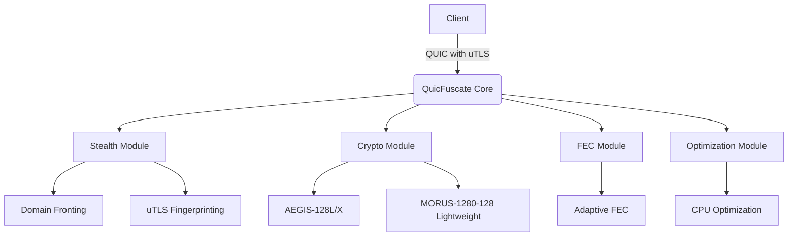
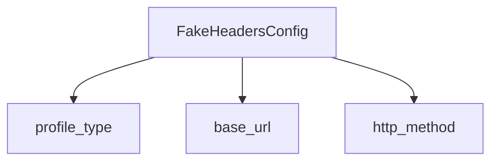
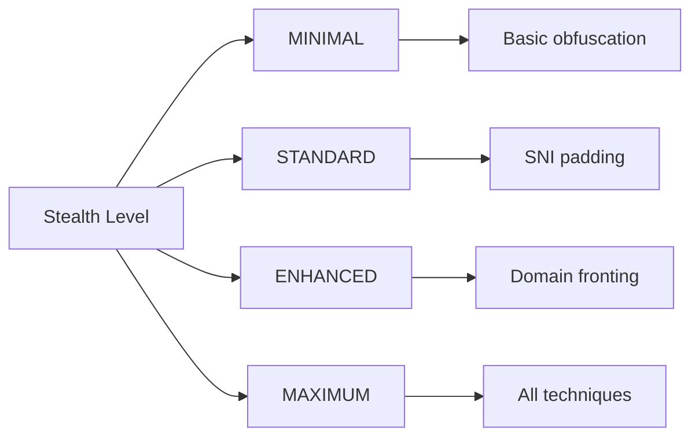
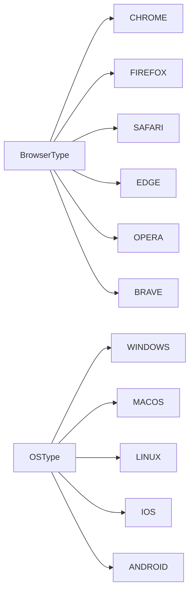
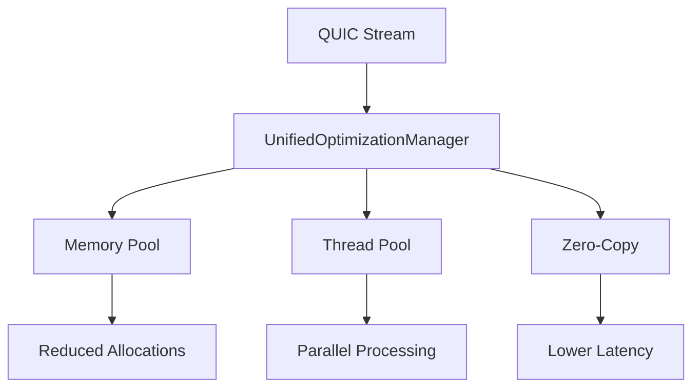
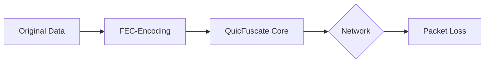
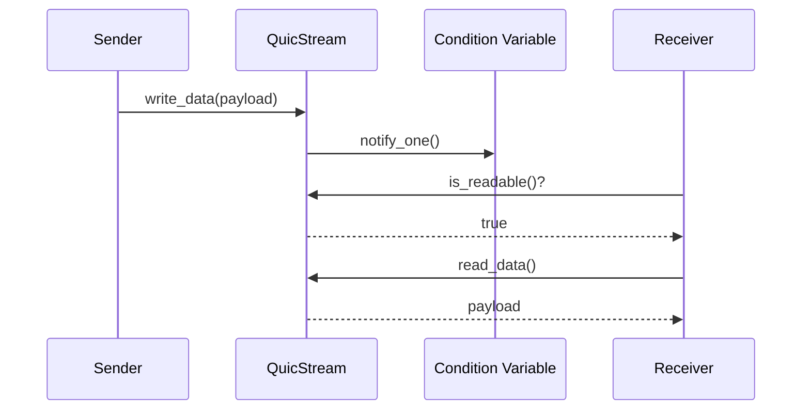

# QuicFuscate Technical Documentation

## Introduction
QuicFuscate is a high-performance VPN solution leveraging QUIC protocol with advanced obfuscation techniques. This document provides comprehensive technical documentation of the system architecture, modules, and implementation details in Rust.

## Architecture Overview


### Project Structure
```
QuicFuscate/
├── rust/
│   ├── core/
│   ├── crypto/
│   ├── fec/
│   ├── stealth/
│   └── cli/
├── docs/
│   └── DOCUMENTATION.md
├── libs/
│   └── patched_quiche/
└── ui/
    └── logo/
```

### Key Features
1. **Advanced QUIC Implementation**: Enhanced QUIC transport protocol with BBRv2 congestion control and XDP zero-copy optimization
2. **Comprehensive Stealth Capabilities**: 
   - DNS-over-HTTPS with browser profile emulation
   - Domain fronting and HTTP/3 masquerading
   - uTLS integration for TLS fingerprint spoofing
   - Anti-fingerprinting countermeasures
   - XOR-based traffic obfuscation
3. **High-Performance Cryptography**: 
   - AEGIS-128L/128X authenticated encryption with hardware acceleration
   - MORUS-1280-128 lightweight cryptography
   - Automatic cipher suite selection based on hardware capabilities
4. **Optimization Framework**: 
   - CPU feature detection (x86/x64 and ARM)
   - SIMD dispatching and operations
   - Memory pool configuration
   - Stream optimization
5. **Forward Error Correction**: SIMD-optimized FEC with adaptive redundancy and zero-copy operations
6. **Browser Emulation**: Comprehensive browser fingerprint profiles and TLS configurations
7. **Cross-Platform Support**: Support for multiple operating systems and architectures

### Error Handling
QuicFuscate uses a consistent error handling system defined in `core/error_handling.hpp`.
Functions that may fail return `Result<T>` where `T` is the successful value type.
Errors are created with the `MAKE_ERROR` macro and reported via `report_error` or the
convenience macro `REPORT_ERROR`. Example pattern:

```rust
fn do_something() -> Result<()> {
    if !precondition {
        let err = Error::new(ErrorCategory::RUNTIME, ErrorCode::INVALID_ARGUMENT, "precondition failed");
        report_error(err);
        return Err(err);
    }
    Ok(())
}
```

The `ErrorManager` singleton collects recent errors and prints them when logging is
enabled. Call `report_error()` whenever a recoverable error occurs.

## Module Documentation

### Core Module (`core/`)
Handles QUIC connection management with advanced features:
- **Connection Migration**: Seamless switching between network interfaces
- **BBRv2 Congestion Control**: Optimized for high throughput and low latency
- **XDP Zero-Copy**: Kernel bypass for maximum network performance
- **MTU Discovery**: Automatic packet size optimization

#### Cipher Suite Selector
Defined in `cipher_suite_selector.rs`:

```rust
pub struct CipherSuiteSelector {
    // Automatic selection of the best cipher suite
    pub select_best_cipher_suite(&self) -> CipherSuite {
        if self.has_vaes_support() { return CipherSuite::AEGIS_128X; }
        else if self.has_aes_support() { return CipherSuite::AEGIS_128L; }
        else { return CipherSuite::MORUS_1280_128; }
    }

    // Hardware detection
    pub has_vaes_support(&self) -> bool; // VAES-512 (AVX-512F + AVX-512BW)
    pub has_aes_support(&self) -> bool;  // AES-NI or ARM Crypto Extensions
}

// Usage
let selector = CipherSuiteSelector::new();
selector.encrypt(plaintext, len, key, nonce, ad, ad_len, ciphertext, tag);
```

**Selection Strategy:**
1. **AEGIS-128X**: With VAES-512 support (modern x86 CPUs)
2. **AEGIS-128L**: With AES-NI (x86) or ARM Crypto Extensions
3. **MORUS-1280-128**: Software fallback without hardware acceleration

#### Forward Error Correction (FEC) Module
Defined in `fec.rs`:

The QuicFuscate project implements **ASW-RLNC-X** (Adaptive Systematic Sliding-Window RLNC Extended), a highly adaptive Forward Error Correction scheme designed for real-time applications requiring low latency and high resilience against a wide range of packet loss patterns.

##### Architecture and Modes

The system dynamically adjusts redundancy and window sizes based on real-time network conditions. It uses a PID-controlled logic with hysteresis to seamlessly transition between six distinct operational modes.

| Mode   | Max Overhead | p_est Range     | Initial Window (W₀) | Max CPU Budget | Dynamic Window Adjustment        |
|:------:|:------------:|:---------------:|:-------------------:|:--------------:|:--------------------------------:|
| 0      | 0 %          | p < 1 %         | –                   | 0 %            | Pass-Through (No FEC)            |
| 1      | ≤ 5 %        | 1 % ≤ p < 5 %   | 16                  | ≤ 5 %          | W = clamp(8…32, W_prev·α_loss)   |
| 2      | ≤ 15 %       | 5 % ≤ p < 15 %  | 64                  | ≤ 10 %         | W = clamp(32…128, W_prev·α_loss) |
| 3      | ≤ 30 %       | 15 % ≤ p < 30 % | 128                 | ≤ 20 %         | W = clamp(64…256, W_prev·α_loss) |
| 4      | ≤ 50 %       | 30 % ≤ p < 50 % | 512                 | ≤ 40 %         | W = clamp(256…1024, W_prev·α_loss)|
| 5      | Unlimited    | p ≥ 50 %        | 1024                | ≤ 70 %         | Rateless, W ⭢ ∞ as needed      |

##### Core Concepts

1.  **Systematic Sliding-Window RLNC**: Transmits original (systematic) packets first, followed by repair packets generated from linear combinations of the source packets. This allows for immediate use of received data without waiting for a full block. Coefficients are generated from a Cauchy matrix to ensure minimal density and efficient decoding.

2.  **High-Performance Decoding**: Employs advanced, hardware-accelerated algorithms for matrix inversion:
    *   **Sparse Gaussian Elimination**: Operates on a highly-optimized Compressed-Sparse-Row (CSR) matrix representation. It includes an "Early Exit" mechanism to terminate decoding as soon as a solution is found, minimizing CPU usage.
    *   **Wiedemann Algorithm**: For larger windows (W > 256), the system seamlessly switches to a fully implemented Wiedemann algorithm. This includes a performant Lanczos iteration for sequence generation and a Berlekamp-Massey algorithm for minimal polynomial calculation, ensuring scalability and performance in high-loss scenarios.

3.  **Hyper-Adaptive Behavior**:
    *   **Loss Estimation**: Uses an exponential moving average combined with a short-term burst detector to react to both gradual and sudden changes in network quality.
    *   **Seamless Transitions**: Mode switches are cross-faded to prevent any disruption in service quality.
    *   **Emergency Override**: A sudden, high-loss spike triggers an immediate switch to the maximum recovery mode (Mode 5).

4.  **Hardware-Level Optimizations**:
    *   **SIMD Acceleration**: Galois Field (GF(2⁸)) arithmetic is heavily accelerated using AVX512/AVX2 on x86 (via `PCLMULQDQ` with full, correct polynomial reduction) and NEON (Crypto Extension PMULL) on ARM64.
    *   **Multi-Threading**: Tokio tasks are used to manage sliding windows, while Rayon is used for parallelizing bulk decoding operations.
    *   **Memory Management**: Pre-allocated memory pools are used for window matrices to avoid `malloc`/`free` overhead during runtime. NUMA-awareness ensures memory stays local to the processing CPU socket.

##### Rust Implementation Blueprint

```rust
pub enum Mode { Zero, Light, Normal, Medium, Strong, Extreme }

pub struct AdaptiveFec {
    estimator: LossEstimator,
    mode_mgr: ModeManager,
    encoder: Encoder,
    decoder: Decoder,
}

impl AdaptiveFec {
    pub fn new(config: &Config) -> Self;
    pub fn on_send(&mut self, pkt: &[u8]) -> Vec<Packet>;
    pub fn on_receive(&mut self, pkts: &[Packet]) -> Option<Vec<u8>>;
    pub fn report_loss(&mut self, lost: usize, total: usize);
}
```

#### QUIC Core Implementation
Defined in `quic_connection_impl.rs`:

```rust
pub struct QuicConnection {
    // Core components:
    pub quiche_conn: *mut quiche_conn, // QUIC connection handler
    pub bbr: BBRv2, // BBRv2 Congestion Control
    pub memory_pool: MemoryPool, // Zero-Copy memory management
    pub xdp_socket: XdpSocket, // XDP Zero-Copy Socket
    
    // Main functions:
    pub process_packet(&self, data: &[u8], len: usize);
    pub send_pending_packets(&self);
    pub update_state_periodic(&self);
}

// Usage
let conn = QuicConnection::new();
conn.process_packet(data, len);
conn.send_pending_packets();
```

**Key Components:**

#### QUIC Stream Implementation
Defined in `quic_stream_impl.rs`:

```rust
pub struct QuicStream {
    // Thread-safe data management:
    pub buffer_mutex: Mutex<()>,
    pub data_available_cv: ConditionVariable,
    pub buffer: Vec<u8>,
    pub closed: AtomicBool,
}

// Usage
let stream = QuicStream::new();
stream.write_data(data);
let read_data = stream.read_data();
```

#### uTLS Implementation (TLS Fingerprint Spoofing)
Defined in `stealth/uTLS.rs`:

```rust
pub struct UTLSImplementation {
    // Core components:
    pub browser_type: BrowserType, // Target browser (Chrome, Firefox, etc.)
    pub os: OperatingSystem,       // Target operating system
    pub fingerprint: BrowserFingerprint, // Browser fingerprint
    pub current_profile: FingerprintProfile, // Current configuration
}

// Usage
let utls = UTLSImplementation::new();
utls.configure_tls();
```

#### Domain Fronting Implementation
Defined in `stealth/DomainFronting.rs`:

```rust
pub struct SniHiding {
    // Core components:
    pub config: SniConfig, // Configuration for SNI obfuscation
    pub enabled_techniques: HashMap<SniTechnique, bool>, // Enabled techniques
}

// Usage
let domain_fronting = SniHiding::new();
domain_fronting.apply_sni_hidding();
```

#### QUIC Stream Implementation
Defined in `core/quic_stream_impl.rs`:

```rust
pub struct QuicStream {
    // Core components:
    pub buffer: Vec<u8>, // Data buffer
    pub buffer_mutex: Mutex<()>,     // Thread safety
    pub closed: AtomicBool, // Stream status
}

// Usage
let stream = QuicStream::new();
stream.write_data(data);
let read_data = stream.read_data();
```

#### Forward Error Correction (FEC) Module
Defined in `fec/FEC_Modul.rs`:

```rust
pub struct FECModule {
    // Core components:
    pub memory_pool: MemoryPool, // SIMD-optimized memory pool
    pub galois_field: GaloisField, // Galois field operations
    pub config: FECConfig, // Adaptive configuration

    // Main functions:
    pub encode_packet(&self, data: Vec<u8>) -> Vec<FECPacket>;
    pub decode(&self, packets: Vec<FECPacket>) -> Vec<u8>;
}

// Usage
let fec = FECModule::new();
let packets = fec.encode_packet(data);
let recovered = fec.decode(packets);
```

**Key Algorithms:**

1. **Galois Field Operations**:
```rust
pub struct GaloisField {
    // Table-based for maximum performance
    pub exp_table: [u8; 256],
    pub log_table: [u8; 256],
    pub mul_table: [[u8; 256]; 256],
    
    // SIMD-optimized multiplication:
    pub fn multiply_vector_scalar(&self, dst: &mut [u8], src: &[u8], scalar: u8) {
        #[cfg(target_feature = "neon")]
        {
            // ARM NEON implementation
        }
        #[cfg(any(target_feature = "sse2", target_feature = "avx"))]
        {
            // x86 AVX2/AVX512 implementation
        }
    }
}
```

2. **Adaptive Redundancy Calculation**:
```rust
pub fn calculate_current_redundancy(&self) -> f64 {
    // Calculation based on network metrics
    let loss_rate = self.network_metrics.packet_loss_rate();
    let latency = self.network_metrics.average_rtt();
    let throughput = self.network_metrics.current_throughput();
    
    // Apply adaptive logic
    if loss_rate > 0.05 {
        return 0.3; // Higher redundancy for higher loss rates
    } else {
        return 0.1; // Lower redundancy for lower loss rates
    }
}
```

#### Unified Optimization Framework
Defined in `optimize/unified_optimizations.rs`:

```rust
pub struct UnifiedOptimizationManager {
    // Core components:
    pub memory_pool: UnifiedMemoryPool, // SIMD-optimized memory
    pub thread_pool: UnifiedThreadPool, // Adaptive thread management
    pub zero_rtt: UnifiedZeroRTTManager, // Zero-RTT management

    // Main functions:
    pub configure(&self, config: UnifiedOptimizationConfig);
    pub get_performance_metrics(&self) -> PerformanceMetrics;
}

// Usage
let manager = UnifiedOptimizationManager::new();
manager.configure(config);
let metrics = manager.get_performance_metrics();
```
**Key Modules:**

1. **SIMD Dispatching**:
```rust
pub struct UnifiedSIMDDispatcher {
    pub dispatch<F>(func: F) -> Result<F::Output>
    where
        F: FnOnce(UnifiedSIMDPolicy) -> F::Output,
    {
        if UnifiedFeatureDetector::has_feature(CpuFeature::AVX512) {
            return func(UnifiedSIMDPolicy::<__m512i>());
        } else if UnifiedFeatureDetector::has_feature(CpuFeature::AVX2) {
            return func(UnifiedSIMDPolicy::<__m256i>());
        } else {
            return func(UnifiedSIMDPolicy::<__m128i>());
        }
    }
}

// Backward compatibility wrapper for legacy crypto modules
pub mod simd {
    pub struct FeatureDetector {
        pub instance() -> &'static FeatureDetector;
        pub has_feature(&self, feature: CpuFeature) -> bool;
    }
}
```

**Note**: Previously separate `simd_dispatch.hpp` and `simd_feature_detection.hpp` headers have been consolidated into this unified system for better maintainability and reduced code duplication.

### Command Line Interface (CLI)
The command-line client and server are implemented in the Rust crate `rust/cli`. It provides binaries `quicfuscate_client` and `quicfuscate_server` built with Cargo.

### Browser Fingerprinting
Defined in `stealth/browser_profiles/fingerprints/browser_fingerprint.rs`:

```rust
pub struct BrowserFingerprint {
    pub browser_type: BrowserType,
    pub os_type: OSType,
    pub user_agent: String,
}

impl BrowserFingerprint {
    pub fn new(browser_type: BrowserType, os_type: OSType, user_agent: String) -> Self {
        BrowserFingerprint {
            browser_type,
            os_type,
            user_agent,
        }
    }
    
    // Generates typical HTTP headers for the browser fingerprint
    pub fn generate_http_headers(&self) -> HashMap<String, String> {
        let mut headers = HashMap::new();
        headers.insert("User-Agent".to_string(), self.user_agent.clone());
        headers.insert("Accept".to_string(), "text/html,application/xhtml+xml,application/xml;q=0.9,image/webp,*/*;q=0.8".to_string());
        // ... other headers
        headers
    }
    
    // Generates TLS parameters for the browser fingerprint
    pub fn generate_tls_parameters(&self) -> HashMap<String, String> {
        let mut params = HashMap::new();
        params.insert("TLS-Version".to_string(), "TLS 1.3".to_string());
        params.insert("Cipher-Suites".to_string(), "TLS_AEGIS_128X_SHA256,TLS_AEGIS_128L_SHA384,TLS_MORUS_1280_128_SHA256".to_string());
        params
    }
}

// Usage
let fingerprint = BrowserFingerprint::new(BrowserType::Chrome, OSType::Windows, "Mozilla/5.0 (Windows NT 10.0; Win64; x64) AppleWebKit/537.36 (KHTML, like Gecko) Chrome/116.0.0.0 Safari/537.36".to_string());
let headers = fingerprint.generate_http_headers();
let tls_params = fingerprint.generate_tls_parameters();
```

**Key Features:**
1. **Browser and OS Typing**: 
   - Supports all major browsers (Chrome, Firefox, Safari, etc.)
   - Covers all common operating systems
2. **Header Generation**:
   - Creates realistic HTTP headers including:
     * User-Agent
     * Accept-Language
     * Accept-Encoding
     * Connection
3. **TLS Parameter Simulation**:
   - Uses project-specific ciphers (AEGIS, MORUS)
   - Emulates TLS 1.3 handshake characteristics
4. **Fingerprint Customization**:
   - Adjustable browser and OS types
### HTTP Header Spoofing
Defined in `stealth/browser_profiles/headers/FakeHeaders.rs`:

```rust
pub struct FakeHeaders {
    pub profile_type: HeaderProfileType,
    pub base_url: String,
    pub optimize_for_quic: bool,
    pub use_qpack_headers: bool,
    // ... other configuration options
}

impl FakeHeaders {
    pub fn new(config: FakeHeadersConfig) -> Self {
        FakeHeaders {
            profile_type: config.profile_type,
            base_url: config.base_url,
            optimize_for_quic: config.optimize_for_quic,
            use_qpack_headers: config.use_qpack_headers,
            // ... other fields
        }
    }
    
    pub fn inject_fake_headers(&self, packet: Vec<u8>) -> Vec<u8> {
        // Implementation to inject fake headers
    }
    
    pub fn generate_qpack_headers(&self) -> Vec<u8> {
        // Implementation to generate QPACK headers
    }
    // ... other methods
}

// Usage
let config = FakeHeadersConfig {
    profile_type: HeaderProfileType::CHROME_BROWSER,
    base_url: "https://example.com/".to_string(),
    optimize_for_quic: true,
    use_qpack_headers: true,
    // ... other options
};

let fake_headers = FakeHeaders::new(config);
let masked_packet = fake_headers.inject_fake_headers(packet);
```

**Key Functionality:**
1. **Header Profile System**:
   - 14 predefined profiles
   - Support for browsers, mobile apps and VPN protocols
   - Custom headers possible
2. **HTTP Version Support**:
   - Full support for HTTP/1.1, HTTP/2 and HTTP/3
   - Automatic generation of version-specific headers
3. **QPACK Integration**:
   - Native support for HTTP/3 Header Compression
   - Compression according to RFC 9204 specification
4. **Traffic Masking**:
   - Injection of realistic headers into data packets
   - Removal of headers on reception
   - QUIC-specific optimizations

**Configuration Options:**


### Stealth Governance
Defined in `stealth/stealth_gov.rs`:

```rust
pub struct StealthManager {
    pub stealth_level: StealthLevel,
    pub config: StealthConfig,
}

impl StealthManager {
    pub fn new(config: StealthConfig) -> Self {
        StealthManager {
            stealth_level: config.stealth_level,
            config,
        }
    }
    
    // Processes outgoing packets with stealth techniques
    pub fn process_outgoing_packet(&self, packet: Vec<u8>) -> Vec<Vec<u8>> {
        // Implementation to process outgoing packets
    }
    
    // Processes incoming packets
    pub fn process_incoming_packet(&self, packet: Vec<u8>) -> Vec<u8> {
        // Implementation to process incoming packets
    }
    
    // Handles TLS Client Hello packets
    pub fn process_client_hello(&self, client_hello: Vec<u8>) -> Vec<u8> {
        // Implementation to process Client Hello packets
    }
    
    // Obfuscates payload using XOR patterns
    pub fn obfuscate_payload(&self, payload: Vec<u8>, context_id: u64) -> Vec<u8> {
        // Implementation to obfuscate payload
    }
    
    // Manages QUIC path migration
    pub fn migrate_to_path(&self, path_id: String) -> bool {
        // Implementation to manage path migration
    }
}

// Usage
let config = StealthConfig {
    stealth_level: StealthLevel::ENHANCED,
    enable_path_migration: true,
    enable_xor_obfuscation: true,
    enable_quic_masquerading: true,
    // ... other configuration options
};

let manager = StealthManager::new(config);
let processed = manager.process_outgoing_packet(original_packet);
manager.migrate_to_path("cellular_backup");
```

**Key Components:**
1. **Stealth Level System**:
   - 4 levels from MINIMAL to MAXIMUM
   - Automatic configuration of all components based on level
2. **Packet Processing Pipeline**:
   - Special handling of TLS Client Hello packets
   - HTTP/3 masking for QUIC packets
   - Fragmentation and timing randomization
3. **XOR Obfuscation**:
   - Payload obfuscation with context-specific keys
   - Header value obfuscation
   - FEC metadata obfuscation
4. **Path Migration**:
   - Dynamic switching between network paths
   - Performance-based path selection
   - Load distribution across multiple connections

**Stealth Level Configuration:**


**Usage Example:**
```rust
// Configure maximum stealth
let config = StealthConfig {
    stealth_level: StealthLevel::MAXIMUM,
    ..Default::default()
};

let manager = StealthManager::new(config);

// Process outgoing packet
let processed = manager.process_outgoing_packet(original_packet);

// Migrate to better network path
manager.migrate_to_path("cellular_backup");
```

**Performance Metrics:**
- **Path Selection Algorithms**:
  - Bandwidth-optimized
  - Latency-optimized
  - Load-balanced
  - Random
- **Migration Thresholds**:
  - Max RTT: 200ms
  - Max Packet Loss: 5%
  - Min Bandwidth: 1000kbps
    A --> E[http_version]
    A --> F[randomize_header_order]
    A --> G[optimize_for_quic]
    A --> H[use_qpack_headers]
```

**Usage Example:**
```rust
// Configure for Chrome browser with HTTP/3
let config = FakeHeadersConfig {
    profile_type: HeaderProfileType::CHROME_BROWSER,
    http_version: HttpVersion::HTTP_3,
    ..Default::default()
};

let fake_headers = FakeHeaders::new(config);

// Inject headers into packet
let packet = get_original_packet();
let masked_packet = fake_headers.inject_fake_headers(packet);

// Remove headers on receive
let original = fake_headers.remove_fake_headers(masked_packet);
```

**QPACK Header Generation:**
```rust
fn generate_qpack_headers(&self) -> Vec<u8> {
    // Uses QPACK compression for HTTP/3
    // Implements RFC 9204 specifications
    // Returns optimized header block
}
```

**Detection Prevention:**
- Random header order
- Realistic values for Cache-Control and other headers
- Alt-Svc header for HTTP/3 upgrade simulation
- QUIC Transport Parameter Integration
- Custom user agent strings

**Supported Browser Profiles:**


**Usage Example:**
```rust
// Create Chrome on Windows fingerprint
let chrome_win = BrowserFingerprint::new(
    BrowserType::CHROME,
    OSType::WINDOWS,
    "Mozilla/5.0 (Windows NT 10.0; Win64; x64) AppleWebKit/537.36 (KHTML, like Gecko) Chrome/116.0.0.0 Safari/537.36".to_string(),
);

// Generate headers for connection
let headers = chrome_win.generate_http_headers();
let tls_params = chrome_win.generate_tls_parameters();
```

**Integration with uTLS:**
The generated TLS parameters are directly compatible with the uTLS implementation for seamless fingerprint spoofing.
    });
}

**Functionality:**
1. **Parameter processing**: Accepts host and port as input
2. **uTLS initialization**: Configures TLS fingerprinting with Chrome profile
3. **QUIC connection**:
   - Creates QuicConnection object
   - Establishes asynchronous connection to server
4. **Data transmission**:
   - Creates QUIC stream after successful connection
   - Sends "Hello uTLS!" message

**Usage:**
```bash
./quicfuscate_client <host> <port>
# Example:
./quicfuscate_client example.com 443
```

**Browser Emulation:**
Supported profiles in `stealth/uTLS.hpp`:
- `Chrome_Latest`
- `Firefox_Quantum`
- `Safari_MacOS`
- `Edge_Windows`
- `Tor_Browser`

**Error Handling:**
- Error code 1: uTLS initialization error
- Error code 2: Connection error
- Error code 3: Stream creation error
        auto block = free_blocks_[size_class].front();
        free_blocks_[size_class].pop();
        return block;
    }
    return MemoryBlock::new(class_to_size_[size_class]);
}
```

3. **Zero-Copy Buffer**:
```rust
pub struct ZeroCopyBuffer {
    pub send(&self, fd: i32) -> ssize_t {
        let msg = msghdr {
            msg_iov: self.iovecs.as_ptr(),
            msg_iovlen: self.iovecs.len() as libc::c_int,
            ..Default::default()
        };
        unsafe { libc::sendmsg(fd, &msg, self.flags) }
    }
}
```

**Configuration Parameters:**
```rust
pub struct UnifiedOptimizationConfig {
    // Memory settings
    pub memory_pool_size: usize,
    pub memory_block_size: usize,
    
    // Threading settings
    pub thread_pool_size: usize,
    
    // SIMD settings
    pub enable_simd: bool,
    
    // Zero-RTT settings
    pub enable_zero_rtt: bool,
}

impl Default for UnifiedOptimizationConfig {
    fn default() -> Self {
        UnifiedOptimizationConfig {
            memory_pool_size: 16 * 1024 * 1024,
            memory_block_size: 4096,
            thread_pool_size: num_cpus::get(),
            enable_simd: true,
            enable_zero_rtt: true,
        }
    }
}
```

**Performance Metrics:**
```rust
pub struct PerformanceMetrics {
    // Memory metrics
    pub memory_allocations: usize,
    pub fragmentation_percent: f64,
    
    // Threading metrics
    pub thread_efficiency: f64,
    
    // SIMD metrics
    pub simd_operations: usize,
    
    // Network metrics
    pub bandwidth_utilization: f64,
}

impl PerformanceMetrics {
    pub fn new() -> Self {
        PerformanceMetrics {
            memory_allocations: 0,
            fragmentation_percent: 0.0,
            thread_efficiency: 0.0,
            simd_operations: 0,
            bandwidth_utilization: 0.0,
        }
    }
}
```

**Usage Example:**


**BBRv2 Congestion Control:**
```rust
pub struct UnifiedBBRv2 {
    pub update(&mut self, rtt_us: u64, bandwidth_bps: f64) {
        // Update bandwidth estimation
        self.bandwidth_samples.push_back(bandwidth_bps);
        if self.bandwidth_samples.len() > self.params.bw_window_length {
            self.bandwidth_samples.pop_front();
        }
        
        // Update RTT estimation
        self.rtt_samples.push_back(rtt_us);
        if self.rtt_samples.len() > self.params.min_rtt_window_ms {
            self.rtt_samples.pop_front();
        }
        
        // State machine transitions
        match self.state {
            State::STARTUP => self.handle_startup(),
            State::DRAIN => self.handle_drain(),
            State::PROBE_BW => self.handle_probe_bw(),
            State::PROBE_RTT => self.handle_probe_rtt(),
        }
    }
}
```

**Burst Buffer Management:**
```rust
pub struct UnifiedBurstBuffer {
    pub burst_worker(&self) {
        while self.running {
            let burst_size = self.calculate_burst_size();
            let interval = self.calculate_burst_interval();
            
            std::thread::sleep(Duration::from_millis(interval as u64));
            
            let mut data_to_send = Vec::new();
            {
                let mut lock = self.buffer_mutex.lock().unwrap();
                if self.buffer.len() >= burst_size {
                    data_to_send = std::mem::take(&mut self.buffer);
                }
            }
            
            if !data_to_send.is_empty() && self.send_callback.is_some() {
                if let Some(callback) = &self.send_callback {
                    callback(data_to_send.as_ptr(), data_to_send.len() as u32);
                }
            }
        }
    }
}
```
**Key Algorithms:**

1. **Galois Field Operations**:
```rust
pub struct GaloisField {
    // Table-based for maximum performance
    pub exp_table: [u8; 256],
    pub log_table: [u8; 256],
    pub mul_table: [[u8; 256]; 256],
    
    // SIMD-optimized multiplication:
    pub fn multiply_vector_scalar(&self, dst: &mut [u8], src: &[u8], scalar: u8) {
        #[cfg(target_feature = "neon")]
        {
            // ARM NEON implementation
        }
        #[cfg(any(target_feature = "sse2", target_feature = "avx"))]
        {
            // x86 AVX2/AVX512 implementation
        }
    }
}
```

2. **Adaptive Redundancy Calculation**:
```rust
fn calculate_current_redundancy(&self) -> f64 {
    match self.config.redundancy_mode {
        RedundancyMode::ADAPTIVE_ADVANCED => {
            return self.network_metrics.calculate_redundancy();
        }
        // ... other modes
    }
}
```

3. **Packet Encoding**:
```rust
fn encode_packet(&self, data: &[u8]) -> Vec<FECPacket> {
    // Generate repair packets based on network metrics
    let repair_count = (self.calculate_current_redundancy() as usize).ceil();
    let mut encoded_packets = Vec::new();
    for i in 0..repair_count {
        // Galois field multiplication for FEC data
        self.galois_field.multiply_vector_scalar(repair_data, data, coefficient);
        encoded_packets.push(FECPacket {
            type: PacketType::REPAIR,
            data: repair_data.clone(),
            coding_coefficients: self.generate_coding_coefficients(i),
        });
    }
    encoded_packets
}
```

**Configuration Parameters:**
```rust
pub struct FecConfig {
    pub lambda: f32,
    pub burst_window: usize,
    pub hysteresis: f32,
    pub pid: PidConfig,
    pub initial_mode: FecMode,
    pub kalman_enabled: bool,
    pub kalman_q: f32,
    pub kalman_r: f32,
    pub window_sizes: HashMap<FecMode, usize>,
}

impl Default for FecConfig {
    fn default() -> Self {
        FecConfig {
            lambda: 0.1,
            burst_window: 20,
            hysteresis: 0.01,
            pid: PidConfig { kp: 0.5, ki: 0.1, kd: 0.2 },
            initial_mode: FecMode::Zero,
            kalman_enabled: false,
            kalman_q: 0.001,
            kalman_r: 0.01,
            window_sizes: FecConfig::default_windows(),
        }
    }
}
```

* **`lambda`** – Smoothing factor for the loss estimator's exponential moving average.
* **`burst_window`** – Number of recent packets tracked for burst loss detection.
* **`hysteresis`** – Threshold to avoid rapid mode switching when loss fluctuates around a boundary.
* **`pid`** – Proportional–Integral–Derivative controller settings for mode adjustments.
* **`initial_mode`** – FEC mode used on startup before feedback is available.
* **`kalman_enabled`**, **`kalman_q`**, **`kalman_r`** – Parameters for an optional Kalman filter applied to the loss estimate.
* **`window_sizes`** – Mapping of `FecMode` to its baseline sliding‑window size.

**Performance Optimizations:**
- SIMD-accelerated Galois field operations (NEON/AVX2/AVX512)
- Memory pool with 64-byte alignment for cache optimization
- Lock-free data structures for parallel processing
- Adaptive redundancy based on network metrics:
  - Packet loss rate
  - Latency
  - Throughput
  - Jitter

**Usage Example:**


**Stealth Integration:**
- Random timing variations for traffic patterns
- Dynamic redundancy adaptation for obfuscation
- Support for stealth mode

**Performance Metrics:**
```rust
pub struct Statistics {
    pub packets_encoded: usize,
    pub packets_decoded: usize,
    pub packets_recovered: usize,
    pub repair_packets_generated: usize,
    pub total_bytes_processed: usize,
    pub current_redundancy_ratio: f64,
    pub simd_operations: usize,
    pub scalar_fallbacks: usize,
}

impl Default for Statistics {
    fn default() -> Self {
        Statistics {
            packets_encoded: 0,
            packets_decoded: 0,
            packets_recovered: 0,
            repair_packets_generated: 0,
            total_bytes_processed: 0,
            current_redundancy_ratio: 0.0,
            simd_operations: 0,
            scalar_fallbacks: 0,
        }
    }
}
```
   // Main functions:
   bool write_data(&self, data: &[u8]) -> bool;
   Vec<u8> read_data(&self) -> Vec<u8>;
   bool is_readable(&self) -> bool;
}

**Key Features:**

1. **Data Writing**:
```rust
fn write_data(&self, data: &[u8]) -> bool {
    let mut lock = self.buffer_mutex.lock().unwrap();
    self.buffer.extend_from_slice(data);
    self.bytes_sent.fetch_add(data.len() as u64, Ordering::SeqCst);
    self.data_available_cv.notify_one();
    true
}
```
- Thread-safe write access with Mutex
- Notification of waiting readers

2. **Data Reading**:
```rust
fn read_data(&self) -> Vec<u8> {
    let mut lock = self.buffer_mutex.lock().unwrap();
    let data = std::mem::take(&mut self.buffer);
    self.bytes_received.fetch_add(data.len() as u64, Ordering::SeqCst);
    data
}
```
- Move semantics for efficient data transfer
- Automatic buffer clearing after read operation

3. **Readability Check**: 
```rust
fn is_readable(&self) -> bool {
    let lock = self.buffer_mutex.lock().unwrap();
    !self.buffer.is_empty() && !self.closed.load(Ordering::SeqCst)
}
```
- Thread-safe status query
- Const-cast for mutex in const method (acceptable compromise)

**Design Features:**
- Atomic operations for performance optimization
- Condition variable for efficient notification
- Move semantics to avoid data copies
- RAII mutex locks for exception safety

**Application Example:**


**Performance Optimizations:**
- Lock-Guards with minimal scope
- Atomic counters instead of mutex for statistics
- Move semantics instead of copying large data
- Separate condition variable for blocking reads
    std::vector<uint8_t> process_client_hello(const std::vector<uint8_t>& client_hello);
    std::vector<uint8_t> modify_sni(const std::vector<uint8_t>& client_hello, const std::string& new_sni);
    std::string apply_domain_fronting(const std::string& http_headers);
};

// Usage
let sni_hidding = SniHidding::new();
let modified_client_hello = sni_hidding.process_client_hello(client_hello);
let new_sni = sni_hidding.modify_sni(client_hello, "new_sni.example.com");
let modified_headers = sni_hidding.apply_domain_fronting(http_headers);

## Production Configuration
When deploying QuicFuscate in a production environment you should expose the
telemetry endpoint and adjust resource limits:

- Run `telemetry::serve("0.0.0.0:9898")` and scrape this endpoint with
  Prometheus.
- Increase the `MemoryPool` capacity to match expected traffic volume.
- Configure a reliable DoH provider in `StealthConfig` for consistent DNS
  resolution.
- Use `FecConfig::from_file` to tune window sizes and PID constants for your
  network conditions.
