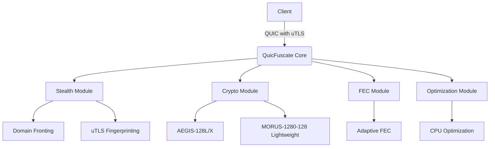
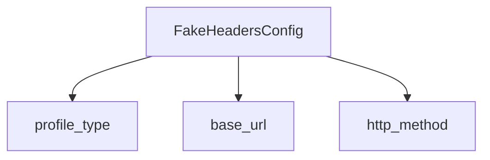
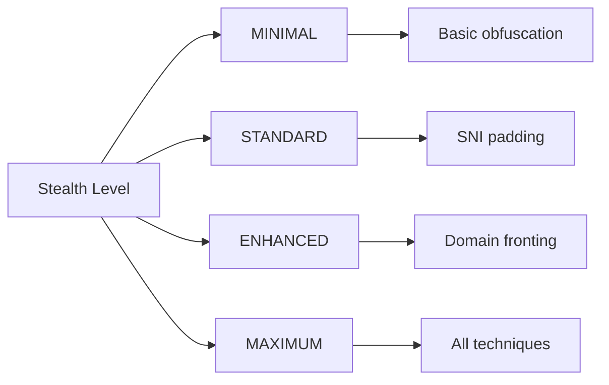
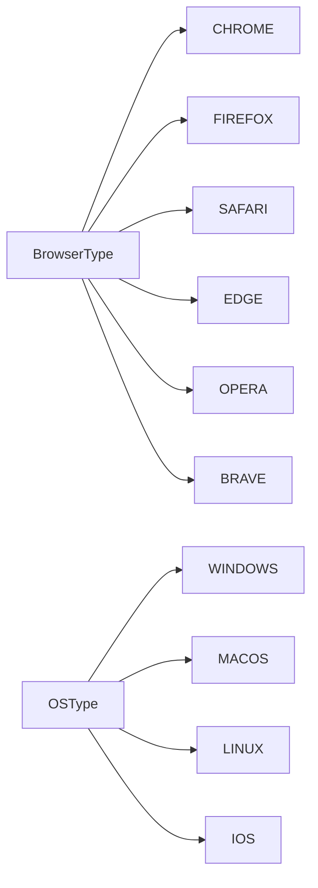
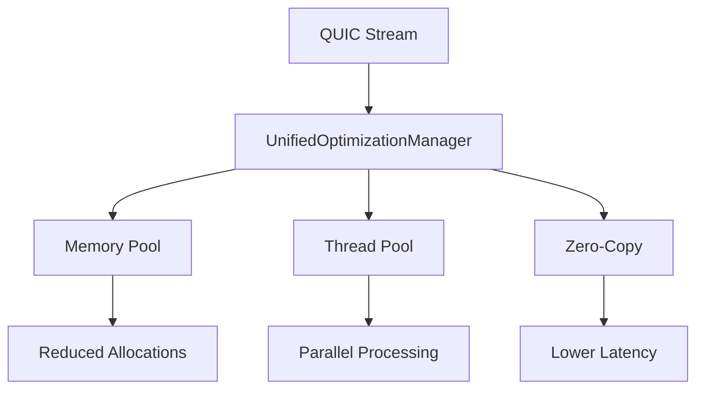
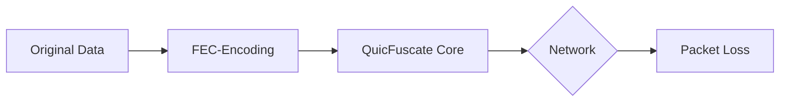
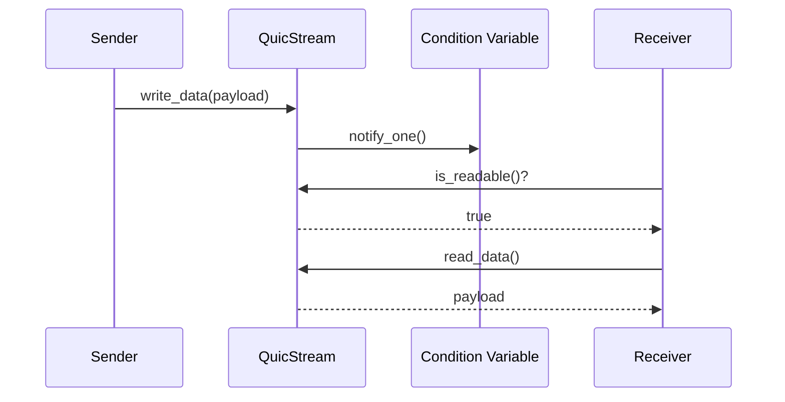

# QuicFuscate Technical Documentation

## Introduction & Purpose
QuicFuscate aims to deliver a state-of-the-art VPN protocol that maximizes efficiency and performance while remaining exceptionally resilient against network censorship. By fusing modern transport, cryptography, forward error correction (FEC), and coherent stealth techniques, the system enables reliable, high-throughput connectivity under adversarial conditions. The project supports democratic values by facilitating open access to information and freedom of speech.

This document provides comprehensive technical documentation of the system architecture, modules, and implementation details in Rust.

### Architecture at a Glance
- Monolithic Rust crate with consolidated modules: `src/core.rs` (QUIC I/O and session), `src/crypto.rs` (AEAD and handshake glue), `src/fec.rs` (encoder/decoder/adaptive/GF tables inline), `src/stealth.rs` (DoH, HTTP/3 masquerading, FakeTLS, domain fronting, QPACK helpers)
- Curated browser fingerprints stored in `src/browser_profiles/*.chlo` (preferred; fallback: `browser_profiles/`)
- Unified configuration via `docs/example_config.toml`; environment overrides through `QUICFUSCATE_*`
- Modular script-based architecture with dedicated scripts for each functionality
- Organized script directories: `scripts/Build/`, `scripts/Benchmarks/`, `scripts/Audits/`, `scripts/Tests/`, `scripts/Utils/`
- Individual scripts for specific tasks: build management, benchmarking, testing, auditing, and utilities

### Cohesive Stealth Stack (Hard to Classify)
All stealth components share one active browser/OS profile for coherence. The active profile can be rotated on an interval using `--profile-seq` and `--profile-interval`:
- TLS: ClientHello layout, extensions, and cipher preferences mirror real browsers (uTLS) or are replayed via curated `.chlo` artifacts (FakeTLS)
- HTTP/3/QPACK: ALPN, header sets, and framing align with common web traffic patterns
- Domain Fronting: decouples visible SNI from origin; rotations across vetted front domains diversify exposure
- DoH and XOR Obfuscation: hides DNS lookups and disrupts payload regularity post‑encryption
This unity yields a homogeneous, believable fingerprint that remains difficult to reliably classify by DPI systems.

### Performance Architecture & Hardware Dispatch
- Centralized CPU feature detection selects optimal code paths at runtime (x86: SSE2/AVX2/AVX‑512; ARM: NEON), with safe scalar fallbacks
- Zero‑copy memory pool with tunables (`--pool-capacity`, `--pool-block`) minimizes allocations and cache misses
- Batched processing keeps hot loops in cache and amortizes per‑packet overheads
- Optional XDP Fast Path (AF_XDP) reduces kernel overhead on supported Linux systems
- Telemetry counters and gauges expose throughput, latency, and repair effectiveness for tuning

### Cryptography Design (AEAD‑First, Efficient by Construction)
- AEAD choices: AEGIS‑128L/X (round‑based, excellent on AES‑NI/VAES) and MORUS‑1280‑128 (lightweight, high‑throughput on wide SIMD)
- Constant‑time glue and strict nonce/tag checks on hot paths
- Perfect Forward Secrecy via ephemeral X25519; optional post‑quantum experiments can be gated behind feature flags
- Runtime dispatcher selects the AEAD implementation best suited to the host CPU for maximum practical Gbps

### FEC Design (Stability Under Loss)
- Adaptive RLNC, sliding‑window, systematic: intact data packets plus on‑demand repairs
- Window policy: repairs emit only on a full window and the window is cleared after emission to bound latency and memory
- GF arithmetic kernels: bit‑sliced GF(2^8) and GF(2^16) with SIMD acceleration where available; consistent byte‑width policy across encoder/decoder
- Decoder: sparse elimination and early‑repair paths reduce recovery latency
- Adaptation targets loss/RTT to balance overhead with delivery probability, delivering stability on lossy/high‑jitter paths

### Origins & Rewrite
QuicFuscate originated as a C++ prototype and underwent a complete rewrite and extensive refactoring in Rust. The consolidated layout improves safety, performance, and maintainability while keeping hot paths explicit and auditable.

### Governance and Task Tracking
- Cross-cutting engineering principles and policies: see “Governance (Canonical)”.
- Authoritative task tracker: see “Open Issues (Curated)”.
- Changelog of all changes: `docs/Changelog.md`.
- Contributions: see `CONTRIBUTING.md` for guidelines and PR requirements.
- **Stealth Module Compile Reliability**: Recent changes improved reliability by simplifying the XOR obfuscator to a portable scalar implementation, correcting HTTP/3 header handling to the current quiche API (retaining the `quiche::h3::NameValue` trait where header accessors are used in `stealth.rs`, and removing an unused import from `core.rs`), and eliminating an unused TLS cipher mapping helper.

## Documentation Index (Aggregated)
This section aggregates technical documentation and READMEs living under `docs/`. It does not cover the GitHub root README.

Consolidated here (original standalone files will be removed):
- Usage and Suite Quickstart — see “Usage”
- Governance and Deterministic Workflow — see “Governance (Canonical)”
- Quiche Integration and Maintenance — see “Quiche Dependency Management”
- Quiche Workflow and Patches — see “Workflow & Patches”
- Example Configuration — see “Example Configuration (TOML)”
- Open Issues (curated) — see “Open Issues (Curated)”
- Changelog remains separate: `docs/Changelog.md`

---
## Usage

### Script-Based Operations
Execute specific functionality using dedicated scripts organized in purpose-built directories:

Common examples:
```bash
./scripts/Build/build-quiche-and-check.sh
./scripts/Tests/tests-comprehensive-runner.sh
./scripts/Utils/e2e-verify-all.sh
```

Each script is self-contained and handles specific functionality. Scripts can be combined for complex workflows or executed individually for targeted operations. Use environment variables like `QUICFUSCATE_BROWSER` and `QUICFUSCATE_OS` to override the active fingerprint profile.

All scripts include built-in help and usage information accessible via the `--help` flag.

### Scripts Reference (Authoritative)
This is the complete, categorized list of available scripts. Release artifacts produced by release scripts are written to `releases/<timestamp>/`.

#### Build (`scripts/Build/`)
- `build-cargo-tree-features.sh` — Show feature tree for Cargo dependencies
- `build-clean-target.sh` — Clean the Cargo `target/` directory safely
- `build-clippy-fix.sh` — Run Clippy with auto-fixes where possible
- `build-doc-open.sh` — Build and open Rust documentation locally
- `build-fmt-apply.sh` — Apply `cargo fmt` formatting
- `build-fmt-check.sh` — Check formatting without applying changes
- `build-list-binaries.sh` — List compiled binaries in the workspace
- `build-quiche-and-check.sh` — Fetch/patch/build patched quiche and `cargo check`
- `build-quiche-rebuild-and-test.sh` — Rebuild patched quiche and run tests
- `build-release-cross-platform.sh` — Build cross-platform release set
- `build-release-macos-arm.sh` — Build macOS (arm64) release
- `build-release-macos-only.sh` — Build macOS (arm64, amd64) releases
- `build-target-size.sh` — Report target binary sizes
- `build-toolchain-versions.sh` — Print toolchain versions (rustc, cargo, etc.)
- `env-doctor.sh` — Environment diagnostics for build prerequisites

#### Tests (`scripts/Tests/`)
- `tests-advanced-with-optional-fuzz.sh` — Advanced test suite with optional fuzz stages
- `tests-all-release.sh` — Run all tests in release mode
- `tests-comprehensive-runner.sh` — Comprehensive test runner (unit + integration)

#### Benchmarks (`scripts/Benchmarks/`)
- `bench-build-release.sh` — Build benchmarks in release mode
- `bench-crypto-advanced.sh` — Advanced crypto benchmark runs
- `bench-crypto-export-json.sh` — Export crypto benchmark results as JSON
- `bench-crypto-quick.sh` — Quick crypto benchmark smoke test
- `bench-fec-advanced.sh` — Advanced FEC benchmark
- `bench-fec-normal.sh` — Standard FEC benchmark
- `bench-fec-quick-smoke.sh` — Quick FEC smoke test
- `bench-net-advanced.sh` — Advanced network benchmark
- `bench-net-export-json.sh` — Export network benchmark results as JSON
- `bench-net-quick.sh` — Quick network benchmark smoke test
- `bench-performance-comprehensive.sh` — Comprehensive performance suite
- `bench-pool-advanced.sh` — Advanced memory pool benchmark
- `bench-pool-export-json.sh` — Export pool benchmark results as JSON
- `bench-pool-quick.sh` — Quick pool benchmark smoke test

#### Audits (`scripts/Audits/`)
- `audit-clippy-comprehensive.sh` — Comprehensive Clippy checks
- `audit-code-quality-comprehensive.sh` — Code quality checks
- `audit-dependency-cargo-audit.sh` — Dependency vulnerability audit
- `audit-policy-cargo-deny.sh` — Policy/licensing audit via cargo-deny
- `audit-static-hardening.sh` — Static hardening checks
- `audit-unsafe-usage.sh` — Detect and report `unsafe` usage

#### Utils (`scripts/Utils/`)
- `e2e-decode-all-profiles.sh` — Decode all `.chlo` browser profiles
- `e2e-verify-all.sh` — Verify all profiles against `.sha256` sidecars
- `e2e-verify-current.sh` — Verify active profile (via `QUICFUSCATE_BROWSER`/`QUICFUSCATE_OS`)
- `tls-diff-profiles.sh` — Diff two TLS profiles
- `tls-export-active-profile.sh` — Export active TLS profile
- `tls-generate-sha256-sidecars.sh` — Generate `.sha256` sidecars for profiles
- `tls-list-profiles.sh` — List available TLS profiles
- `tls-profile-head.sh` — Show profile head/metadata
- `tls-show-active-env.sh` — Show active TLS env selection
- `upstream-endpoint-smoke.sh` — Smoke test upstream quiche server/client
- `upstream-gen-certs.sh` — Generate example TLS certs (OpenSSL)
- `upstream-generate-fuzz-seeds.sh` — Generate fuzz seeds via upstream examples
- `utils-project-cleanup.sh` — Project cleanup (artifacts/caches) without touching sources

<!-- Legacy Scenarios section removed: consolidated and no longer exposed in the TUI -->

#### Benchmarking Scripts
Performance measurements are handled by dedicated benchmark scripts in the `scripts/Benchmarks/` directory. Each script focuses on specific performance aspects:

**FEC Benchmarking** (`./scripts/Benchmarks/bench-fec-normal.sh`):
- Automated release build when needed
- Sequential vs parallel FEC performance comparison
- Configurable via environment variables (`QUICFUSCATE_FEC_PARALLEL=0/1`)
- Reports elapsed time and packets-per-second (PPS) metrics
- Supports JSON output for downstream analysis

**Crypto Benchmarking** (`./scripts/Benchmarks/bench-crypto-quick.sh`):
- AEAD cipher performance testing
- Hardware acceleration validation
- Runtime dispatcher efficiency measurement

**Network Benchmarking** (`./scripts/Benchmarks/bench-net-quick.sh`):
- Throughput and latency measurements
- XDP fast path performance validation
- Memory pool efficiency testing

**Performance Benchmarking** (`./scripts/Benchmarks/bench-performance-comprehensive.sh`):
- Comprehensive performance suite combining all benchmark types
- Automated build and test execution
- Detailed performance reporting with timestamps
- Cross-platform compatibility testing

All benchmark scripts support advanced profiling with CPU and memory usage tracking when system tools are available (`time`, `gtime`). Use `--help` with any benchmark script for detailed usage information and available options.
 Maintenance: Parallel repair emission uses Rayon with explicit trait imports; this is a compile-time hygiene fix with no behavioral changes.

 Capability probe & feature gating:
 The internal bench subcommands are compiled behind the Cargo feature `benches`. Production builds typically disable this feature to exclude benchmark code. The Suite probes a hidden CLI subcommand `capabilities` on startup to detect which benches are available and disables the corresponding menu entries if unavailable. This ensures a clean production binary and a robust developer experience when `--features benches` is used.
 
 Implementation note: Each benchmark script includes built-in capability detection and graceful fallback mechanisms. Scripts automatically detect available system tools and adjust their behavior accordingly.

#### Environment-driven benchmark controls
Benchmark scripts support environment variables for configuration and testing:
- `QUICFUSCATE_FEC_PARALLEL`: Control FEC parallelization (0=sequential, 1=parallel)
- `QUICFUSCATE_BENCHMARK_TIMEOUT`: Override benchmark timeout (default: 300 seconds)
- `QUICFUSCATE_BENCHMARK_JSON`: Enable JSON output format for downstream processing
- `QUICFUSCATE_BENCHMARK_VERBOSE`: Enable verbose output and debugging information
Scripts include built-in validation and will report capability limitations or missing dependencies.

#### Script Organization

Scripts are organized in a clear directory structure under `scripts/`:
- **scripts/Build/**: Build management and compilation scripts including cross-platform builds
- **scripts/Benchmarks/**: Performance measurement and testing scripts
- **scripts/Audits/**: Security auditing, static analysis, and code quality scripts
- **scripts/Tests/**: Unit, integration, and end-to-end testing scripts
- **scripts/Utils/**: Utility scripts for maintenance and setup

Each directory contains focused, single-purpose scripts with consistent naming conventions and built-in help documentation. All scripts support `--help` for usage information and include comprehensive error handling.

#### Upstream Utilities
Upstream quiche utilities are available through dedicated scripts in the `scripts/Utils/` directory. These scripts integrate commonly used upstream quiche functionality:

- **Certificate Generation** (`./scripts/Utils/upstream-gen-certs.sh`) — Replicates `quiche/examples/gen-certs.sh` using OpenSSL directly under `libs/{patched,vanilla}_quiche/quiche/examples/`. Produces `cert.crt`, `cert.key`, and `cert-big.crt` and verifies the chain.
- **Fuzz Seed Generation** (`./scripts/Utils/upstream-generate-fuzz-seeds.sh`) — Builds `quiche_apps`, runs the example server/client locally to dump `.pkt` traces into `fuzz/corpus/packet_recv_{client,server}/seed`, and minimizes corpora using `cargo +nightly fuzz cmin` when available.
- **Endpoint Smoke Testing** (`./scripts/Utils/upstream-endpoint-smoke.sh`) — Starts the upstream example server with generated certs, performs a simple GET via `quiche-client`, then terminates the server and provides log output and downloaded artifacts.
- **Project Cleanup** (`./scripts/Utils/utils-project-cleanup.sh`) — Comprehensive cleanup utility that removes build artifacts, temporary files, and caches while preserving source code and configuration files.

  **Notes:**
  - Source resolution prefers `libs/patched_quiche`, falling back to `libs/vanilla_quiche`
  - All scripts are deterministic and offline-first
  - Each script includes comprehensive error handling and status reporting

### Building Platform Binaries (macOS, Linux, Windows)

Build platform-specific binaries using dedicated build scripts in the `scripts/Build/` directory:

- **macOS Builds**: `./scripts/Build/build-release-macos-only.sh` (arm64, amd64)
- **Linux Builds**: `./scripts/Build/build-release-cross-platform.sh` (amd64, arm64; optional Debian packaging when supported)
- **Windows Builds**: `./scripts/Build/build-release-cross-platform.sh` (amd64, arm64)
- **Cross-platform Release**: `./scripts/Build/build-release-cross-platform.sh`

Artifacts are written to `releases/`:
- `quicfuscate_darwin_{arm64,amd64}` (macOS)
- `quicfuscate_linux_{amd64,arm64}` and Debian packages `quicfuscate_<version>_{amd64,arm64}.deb` (optional)
- `quicfuscate_windows_{amd64,arm64}.exe`

**Build Features:**
- Cross-compilation uses Rust with `cargo` for all target platforms
- Debian packages assembled using standard `ar`/`tar` when available
- Comprehensive error handling and build verification
- Automatic dependency detection and installation
- Build artifact checksums and validation

**Example Usage:**

```bash
# Build for current platform
./scripts/Build/build-release-macos-only.sh

# Cross-platform release build
./scripts/Build/build-release-cross-platform.sh

# Build for all platforms
./scripts/Build/build-release-cross-platform.sh

# Build specific platform
./scripts/Build/build-release-cross-platform.sh

```


#### TLS Profile Sidecars (Generating & Verifying)
To make E2E TLS checks deterministic, each base64-encoded ClientHello profile (`.chlo`) has a companion SHA‑256 sidecar (`.sha256`). Use the utility scripts to manage these files:

- Generate sidecars: `./scripts/Utils/tls-generate-sha256-sidecars.sh`
- Verify all profiles: `./scripts/Utils/e2e-verify-all.sh`

Tool detection and portability
- Base64: The utilities auto-detect the correct decode flag at runtime (GNU `base64 -d`; BSD/macOS `base64 -D`) and always read input via stdin for consistent behavior across shells.
- Hashing: Uses `shasum -a 256` when available, otherwise `sha256sum`. Only the first whitespace-delimited field (hex digest) is compared.
- Locations: Profiles are discovered under `src/browser_profiles/` (preferred) and `browser_profiles/` (fallback). Sidecars are written next to the profiles.

Tips
- Use `./scripts/Utils/e2e-verify-current.sh` to validate only the active profile, selected via `QUICFUSCATE_BROWSER` and `QUICFUSCATE_OS`.
- The decode/verify helpers operate locally and do not perform any network I/O.

### Client

```
quicfuscate client \
  --remote 203.0.113.1:4433 \
  --local 127.0.0.1:1080 \
  --profile chrome \
  --front-domain cdn.example.com \
  --verify-peer \
  --config ./docs/example_config.toml
```

Telemetry metrics are disabled by default. Launch the binary with `--telemetry` to expose Prometheus statistics on `0.0.0.0:9898`.

### Server

```
quicfuscate server \
  --listen 0.0.0.0:4433 \
  --cert ./server.crt \
  --key ./server.key \
  --profile firefox \
  --config ./docs/example_config.toml
```

Ensure certificate and key are valid PEM files. Use `CTRL+C` to gracefully stop the process.

Use the `--config` flag to load a unified TOML file containing FEC, stealth and optimization settings. See the section "Example Configuration (TOML)" for details.

### Stealth Options

```
    --front-domain <d>     Domain used for fronting (repeatable)
    --doh-provider <url>   Custom DNS-over-HTTPS resolver
    --verify-peer          Validate the server certificate
    --ca-file <path>       CA file for verification
    --disable-doh          Disable DNS over HTTPS
    --disable-fronting     Disable domain fronting
    --disable-xor          Disable XOR obfuscation
    --disable-http3        Disable HTTP/3 masquerading
    --no-utls              Use native TLS instead of uTLS
    --debug-tls            Dump TLS keys for debugging
    --list-fingerprints    Show available browser fingerprints
    --profile-seq <list>   Comma-separated browser:os entries to cycle (e.g., chrome:windows,firefox:linux)
    --profile-interval <s> Interval in seconds for profile switching
```

Profile rotation allows QuicFuscate to periodically switch the active browser/OS fingerprint to diversify observable characteristics on the wire.

### Real TLS Fingerprints

When built against the patched `quiche` library, QuicFuscate can replay captured TLS ClientHello messages. Store the base64 encoded handshake in `src/browser_profiles/<browser>_<os>.chlo` (preferred; fallback: top-level `browser_profiles/`) and build with `QUICHE_PATH` pointing to the patched sources. The runtime loads the file, feeds the bytes to `ChloBuilder` and attaches it to the configuration:
```bash
./scripts/Build/build-quiche-and-check.sh
# Alternative: use dedicated scripts directly
./scripts/Tests/tests-all-release.sh
./scripts/Build/build-fmt-check.sh
# Or use individual scripts:
./scripts/Benchmarks/bench-performance-comprehensive.sh --help
./scripts/Build/build-release-macos-only.sh --help
./scripts/Tests/tests-comprehensive-runner.sh --help
./scripts/Audits/audit-clippy-comprehensive.sh --help
```

The runtime automatically loads the matching profile based on the selected `--profile` and `--os` options.

### FakeTLS Handshake

When stealth mode is active, QuicFuscate emits a trimmed TLS handshake. The ClientHello is derived from the active fingerprint profile while the ServerHello and certificate are synthesized. Message lengths are kept shorter than a real handshake for quicker startup.

To force FakeTLS via the configuration file add:

```toml
[stealth]
use_fake_tls = true
```

Custom handshakes can be generated programmatically:

```rust
use quicfuscate::fake_tls::{
    ClientHelloParams, FakeTls, ServerHelloParams,
};

let hello = FakeTls::client_hello_custom(ClientHelloParams {
    tls_version: 0x0303,
    cipher_suites: &[0x1301],
    extensions: &[],
});
let response = FakeTls::server_response_custom(
    ServerHelloParams {
        tls_version: 0x0303,
        cipher_suite: 0x1301,
        extensions: &[],
    },
    b"cert",
);
let full = FakeTls::handshake_custom_with_cert(
    ClientHelloParams {
        tls_version: 0x0303,
        cipher_suites: &[0x1301],
        extensions: &[],
    },
    ServerHelloParams {
        tls_version: 0x0303,
        cipher_suite: 0x1301,
        extensions: &[],
    },
    b"cert",
);
```

### Optimization Parameters

Both client and server accept additional flags to tune the memory pool used for zero-copy buffers:

```
    --pool-capacity <num>    Number of blocks to keep in the pool (default: 1024)
    --pool-block <bytes>     Size of each block in bytes (default: 4096)
```

Increase the capacity when handling high traffic volumes or decrease it to save memory.

### Example Configuration (Full)

For a complete, commented configuration file that covers all sections and defaults, see `docs/example_config.toml`.

### Environment Variable Overrides

At runtime you can override selected stealth options without changing the config file. The following variables are recognized (case-insensitive values where applicable):

- `QUICFUSCATE_BROWSER`: `chrome|firefox|safari|edge|opera|brave`
- `QUICFUSCATE_OS`: `windows|linux|macos|ios`
- `QUICFUSCATE_USE_FAKE_TLS`: `0|1|true|false`
- `QUICFUSCATE_DOH`: `0|1|true|false`
- `QUICFUSCATE_DOH_PROVIDER`: URL
- `QUICFUSCATE_FRONTING`: `0|1|true|false`
- `QUICFUSCATE_QPACK`: `0|1|true|false`
- `QUICFUSCATE_XOR`: `0|1|true|false`

Example:

```bash
export QUICFUSCATE_BROWSER=firefox
export QUICFUSCATE_OS=linux
export QUICFUSCATE_DOH_PROVIDER=https://dns.google/dns-query
export QUICFUSCATE_FRONTING=true
```

### Standard Configuration

The following setup provides a good starting point on most systems:

```
quicfuscate client \
  --remote 203.0.113.1:4433 \
  --profile chrome \
  --front-domain cdn.example.com \
  --pool-capacity 1024 \
  --pool-block 4096 \
  --xdp
```

```
quicfuscate server \
  --listen 0.0.0.0:4433 \
  --cert ./server.crt \
  --key ./server.key \
  --profile chrome \
  --pool-capacity 1024 \
  --pool-block 4096 \
  --xdp
```

### Connection Migration

To migrate an established connection to a new local port, call `migrate_connection` on the active session:

```rust
let new_addr = "127.0.0.1:0".parse().unwrap();
let path_id = conn.migrate_connection(new_addr).unwrap();
println!("migrated to path {path_id}");
```

The library records successful migrations via the `path_migrations_total` telemetry counter.

---
## Governance (Canonical)

### QuicFuscate Governance and Deterministic Workflow
Canonical cross-cutting engineering principles, policies, and deterministic offline-first workflow.

#### Principles and Policies
- Security: AEAD-only; strict nonce/tag checks.
- Stealth: uTLS/Fake-TLS and HTTP/3/QPACK mirror real browsers (JA3/JA4). Domain fronting coherence.
- Performance: centralized CPU feature detection and dispatch; SIMD and zero-copy where safe.
- Modularity: single sources of truth; avoid duplication and scattered hot-paths.
- Determinism: offline, script-driven workflows; reproducible builds/benches; stable telemetry schemas; no secrets in logs.
- Documentation equals implementation.

#### Deterministic Offline Workflow (Authoritative)
- Modular script architecture organized in dedicated directories (`scripts/Build/`, `scripts/Tests/`, `scripts/Benchmarks/`, `scripts/Audits/`, `scripts/Utils/`).
- Individual scripts for specific operations with clear separation of concerns.
- E2E TLS fingerprint checks integrated (decode/verify via shell-based actions; sidecar generation in Build).
- Logs to `logs/`, artifacts to `target/`; deterministic timestamps and seeds.

#### QA Gates and Ownership
Security/Stealth/Performance/Reliability/Documentation gates; tracked work in `TODO123.md` (root); changes in `docs/Changelog.md`.

---
## Quiche Dependency Management

### Overview and Quick Start
Use the dedicated build scripts to download (if needed), patch (if applicable), and build quiche:

```bash
./scripts/Build/build-quiche-and-check.sh
# Alternative: rebuild with patches
./scripts/Build/build-quiche-rebuild-and-test.sh
```

After completion `QUICHE_PATH` points to `libs/patched_quiche/quiche`. If a patch fails to apply, check `libs/logs`.

### Step-by-Step Guide
1. Install prerequisites: Rust 1.82+ with cargo; cmake, perl, and go for BoringSSL.
2. Run the build script: `./scripts/Build/build-quiche-and-check.sh`.
3. Update patches and rebuild (if applicable): edit `libs/patches/*.patch`, then run `./scripts/Build/build-quiche-rebuild-and-test.sh`; consult `libs/logs` on failure.

### Integration Guidelines and Optimization Strategy
Minimalist approach; separation of concerns; code reduction; LTO/CPU features; runtime optimizations (BBR, zero-copy, memory pools, SIMD).

### Build System
Prereqs, kernel requirements for XDP, and build commands (release/debug). Consult `libs/logs` on failure.

### Custom TLS Hooks
Patched quiche exposes FFI to inject ClientHello buffers (`quiche_config_set_custom_tls` and CHLO builder helpers). Stub in `src/tls_ffi.rs` for tests when patched lib is absent.

### Browser Fingerprints
Base64 `.chlo` files under `browser_profiles/*.chlo`, loaded by `StealthManager` via CHLO builder.

#### Creating new fingerprints
1) capture with Wireshark → 2) extract ClientHello → 3) save `<browser>_<os>.chlo` → 4) rebuild workflow.

### Advanced Optimizations
CPU features, memory management, and security hardening.

### Automated Build and CI/CD
`build-quiche.yml` builds+tests; `.github/workflows/ci.yml` includes an `e2e-tls` job that runs suite-equivalent shell checks (Decode/Verify) without the Rust binary.

### Local Development Workflow
Targeted `--step fetch|patch|build|test` invocations supported.

### Maintenance
Automated/manual update process, patch management, submodule updates, VCS guidance.

---
## Workflow & Patches

### Quiche Workflow Usage
How to use the build scripts and when to create new patches for the embedded quiche library.

#### Running the build via scripts
```bash
./scripts/Build/build-quiche-and-check.sh
```
The build script encapsulates fetch/patch/build/test as needed using modular scripts under `scripts/Build/`; all flows remain deterministic and offline‑first.
If patch/build aborts, check `libs/logs/`. If submodule init failed:
```bash
git submodule update --init libs/patched_quiche
# Then re-run the build script: ./scripts/Build/build-quiche-and-check.sh
```

#### Creating new patches
Generate `.patch` files in `libs/patches/` using `git format-patch` after committing under `libs/patched_quiche`.

#### GitHub Actions
Automated workflow in `.github/workflows/build-quiche.yml` to fetch/patch/verify/build/test and upload artifacts.

#### When to create new patches
On quiche updates, TLS handling/SIMD changes, or new features needing vendored changes.

---
## Example Configuration (TOML)

QuicFuscate uses a comprehensive TOML configuration file that covers all aspects of the system. The complete example configuration file is located at `docs/example_config.toml` and includes detailed comments for all options.

### Configuration Sections

#### Adaptive FEC Configuration
Controls forward error correction behavior with adaptive algorithms:

```toml
[adaptive_fec]
lambda = 0.1              # Loss rate estimation factor (0.0-1.0)
burst_window = 20         # Window size for burst loss detection
hysteresis = 0.02         # Prevents mode oscillation (0.0-1.0)
kalman_enabled = false    # Enable Kalman filter for loss estimation
kalman_q = 0.001         # Process noise covariance
kalman_r = 0.01          # Measurement noise covariance

# PID controller for adaptive mode switching
[adaptive_fec.pid]
kp = 1.2  # Proportional gain
ki = 0.5  # Integral gain
kd = 0.1  # Derivative gain

# FEC modes with custom window sizes
[[adaptive_fec.modes]]
name = "light"
w0 = 16

[[adaptive_fec.modes]]
name = "normal"
w0 = 64
```

#### Stealth and Obfuscation Configuration
Controls traffic obfuscation and fingerprint masquerading:

```toml
[stealth]
browser_profile = "Chrome"           # Chrome, Firefox, Safari, Edge, Opera, Brave
os_profile = "Windows"               # Windows, MacOS, Linux, Android, iOS
use_fake_tls = false                 # Enable fake TLS handshake generation
enable_doh = true                    # DNS over HTTPS
doh_provider = "cloudflare-dns.com"  # DNS provider
enable_http3_masquerading = true     # Appear as regular web traffic
use_qpack_headers = true             # Use QPACK headers for HTTP/3
enable_domain_fronting = true        # Domain fronting obfuscation
fronting_domains = ["www.google.com", "www.microsoft.com"]
cdn_providers = ["cloudflare", "fastly", "akamai"]
enable_xor_obfuscation = true        # XOR payload obfuscation
```

#### Runtime Optimization Configuration
Controls performance and memory optimization:

```toml
[optimize]
pool_capacity = 1024      # Memory pool capacity for zero-copy operations
block_size = 4096         # Block size for memory allocation (bytes)
enable_xdp = false        # Enable XDP acceleration on Linux
```

### Complete Configuration Reference
For the complete, commented configuration file with all available options and detailed explanations, see `docs/example_config.toml`. This file includes:

- All FEC modes (zero, light, normal, medium, strong, extreme)
- Complete stealth configuration options
- Runtime optimization parameters
- Detailed comments explaining each parameter
- Recommended values for different use cases

---
## Open Issues (Curated)

### Issue: Real TLS Fingerprints
Status: open – patched quiche builds, crate compiles (`cargo check`), loader/env overrides/Suite helpers implemented; offline ClientHello digest verification implemented; BoringSSL patch (deterministic GREASE/hello) still pending.

Description: `src/stealth.rs` injects base64 `ClientHello` dumps via FFI into quiche; profile path resolution covers `browser_profiles/` and `src/browser_profiles/`. The Suite (Build) exposes TLS helper actions to list profiles and show the active environment-derived config. Authentic fingerprints require quiche/BoringSSL stack changes.

Tasks:
- [x] Patch `quiche` to expose hooks for custom ClientHello building.
- [ ] Modify the bundled BoringSSL to allow exact control over cipher ordering, extensions and GREASE values.
- [x] Integrate Suite entry (Build) to rebuild/test the patched quiche workflow.
- [x] Update `StealthManager` to load true fingerprints from `browser_profiles` and apply them through the new API.
- [x] Add Stealth environment overrides (browser/os, DoH, fronting, QPACK, XOR, FakeTLS) for rapid toggling.
- [x] Add offline digest verification via Suite VERIFY checks against `.sha256` sidecars for each `.chlo`.

Planned Commits:
1. quiche hooks – expose `quiche_config_set_custom_tls` replacement.
2. BoringSSL patch – deterministic handshake layout and disable randomization.
3. Stealth integration – update `TlsClientHelloSpoofer` to new API.
4. Documentation – document fingerprint selection and rebuild.

---


#### Design specification (SIMD GF kernels)

Scope and objectives
- Fields: GF(2^8) primary; GF(2^16) optional for wider symbol packing. All FEC arithmetic is consolidated in `src/fec.rs`.
- Goal: Replace/augment table-based multiply with vectorized bitsliced kernels on AVX2/AVX512 (x86) and NEON/ASIMD (arm64), maintaining identical results and deterministic behavior.
- Constraints: No entropy or time-based variability; fixed seeds for any benchmark; constant control flow in hot kernels to minimize data-dependent timing.

Data layout and kernel strategy
- Packet layout: Symbol-major contiguous buffers; align to 64 bytes; prefer SoA for parallel lanes.
- GF(2^8):
  - Bitslice 8-way: pack 8 bytes across 8 bit-planes into 8 vector registers; use XOR/AND/SHIFT to realize polynomial mult + modular reduction with the AES irreducible polynomial (0x11B unless configured otherwise).
  - Alternatives: log/exp or 64k tables remain as safe fallback when vector width or k is small.<br>
- GF(2^16) (optional):
  - Karatsuba-like decomposition into GF(2^8) limbs, or 16-way bitslice when register pressure allows; validate against table reference.<br>
- Reduction: Precompute reduction masks; prefer shuffles over variable shifts when cheaper on target ISA.

Feature detection and dispatch
- x86: use `is_x86_feature_detected!("avx2")`, `("avx512f")`, `("avx512bw")` to gate kernels; compile-time `#[cfg(target_feature = ...)]` specializations with a runtime selector in `optimize`.
- arm64: detect NEON via `#[cfg(target_feature = "neon")]` and a runtime check on non-guaranteed platforms; iOS/macOS/Apple Silicon generally guarantee NEON.
- Dispatcher policy:
  1) Prefer AVX512 (with BW) → 2) AVX2 → 3) NEON → 4) portable table-based reference.
  - The chosen path is recorded in telemetry for observability.<br>

Memory, alignment, and prefetching
- Alignment: 64B alignment for sources/destinations; pad tails to vector width to avoid masked tails where possible.
- Prefetch: Strided prefetch ahead by 2–3 cache lines in encoder/decoder loops; tune distance per architecture.
- Pooling: Reuse buffers from the zero-copy memory pool to minimize allocator effects on benchmark variance.

Constant-time and side-channel guidance
- Avoid secret-dependent lookups where feasible (bitslice > large tables); when tables remain, keep accesses linear and cache-friendly.
- Keep branchless hot paths (XOR/AND/SHUF dominate), no early exits; ensure identical instruction mix for identical lengths.

Benchmarking methodology
- Metrics: throughput (GB/s), latency per block (ns), energy proxy (cycles/byte), L1/L2 misses, branch misses.
- Datasets: uniform random, zero-heavy, and realistic packet size distributions (MTU-aligned); test K={4,8,16,32,64}.
- Procedure: warm-up runs, N repeated trials, report median and p95; pin CPU affinity; disable turbo where possible; fixed RNG seed.
- Tooling: `criterion` with custom perf counters, or OS-specific perf tools; results exported as JSON and summarized by the Suite.

API and ABI considerations
- Public API remains stable: existing `Encoder`, `Decoder`, and `EncoderVariant` signatures unchanged.
- Internals: introduce `SimdKernel` trait with per-ISA impls; select at runtime via `optimize` without leaking ISA types to callers.

Testing and verification
- Property tests: field axioms (associativity, distributivity, identity elements), inverse existence for non-zero elements.
- Cross-check: SIMD kernels vs. table reference on randomized vectors; fuzz with fixed seeds.
- Determinism: identical outputs across runs/ISAs for the same inputs; record kernel choice in logs for reproducibility.

Fallbacks and determinism
- If ISA unavailable or input sizes are too small to amortize setup cost, fall back to the portable reference automatically.
- Provide env override `QUICFUSCATE_FEC_KERNEL=ref|avx2|avx512|neon` for diagnostics and offline reproduction.
- Provide env override `QUICFUSCATE_FEC_PARALLEL=0|1` to control parallel repair generation (default: `1`). Set to `0` to force sequential emission for profiling or debugging.

Risks and open points
- Register pressure on AVX512 with wide windows; assess masking vs. tail loops.
- arm64 micro-architectural variance (M1 vs. X1) may require distinct prefetch distances.
- GF(2^16) kernels deliver benefits only for certain mode profiles; keep optional until benchmarks justify enablement.

#### FEC Repair Emission Policy (2025-08-12)
- Adaptive FEC now emits repair packets only when the encoder's source window is full (`len == k`).
- After emission, the encoder window is cleared to avoid re-emitting the same window.
- Helper methods were added to encapsulate window state without exposing internals: `window_is_full()` and `clear_window()` on `Encoder`, `Encoder16`, and via `EncoderVariant`.

### Runners (Deterministic, Offline)
- Modular Script Architecture: Organized scripts in dedicated directories (`Build/`, `Tests/`, `Benchmarks/`, `Audits/`, `Utils/`). Provides test/build utilities, E2E TLS checks, and helpers.
- Individual Scripts: Standalone scripts for direct CLI usage with clear separation of concerns.

### Build Features (Crypto)
To support deterministic offline builds, AEGIS is now gated behind the optional Cargo feature `with_aegis`.

- Default (no feature): Only MORUS implementations are compiled. This avoids pulling incompatible `aead`/`rand_core` prereleases when working offline.
- Enable AEGIS explicitly when a compatible crate set is cached locally:

```bash
cargo build --features with_aegis
```

Implementation details:
- `Cargo.toml`: `aegis` and `aead` are optional; `with_aegis` enables both.
- `src/crypto.rs`: All AEGIS imports/implementations are behind `cfg(feature = "with_aegis")`. When the feature is disabled, the runtime selector chooses MORUS, and any explicit AEGIS suite request is remapped to the closest MORUS suite for consistent behavior.

### Recent build fixes (2025-08-11)
- Migrated deprecated `base64::decode` calls to the Engine API (`base64::engine::general_purpose::STANDARD.decode`) in `src/stealth.rs` and `src/tls_ffi.rs`.
- Restored necessary imports in `src/optimize.rs` (`serde::Deserialize`, `std::io`, `std::net::SocketAddr`) to ensure TOML config parsing and socket helpers compile across platforms.

#### Minor build warning cleanup (2025-08-11)
- Removed unused imports: `ErrorKind` in `src/xdp_socket.rs`, `serde::Deserialize` in `src/app_config.rs`, and `Ordering` in `src/telemetry.rs`.
- Dropped unnecessary `mut` on local `cipher` variables in MORUS code paths in `src/crypto.rs`.
- Result: reduced warning noise; no functional changes.

### Module aggregation (2025-08-11)
- Telemetry is now defined inline in `src/lib.rs` as `pub mod telemetry { .. }`. Public API remains unchanged (`crate::telemetry::*`).
- `xdp_socket` and `pq` are inlined inside `src/core.rs`. For compatibility, `src/lib.rs` re-exports them as `pub use crate::core::xdp_socket;` and `#[cfg(feature = "pq")] pub use crate::core::pq;` so existing paths `crate::xdp_socket::*` and `crate::pq::*` continue to work.
- Rationale: single source of truth, better locality, and reduced module indirection without breaking external users.
 - Obsolete sources removed post-parity: `src/telemetry.rs`, `src/xdp_socket.rs`, `src/pq.rs`.

### FEC consolidation (2025-08-11)
- The FEC stack is fully consolidated into `src/fec.rs` with no remaining `#[path]` re-exports. Decoder, Adaptive logic, and GF tables are inlined. A minimal compatibility shim keeps `fec::encoder::Packet` working to preserve the external API.
- Recovered QUIC packets from FEC are now passed as mutable slices (`&mut [u8]`) to both the stealth layer and `quiche::Connection::recv()`, preserving zero-copy behavior and fixing prior type mismatches.

## Architecture Overview

```mermaid
graph TD
    A[Client] -->|QUIC with uTLS| B(QuicFuscate Core)
    B --> C[Stealth Module]
    B --> D[Crypto Module]
    B --> E[FEC Module]
    B --> F[Optimization Module]
    C --> G[Domain Fronting]
    C --> H[uTLS Fingerprinting]
    D --> I[AEGIS-128L/X]
    D --> J[MORUS-1280-128 Lightweight]
    E --> K[Adaptive FEC]
    F --> L[CPU Optimization]
```

### Project Structure

For a comprehensive overview of the project structure, file organization, and detailed descriptions of all components, see the dedicated [Architecture Documentation](architecture.md).

**Linker Flags (Portability):** We do not set a global custom linker on macOS (Darwin). The workspace `.cargo/config.toml` no longer injects `-fuse-ld=lld`, and scripts that generate quiche configs avoid adding it on Darwin. The platform default linker is used on macOS. On Linux, using `lld` remains optional via the user's environment.

**LTO Policy:** We avoid setting `-C lto=*` in global `rustflags` to prevent `proc-macro` build failures. Link-Time Optimization is controlled through Cargo profiles (`[profile.release] lto = "thin"`), which do not affect `proc-macro` crates. This keeps builds reliable while retaining optimization in release builds.

### Static Hardening Audit
Use the dedicated audit script to enforce panic-free runtime code and absence of debug prints:

- Scope: Scans `src/` for `unwrap/expect`, `dbg!/println!/eprintln!`, and `todo!/unimplemented!/panic!` (tests excluded)
- Exclusions: Backup snapshots under `src/_fec_backup_*` are excluded from reports

Run:
```bash
./scripts/Audits/audit-static-hardening.sh
```

### Stealth Environment Overrides & Suite Helpers (2025-08-12)
The stealth subsystem can be tuned via environment variables without editing config files. These are applied at `StealthManager` construction time:

- `QUICFUSCATE_BROWSER` = chrome | firefox | safari | edge
- `QUICFUSCATE_OS` = windows | linux | macos | ios
- `QUICFUSCATE_USE_FAKE_TLS` = 0|1|true|false
- `QUICFUSCATE_DOH` = 0|1|true|false
- `QUICFUSCATE_DOH_PROVIDER` = URL
- `QUICFUSCATE_FRONTING` = 0|1|true|false
- `QUICFUSCATE_QPACK` = 0|1|true|false
- `QUICFUSCATE_XOR` = 0|1|true|false

Implementation: Applied in `StealthConfig::apply_env_overrides()` and invoked from `StealthManager::new()`.

Helper actions in the unified Suite (Build tab):
- "TLS profiles: list available" — scans `browser_profiles/` and `src/browser_profiles/` for available `*.chlo` ClientHello dumps.
- "TLS profiles: show active (env/defaults)" — prints the currently effective stealth knobs as derived from the environment.

 Notes:
 - ClientHello profiles are base64-encoded and resolved from either `browser_profiles/` or `src/browser_profiles/`.
 - When using real TLS fingerprints, GREASE and randomization are disabled to ensure deterministic handshakes.

### E2E TLS End-to-End Tests (2025-08-12)
 The project provides a dedicated, offline verification path for TLS fingerprinting via the unified suite. This validates, without network IO, that ClientHello dumps exist and fingerprint data remains consistent.

 - Script integration via dedicated utilities:
   - `./scripts/Utils/e2e-decode-all-profiles.sh` — decodes all `.chlo` files (Base64 → bytes) and prints size plus a short hex preview.
   - `./scripts/Utils/e2e-verify-current.sh` — compares the SHA-256 of decoded ClientHello bytes to the active profile's `.sha256` sidecar.
   - `./scripts/Utils/e2e-verify-all.sh` — verifies all available profiles.
   - `./scripts/Build/build-quiche-and-check.sh` — optional build/linkage check for the patched quiche.
 - Environment variables respected (see above): `QUICFUSCATE_BROWSER`, `QUICFUSCATE_OS`, and other stealth toggles.
 - Output: Human-readable summary with non-zero exit on mismatches or missing sidecars.

### Benchmarking (Script-Based)
 Use the dedicated benchmark scripts to run deterministic FEC microbenchmarks. No standalone `src/bin/*` binaries are used.

- Entry point: `./scripts/Benchmarks/bench-performance-comprehensive.sh`
- Output: human-readable summary with optional CSV export
- Defaults: seed=0x5EED_ABCD_0123_4567, iterations=200, payload=1024B, coeff_len=32B, frames=256
- Invocation (examples):
```bash
./scripts/Benchmarks/bench-performance-comprehensive.sh
# Or run specific benchmark types:
./scripts/Benchmarks/bench-fec-normal.sh --payload 1024 --iterations 200
```
Notes:
- Error handling is panic-free; results are printed via direct stdout writes.
- `coeff_len` is in bytes (GF(2^8): k bytes; GF(2^16): 2*k bytes, big-endian).

### Key Features
1. **Advanced QUIC Implementation**: Enhanced QUIC transport protocol with BBRv2 congestion control. XDP zero-copy is available with automatic UDP fallback when unsupported.
2. **Comprehensive Stealth Capabilities**: 
   - DNS-over-HTTPS with browser profile emulation
   - Domain fronting and HTTP/3 masquerading
   - uTLS integration for TLS fingerprint spoofing
   - Anti-fingerprinting countermeasures
   - XOR-based traffic obfuscation
3. **High-Performance Cryptography**: 
   - AEGIS-128L/128X authenticated encryption with hardware acceleration
   - MORUS-1280-128 lightweight cryptography
   - Automatic cipher suite selection based on hardware capabilities
4. **Optimization Framework**: 
   - CPU feature detection (x86/x64 and ARM)
   - SIMD dispatching and operations
   - Memory pool configuration
   - Stream optimization
5. **Forward Error Correction**: SIMD-optimized FEC with adaptive redundancy and zero-copy operations
6. **Browser Emulation**: Comprehensive browser fingerprint profiles and TLS configurations
7. **Cross-Platform Support**: Support for multiple operating systems and architectures

### Error Handling
QuicFuscate uses a consistent error handling system defined in `core/error_handling.hpp`.
Functions that may fail return `Result<T>` where `T` is the successful value type.
Errors are created with the `MAKE_ERROR` macro and reported via `report_error` or the
convenience macro `REPORT_ERROR`. Example pattern:

```rust
fn do_something() -> Result<()> {
    if !precondition {
        let err = Error::new(ErrorCategory::RUNTIME, ErrorCode::INVALID_ARGUMENT, "precondition failed");
        report_error(err);
        return Err(err);
    }
    Ok(())
}
```

The `ErrorManager` singleton collects recent errors and prints them when logging is
enabled. Call `report_error()` whenever a recoverable error occurs.

Runtime policy:
- Unwrap/expect are forbidden in all runtime paths. Use explicit `Result` handling and structured errors; tests may use unwrap-style assertions if necessary.
- TLS FFI stubs are no-op in release builds; any stub logging is removed or guarded so that no stub messages are emitted in non-test builds.

## Module Documentation

### Core Module (`core/`)
Handles QUIC connection management with advanced features:
- **Connection Migration**: Seamless switching between network interfaces
- **BBRv2 Congestion Control**: Optimized for high throughput and low latency
- **XDP Zero-Copy**: Kernel bypass via AF_XDP with graceful fallback to UDP (see `docs/issues/003-xdp-zero-copy.md`)
- **MTU Discovery**: Automatic packet size optimization

#### Cipher Suite Selector
Defined in `cipher_suite_selector.rs`:

```rust
pub struct CipherSuiteSelector {
    // Automatic selection of the best cipher suite
    pub select_best_cipher_suite(&self) -> CipherSuite {
        if self.has_vaes_support() { return CipherSuite::AEGIS_128X; }
        else if self.has_aes_support() { return CipherSuite::AEGIS_128L; }
        else { return CipherSuite::MORUS_1280_128; }
    }

    // Hardware detection
    pub has_vaes_support(&self) -> bool; // VAES-512 (AVX-512F + AVX-512BW)
    pub has_aes_support(&self) -> bool;  // AES-NI or ARM Crypto Extensions
}

// Usage
let selector = CipherSuiteSelector::new();
selector.encrypt(plaintext, len, key, nonce, ad, ad_len, ciphertext, tag);
```

**Selection Strategy:**
1. **AEGIS-128X**: With VAES-512 support (modern x86 CPUs)
2. **AEGIS-128L**: With AES-NI (x86) or ARM Crypto Extensions
3. **MORUS-1280-128**: Software fallback without hardware acceleration

Note: We do not propagate any non-standard TLS cipher suite identifiers into the TLS configuration.
The TLS stack is configured exclusively via captured ClientHello bytes and quiche-supported ciphers.
`CipherSuiteSelector` provides internal hints for logging/telemetry only; `StealthManager` ignores
runtime cipher hints to avoid JA3/JA4 drift and to comply with governance in `docs/EXCELLENCE.md`.

#### Forward Error Correction (FEC) Module
Defined in `fec.rs`:

Note: The FEC encoder logic (including the `Packet` type) has been consolidated into this single module (`src/fec.rs`). A minimal compatibility shim is provided so existing paths like `fec::encoder::Packet` continue to work.

The QuicFuscate project implements **ASW-RLNC-X** (Adaptive Systematic Sliding-Window RLNC Extended), a highly adaptive Forward Error Correction scheme designed for real-time applications requiring low latency and high resilience against a wide range of packet loss patterns.

##### Architecture and Modes

The system dynamically adjusts redundancy and window sizes based on real-time network conditions. It uses a PID-controlled logic with hysteresis to seamlessly transition between six distinct operational modes.

| Mode   | Max Overhead | p_est Range     | Initial Window (W₀) | Max CPU Budget | Dynamic Window Adjustment        |
|:------:|:------------:|:---------------:|:-------------------:|:--------------:|:--------------------------------:|
| 0      | 0 %          | p < 1 %         | –                   | 0 %            | Pass-Through (No FEC)            |
| 1      | ≤ 5 %        | 1 % ≤ p < 5 %   | 16                  | ≤ 5 %          | W = clamp(8…32, W_prev·α_loss)   |
| 2      | ≤ 15 %       | 5 % ≤ p < 15 %  | 64                  | ≤ 10 %         | W = clamp(32…128, W_prev·α_loss) |
| 3      | ≤ 30 %       | 15 % ≤ p < 30 % | 128                 | ≤ 20 %         | W = clamp(64…256, W_prev·α_loss) |
| 4      | ≤ 50 %       | 30 % ≤ p < 50 % | 512                 | ≤ 40 %         | W = clamp(256…1024, W_prev·α_loss)|
| 5      | Unlimited    | p ≥ 50 %        | 1024                | ≤ 70 %         | Rateless, W ⭢ ∞ as needed      |

##### Core Concepts

1.  **Systematic Sliding-Window RLNC**: Transmits original (systematic) packets first, followed by repair packets generated from linear combinations of the source packets. This allows for immediate use of received data without waiting for a full block. Coefficients are generated from a Cauchy matrix to ensure minimal density and efficient decoding.

2.  **High-Performance Decoding**: Employs hardware-accelerated algorithms for matrix inversion:
    *   **Sparse Gaussian Elimination**: Operates on a Compressed-Sparse-Row (CSR) matrix representation and stops once full rank is reached.
    *   **Wiedemann Algorithm (partial)**: For large windows the decoder currently generates a Lanczos sequence and derives a minimal polynomial via Berlekamp–Massey but falls back to Gaussian elimination for the final solve. A full Wiedemann implementation is tracked in `docs/issues/001-full-wiedemann-decoding.md`.

3.  **Hyper-Adaptive Behavior**:
    *   **Loss Estimation**: Uses an exponential moving average combined with a short-term burst detector to react to both gradual and sudden changes in network quality.
    *   **Seamless Transitions**: Mode switches are cross-faded to prevent any disruption in service quality.
    *   **Emergency Override**: A sudden, high-loss spike triggers an immediate switch to the maximum recovery mode (Mode 5).

4.  **Hardware-Level Optimizations**:
    *   **SIMD Acceleration**: Galois Field (GF(2⁸)) arithmetic nutzt nun bitgeschnittene Kernels (AVX2/AVX512/NEON), siehe `docs/issues/004-gf-bitslicing.md`.
    *   **Multi-Threading**: Tokio tasks are used to manage sliding windows, while Rayon is used for parallelizing bulk decoding operations.
    *   **Memory Management**: Pre-allocated memory pools are used for window matrices to avoid `malloc`/`free` overhead during runtime. NUMA-awareness ensures memory stays local to the processing CPU socket.
    *   **NUMA Configuration**: On multi-socket machines the memory pool allocates blocks per NUMA node via `libnuma` so each worker accesses local memory.

##### Rust Implementation Blueprint

```rust
pub enum Mode { Zero, Light, Normal, Medium, Strong, Extreme }

pub struct AdaptiveFec {
    estimator: LossEstimator,
    mode_mgr: ModeManager,
    encoder: Encoder,
    decoder: Decoder,
}

impl AdaptiveFec {
    pub fn new(config: &Config) -> Self;
    pub fn on_send(&mut self, pkt: &[u8]) -> Vec<Packet>;
    pub fn on_receive(&mut self, pkts: &[Packet]) -> Option<Vec<u8>>;
    pub fn report_loss(&mut self, lost: usize, total: usize);
}
```

##### Packet construction requirements (Rust)

All `Packet` instances must respect the following invariants to guarantee safe zero-copy semantics and consistent decoding:

- `data: Option<AlignedBox<[u8]>>` — always `Some(...)` for payload-bearing packets.
- `len: usize` — logical payload length (≤ buffer capacity).
- `is_systematic: bool` — `true` for original/source packets, `false` for repair packets.
- `coefficients: Option<AlignedBox<[u8]>>` — `Some(...)` only for repair packets.
- `coeff_len: usize` — byte length of `coefficients`; set to 0 for systematic packets.
- `mem_pool: Arc<MemoryPool>` — always set via `Arc::clone(...)` from the owning context.

Systematic packets set `coefficients = None` and `coeff_len = 0`; repair packets set both accordingly. These rules are enforced across encoder/decoder paths.

##### Field arithmetic policy (FEC coefficients)

 - G8 mode (GF(2^8)):
  - Coefficients are single bytes (`u8`).
  - `coeff_len` equals the number of coefficients (already in bytes).
  - Decoder consumes exactly `k` bytes per row.<br>
 - G16/Extreme mode (GF(2^16)):
  - Coefficients are `u16` values serialized in big-endian byte order.
  - `coeff_len` is always expressed in bytes and must be `2*k` for a row of size `k`.
  - Decoder validates `coeff_len` and slices the first `2*k` bytes safely.<br>

Encoders must write `coeff_len` in bytes (not elements) and serialize `u16` coefficients big-endian. Decoders must check buffer bounds before reading and handle short/truncated rows gracefully.

#### QUIC Core Implementation
Defined in `quic_connection_impl.rs`:

```rust
pub struct QuicConnection {
    // Core components:
    pub quiche_conn: *mut quiche_conn, // QUIC connection handler
    pub bbr: BBRv2, // BBRv2 Congestion Control
    pub memory_pool: MemoryPool, // Zero-Copy memory management
    pub xdp_socket: XdpSocket, // XDP Zero-Copy Socket
    
    // Main functions:
    pub process_packet(&self, data: &[u8], len: usize);
    pub send_pending_packets(&self);
    pub update_state_periodic(&self);
}

// Usage
let conn = QuicConnection::new();
conn.process_packet(data, len);
conn.send_pending_packets();
```

**Key Components:**

#### QUIC Stream Implementation
Internals are integrated in `src/core.rs`; the following is a conceptual example:

```rust
pub struct QuicStream {
    // Thread-safe data management:
    pub buffer_mutex: Mutex<()>,
    pub data_available_cv: ConditionVariable,
    pub buffer: Vec<u8>,
    pub closed: AtomicBool,
}

// Usage
let stream = QuicStream::new();
stream.write_data(data);
let read_data = stream.read_data();
```

#### uTLS Implementation (TLS Fingerprint Spoofing)
Implemented in `src/stealth.rs` (integration with patched quiche; example below is conceptual):

```rust
pub struct UTLSImplementation {
    // Core components:
    pub browser_type: BrowserType, // Target browser (Chrome, Firefox, etc.)
    pub os: OperatingSystem,       // Target operating system
    pub fingerprint: BrowserFingerprint, // Browser fingerprint
    pub current_profile: FingerprintProfile, // Current configuration
}

// Usage
let utls = UTLSImplementation::new();
utls.configure_tls();
```

The current implementation only adjusts quiche configuration and crafts a custom
ClientHello. Precise reproduction of real browser TLS fingerprints requires
patches to `quiche` and BoringSSL. Planned work is tracked in
`docs/issues/002-real-tls-fingerprints.md`.

#### Domain Fronting Implementation
Implemented in `src/stealth.rs` (domain fronting controls; example API below is conceptual):

```rust
pub struct SniHiding {
    // Core components:
    pub config: SniConfig, // Configuration for SNI obfuscation
    pub enabled_techniques: HashMap<SniTechnique, bool>, // Enabled techniques
}

// Usage
let domain_fronting = SniHiding::new();
domain_fronting.apply_sni_hidding();
```

#### QUIC Stream Implementation
Internals are integrated in `src/core.rs`; the following is a conceptual example:

```rust
pub struct QuicStream {
    // Core components:
    pub buffer: Vec<u8>, // Data buffer
    pub buffer_mutex: Mutex<()>,     // Thread safety
    pub closed: AtomicBool, // Stream status
}

// Usage
let stream = QuicStream::new();
stream.write_data(data);
let read_data = stream.read_data();
```

#### Forward Error Correction (FEC) Module
Implemented in `src/fec.rs`:

```rust
pub struct FECModule {
    // Core components:
    pub memory_pool: MemoryPool, // SIMD-optimized memory pool
    pub galois_field: GaloisField, // Galois field operations
    pub config: FECConfig, // Adaptive configuration

    // Main functions:
    pub encode_packet(&self, data: Vec<u8>) -> Vec<FECPacket>;
    pub decode(&self, packets: Vec<FECPacket>) -> Vec<u8>;
}

// Usage
let fec = FECModule::new();
let packets = fec.encode_packet(data);
let recovered = fec.decode(packets);
```

**Key Algorithms:**

1. **Galois Field Operations**:
```rust
pub struct GaloisField {
    // Table-based for maximum performance
    pub exp_table: [u8; 256],
    pub log_table: [u8; 256],
    pub mul_table: [[u8; 256]; 256],
    
    // SIMD-optimized multiplication:
    pub fn multiply_vector_scalar(&self, dst: &mut [u8], src: &[u8], scalar: u8) {
        #[cfg(target_feature = "neon")]
        {
            // ARM NEON implementation
        }
        #[cfg(any(target_feature = "sse2", target_feature = "avx"))]
        {
            // x86 AVX2/AVX512 implementation
        }
    }
}
```

2. **Adaptive Redundancy Calculation**:
```rust
fn calculate_current_redundancy(&self) -> f64 {
    // Calculation based on network metrics
    let loss_rate = self.network_metrics.packet_loss_rate();
    let latency = self.network_metrics.average_rtt();
    let throughput = self.network_metrics.current_throughput();
    
    // Apply adaptive logic
    if loss_rate > 0.05 {
        return 0.3; // Higher redundancy for higher loss rates
    } else {
        return 0.1; // Lower redundancy for lower loss rates
    }
}
```

#### Unified Optimization Framework
Defined in `optimize/unified_optimizations.rs`:

```rust
pub struct UnifiedOptimizationManager {
    // Core components:
    pub memory_pool: UnifiedMemoryPool, // SIMD-optimized memory
    pub thread_pool: UnifiedThreadPool, // Adaptive thread management
    pub zero_rtt: UnifiedZeroRTTManager, // Zero-RTT management

    // Main functions:
    pub configure(&self, config: UnifiedOptimizationConfig);
    pub get_performance_metrics(&self) -> PerformanceMetrics;
}

// Usage
let manager = UnifiedOptimizationManager::new();
manager.configure(config);
let metrics = manager.get_performance_metrics();
```
**Key Modules:**

1. **SIMD Dispatching**:
```rust
pub struct UnifiedSIMDDispatcher {
    pub dispatch<F>(func: F) -> Result<F::Output>
    where
        F: FnOnce(UnifiedSIMDPolicy) -> F::Output,
    {
        if UnifiedFeatureDetector::has_feature(CpuFeature::AVX512) {
            return func(UnifiedSIMDPolicy::<__m512i>());
        } else if UnifiedFeatureDetector::has_feature(CpuFeature::AVX2) {
            return func(UnifiedSIMDPolicy::<__m256i>());
        } else {
            return func(UnifiedSIMDPolicy::<__m128i>());
        }
    }
}

// Backward compatibility wrapper for legacy crypto modules
pub mod simd {
    pub struct FeatureDetector {
        pub instance() -> &'static FeatureDetector;
        pub has_feature(&self, feature: CpuFeature) -> bool;
    }
}
```

**Note**: Previously separate `simd_dispatch.hpp` and `simd_feature_detection.hpp` headers have been consolidated into this unified system for better maintainability and reduced code duplication.

### Command Line Interface (CLI)

The command-line client and server are built from `src/main.rs` using
the `clap` crate. Running `cargo build --release` produces the binaries
`quicfuscate_client` and `quicfuscate_server`.


### Browser Fingerprinting
Conceptual example (documentation-only). Actual integration lives in `src/stealth.rs`, and fingerprint data files live under `src/browser_profiles/*.chlo`:

```rust
pub struct BrowserFingerprint {
    pub browser_type: BrowserType,
    pub os_type: OSType,
    pub user_agent: String,
}

impl BrowserFingerprint {
    pub fn new(browser_type: BrowserType, os_type: OSType, user_agent: String) -> Self {
        BrowserFingerprint {
            browser_type,
            os_type,
            user_agent,
        }
    }
    
    // Generates typical HTTP headers for the browser fingerprint
    pub fn generate_http_headers(&self) -> HashMap<String, String> {
        let mut headers = HashMap::new();
        headers.insert("User-Agent".to_string(), self.user_agent.clone());
        headers.insert("Accept".to_string(), "text/html,application/xhtml+xml,application/xml;q=0.9,image/webp,*/*;q=0.8".to_string());
        // ... other headers
        headers
    }
    
    // Generates TLS parameters for the browser fingerprint
    pub fn generate_tls_parameters(&self) -> HashMap<String, String> {
        let mut params = HashMap::new();
        params.insert("TLS-Version".to_string(), "TLS 1.3".to_string());
        params.insert("Cipher-Suites".to_string(), "TLS_AEGIS_128X_SHA256,TLS_AEGIS_128L_SHA384,TLS_MORUS_1280_128_SHA256".to_string());
        params
    }
}

// Usage
let fingerprint = BrowserFingerprint::new(
    BrowserType::Chrome,
    OSType::Windows,
    "Mozilla/5.0 (Windows NT 10.0; Win64; x64) AppleWebKit/537.36 (KHTML, like Gecko) Chrome/116.0.0.0 Safari/537.36".to_string(),
);

let headers = fingerprint.generate_http_headers();
let tls_params = fingerprint.generate_tls_parameters();
```

**Key Features:**
1. **Browser and OS Typing**: 
   - Supports all major browsers (Chrome, Firefox, Safari, etc.)
   - Covers all common operating systems
2. **Header Generation**:
   - Creates realistic HTTP headers including:
     * User-Agent
     * Accept-Language
     * Accept-Encoding
     * Connection
3. **TLS Parameter Simulation**:
   - Uses project-specific ciphers (AEGIS, MORUS)
   - Emulates TLS 1.3 handshake characteristics
4. **Fingerprint Customization**:
   - Adjustable browser and OS types

### Available Fingerprint Profiles

| Browser | OS     | File                     |
| ------- | ------ | ------------------------ |
| Chrome  | Windows | `chrome_windows.chlo`   |
| Firefox | Windows | `firefox_windows.chlo`  |
| Opera   | Windows | `opera_windows.chlo`    |
| Brave   | Windows | `brave_windows.chlo`    |
| Edge    | Windows | `edge_windows.chlo`     |
| Vivaldi | Windows | `vivaldi_windows.chlo`  |
| Safari  | macOS   | `safari_macos.chlo`     |

### Adding new Browser Fingerprints
Real TLS ClientHello bytes are stored in `src/browser_profiles/` (or `browser_profiles/`) with the file name
format `<browser>_<os>.chlo`. The content must be base64 encoded. To add a new
fingerprint:

1. Capture the ClientHello bytes using your preferred tooling.
2. Encode the raw bytes with base64 and save them as
   `src/browser_profiles/<browser>_<os>.chlo`.
3. Rebuild the patched quiche library via `./scripts/Build/build-quiche-and-check.sh` (or `./scripts/Build/build-quiche-rebuild-and-test.sh`).
4. Run the unit tests with `cargo test` to verify the fingerprint is loaded
   correctly.
5. Launch QuicFuscate with `--profile <browser> --os <os>` to activate
   the new fingerprint at runtime.

### FakeTLS Handshake

FakeTLS emits a forged TLS handshake without performing real encryption.
The ClientHello is taken from the active fingerprint profile and the server
responds with a minimal ServerHello and certificate. This keeps the
handshake lightweight while still mimicking genuine TLS traffic.

### HTTP Header Spoofing
Handled in `src/stealth.rs` (QPACK/header crafting); the following is a conceptual example:

```rust
pub struct FakeHeaders {
    pub profile_type: HeaderProfileType,
    pub base_url: String,
    pub optimize_for_quic: bool,
    pub use_qpack_headers: bool,
    // ... other configuration options
}

impl FakeHeaders {
    pub fn new(config: FakeHeadersConfig) -> Self {
        FakeHeaders {
            profile_type: config.profile_type,
            base_url: config.base_url,
            optimize_for_quic: config.optimize_for_quic,
            use_qpack_headers: config.use_qpack_headers,
            // ... other fields
        }
    }
    
    pub fn inject_fake_headers(&self, packet: Vec<u8>) -> Vec<u8> {
        // Implementation to inject fake headers
    }
    
    pub fn generate_qpack_headers(&self) -> Vec<u8> {
        // Implementation to generate QPACK headers
    }
    // ... other methods
}

// Usage
let config = FakeHeadersConfig {
    profile_type: HeaderProfileType::CHROME_BROWSER,
    base_url: "https://example.com/".to_string(),
    optimize_for_quic: true,
    use_qpack_headers: true,
    // ... other options
};

let fake_headers = FakeHeaders::new(config);
let masked_packet = fake_headers.inject_fake_headers(packet);
```

**Key Functionality:**
1. **Header Profile System**:
   - 14 predefined profiles
   - Support for browsers, mobile apps and VPN protocols
   - Custom headers possible
2. **HTTP Version Support**:
   - Full support for HTTP/1.1, HTTP/2 and HTTP/3
   - Automatic generation of version-specific headers
3. **QPACK Integration**:
   - Native support for HTTP/3 Header Compression
   - Compression according to RFC 9204 specification
4. **Traffic Masking**:
   - Injection of realistic headers into data packets
   - Removal of headers on reception
   - QUIC-specific optimizations

**Configuration Options:**

```mermaid
graph TB
    A[FakeHeadersConfig] --> B[profile_type]
    A --> C[base_url]
    A --> D[http_method]
```

### Stealth Governance
Defined in `src/stealth.rs`:

```rust
pub struct StealthManager {
    pub stealth_level: StealthLevel,
    pub config: StealthConfig,
}

impl StealthManager {
    pub fn new(config: StealthConfig) -> Self {
        StealthManager {
            stealth_level: config.stealth_level,
            config,
        }
    }
    
    // Processes outgoing packets with stealth techniques
    pub fn process_outgoing_packet(&self, payload: &mut [u8]) {
        // Applies XOR obfuscation if enabled
    }

    // Processes incoming packets
    pub fn process_incoming_packet(&self, payload: &mut [u8]) {
        // Reverses XOR obfuscation
    }

    // Handles TLS Client Hello packets
    pub fn process_client_hello(&self, payload: &mut [u8]) {
        // Optional obfuscation of the ClientHello
    }

    // Obfuscates arbitrary payload data
    pub fn obfuscate_payload(&self, payload: &mut [u8], context_id: u64) {
        // Context specific XOR obfuscation
    }
    
    // Manages QUIC path migration
    pub fn migrate_to_path(&self, path_id: String) -> bool {
        // Implementation to manage path migration
    }
}

// Usage
let config = StealthConfig {
    stealth_level: StealthLevel::ENHANCED,
    enable_path_migration: true,
    enable_xor_obfuscation: true,
    enable_quic_masquerading: true,
    // ... other configuration options
};

let manager = StealthManager::new(config);
let processed = manager.process_outgoing_packet(original_packet);
manager.migrate_to_path("cellular_backup");
```

**Key Components:**
1. **Stealth Level System**:
   - 4 levels from MINIMAL to MAXIMUM
   - Automatic configuration of all components based on level
2. **Packet Processing Pipeline**:
   - Special handling of TLS Client Hello packets
   - HTTP/3 masking for QUIC packets
   - Fragmentation and timing randomization
3. **XOR Obfuscation**:
   - Payload obfuscation with context-specific keys
   - Header value obfuscation
   - FEC metadata obfuscation
4. **Path Migration**:
   - Dynamic switching between network paths
   - Performance-based path selection
   - Load distribution across multiple connections

**Stealth Level Configuration:**

```mermaid
graph LR
    A[Stealth Level] --> B[MINIMAL]
    A --> C[STANDARD]
    A --> D[ENHANCED]
    A --> E[MAXIMUM]
    
    B --> F[Basic obfuscation]
    C --> G[SNI padding]
    D --> H[Domain fronting]
    E --> I[All techniques]
```

**Usage Example:**
```rust
// Configure maximum stealth
let config = StealthConfig {
    stealth_level: StealthLevel::MAXIMUM,
    ..Default::default()
};

let manager = StealthManager::new(config);

// Process outgoing packet
let processed = manager.process_outgoing_packet(original_packet);

// Migrate to better network path
manager.migrate_to_path("cellular_backup");
```

**Performance Metrics:**
- **Path Selection Algorithms**:
  - Bandwidth-optimized
  - Latency-optimized
  - Load-balanced
  - Random<br>
- **Migration Thresholds**:
  - Max RTT: 200ms
  - Max Packet Loss: 5%
  - Min Bandwidth: 1000kbps<br>
    A --> E[http_version]
    A --> F[randomize_header_order]
    A --> G[optimize_for_quic]
    A --> H[use_qpack_headers]
```

**Usage Example:**
```rust
// Configure for Chrome browser with HTTP/3
let config = FakeHeadersConfig {
    profile_type: HeaderProfileType::CHROME_BROWSER,
    http_version: HttpVersion::HTTP_3,
    ..Default::default()
};

let fake_headers = FakeHeaders::new(config);

// Inject headers into packet
let packet = get_original_packet();
let masked_packet = fake_headers.inject_fake_headers(packet);

// Remove headers on receive
let original = fake_headers.remove_fake_headers(masked_packet);
```

**QPACK Header Generation:**
```rust
fn generate_qpack_headers(&self) -> Vec<u8> {
    // Uses QPACK compression for HTTP/3
    // Implements RFC 9204 specifications
    // Returns optimized header block
}
```

**Detection Prevention:**
- Random header order
- Realistic values for Cache-Control and other headers
- Alt-Svc header for HTTP/3 upgrade simulation
- QUIC Transport Parameter Integration
- Custom user agent strings

**Supported Browser Profiles:**

```mermaid
graph LR
    A[BrowserType] --> B[CHROME]
    A --> C[FIREFOX]
    A --> D[SAFARI]
    A --> E[EDGE]
    A --> F[OPERA]
    A --> G[BRAVE]
    
    H[OSType] --> I[WINDOWS]
    H --> J[MACOS]
    H --> K[LINUX]
    H --> L[IOS]
```

**Usage Example:**
```rust
// Create Chrome on Windows fingerprint
let chrome_win = BrowserFingerprint::new(
    BrowserType::CHROME,
    OSType::WINDOWS,
    "Mozilla/5.0 (Windows NT 10.0; Win64; x64) AppleWebKit/537.36 (KHTML, like Gecko) Chrome/116.0.0.0 Safari/537.36".to_string(),
);

// Generate headers for connection
let headers = chrome_win.generate_http_headers();
let tls_params = chrome_win.generate_tls_parameters();
```

**Integration with uTLS:**
The generated TLS parameters are directly compatible with the uTLS implementation for seamless fingerprint spoofing.
    });
}

**Functionality:**
1. **Parameter processing**: Accepts host and port as input
2. **uTLS initialization**: Configures TLS fingerprinting with Chrome profile
3. **QUIC connection**:
   - Creates QuicConnection object
   - Establishes asynchronous connection to server
4. **Data transmission**:
   - Creates QUIC stream after successful connection
   - Sends "Hello uTLS!" message

**Usage:**
```bash
./quicfuscate_client <host> <port>
# Example:
./quicfuscate_client example.com 443
```

**Browser Emulation:**
QuicFuscate provides several built-in profiles which mimic real browsers.
Supported profiles:
- `Chrome`
- `Firefox`
- `Safari`
- `Opera`
- `Brave`
- `Edge`
- `Vivaldi`

**Error Handling:**
- Error code 1: uTLS initialization error
- Error code 2: Connection error
- Error code 3: Stream creation error
        auto block = free_blocks_[size_class].front();
        free_blocks_[size_class].pop();
        return block;
    }
    return MemoryBlock::new(class_to_size_[size_class]);
}
```

3. **Zero-Copy Buffer**:
```rust
pub struct ZeroCopyBuffer {
    pub send(&self, fd: i32) -> ssize_t {
        let msg = msghdr {
            msg_iov: self.iovecs.as_ptr(),
            msg_iovlen: self.iovecs.len() as libc::c_int,
            ..Default::default()
        };
        unsafe { libc::sendmsg(fd, &msg, self.flags) }
    }
}
```

**Configuration Parameters:**
```rust
pub struct UnifiedOptimizationConfig {
    // Memory settings
    pub memory_pool_size: usize,
    pub memory_block_size: usize,
    
    // Threading settings
    pub thread_pool_size: usize,
    
    // SIMD settings
    pub enable_simd: bool,
    
    // Zero-RTT settings
    pub enable_zero_rtt: bool,
}

impl Default for UnifiedOptimizationConfig {
    fn default() -> Self {
        UnifiedOptimizationConfig {
            memory_pool_size: 16 * 1024 * 1024,
            memory_block_size: 4096,
            thread_pool_size: num_cpus::get(),
            enable_simd: true,
            enable_zero_rtt: true,
        }
    }
}
```

**Performance Metrics:**
```rust
pub struct PerformanceMetrics {
    // Memory metrics
    pub memory_allocations: usize,
    pub fragmentation_percent: f64,
    
    // Threading metrics
    pub thread_efficiency: f64,
    
    // SIMD metrics
    pub simd_operations: usize,
    
    // Network metrics
    pub bandwidth_utilization: f64,
}

impl PerformanceMetrics {
    pub fn new() -> Self {
        PerformanceMetrics {
            memory_allocations: 0,
            fragmentation_percent: 0.0,
            thread_efficiency: 0.0,
            simd_operations: 0,
            bandwidth_utilization: 0.0,
        }
    }
}
```

**Usage Example:**

```mermaid
graph TD
    A[QUIC Stream] --> B[UnifiedOptimizationManager]
    B --> C[Memory Pool]
    B --> D[Thread Pool]
    B --> E[Zero-Copy]
    C --> F[Reduced Allocations]
    D --> G[Parallel Processing]
    E --> H[Lower Latency]
```

**BBRv2 Congestion Control:**
```rust
pub struct UnifiedBBRv2 {
    pub update(&mut self, rtt_us: u64, bandwidth_bps: f64) {
        // Update bandwidth estimation
        self.bandwidth_samples.push_back(bandwidth_bps);
        if self.bandwidth_samples.len() > self.params.bw_window_length {
            self.bandwidth_samples.pop_front();
        }
        
        // Update RTT estimation
        self.rtt_samples.push_back(rtt_us);
        if self.rtt_samples.len() > self.params.min_rtt_window_ms {
            self.rtt_samples.pop_front();
        }
        
        // State machine transitions
        match self.state {
            State::STARTUP => self.handle_startup(),
            State::DRAIN => self.handle_drain(),
            State::PROBE_BW => self.handle_probe_bw(),
            State::PROBE_RTT => self.handle_probe_rtt(),
        }
    }
}
```

**Burst Buffer Management:**
```rust
pub struct UnifiedBurstBuffer {
    pub burst_worker(&self) {
        while self.running {
            let burst_size = self.calculate_burst_size();
            let interval = self.calculate_burst_interval();
            
            std::thread::sleep(Duration::from_millis(interval as u64));
            
            let mut data_to_send = Vec::new();
            {
                let mut lock = self.buffer_mutex.lock().unwrap();
                if self.buffer.len() >= burst_size {
                    data_to_send = std::mem::take(&mut self.buffer);
                }
            }
            
            if !data_to_send.is_empty() && self.send_callback.is_some() {
                if let Some(callback) = &self.send_callback {
                    callback(data_to_send.as_ptr(), data_to_send.len() as u32);
                }
            }
        }
    }
}
```
**Key Algorithms:**

1. **Galois Field Operations**:
```rust
pub struct GaloisField {
    // Table-based for maximum performance
    pub exp_table: [u8; 256],
    pub log_table: [u8; 256],
    pub mul_table: [[u8; 256]; 256],
    
    // SIMD-optimized multiplication:
    pub fn multiply_vector_scalar(&self, dst: &mut [u8], src: &[u8], scalar: u8) {
        #[cfg(target_feature = "neon")]
        {
            // ARM NEON implementation
        }
        #[cfg(any(target_feature = "sse2", target_feature = "avx"))]
        {
            // x86 AVX2/AVX512 implementation
        }
    }
}
```

2. **Adaptive Redundancy Calculation**:
```rust
fn calculate_current_redundancy(&self) -> f64 {
    match self.config.redundancy_mode {
        RedundancyMode::ADAPTIVE_ADVANCED => {
            return self.network_metrics.calculate_redundancy();
        }
        // ... other modes
    }
}
```

3. **Packet Encoding**:
```rust
fn encode_packet(&self, data: &[u8]) -> Vec<FECPacket> {
    // Generate repair packets based on network metrics
    let repair_count = (self.calculate_current_redundancy() as usize).ceil();
    let mut encoded_packets = Vec::new();
    for i in 0..repair_count {
        // Galois field multiplication for FEC data
        self.galois_field.multiply_vector_scalar(repair_data, data, coefficient);
        encoded_packets.push(FECPacket {
            type: PacketType::REPAIR,
            data: repair_data.clone(),
            coding_coefficients: self.generate_coding_coefficients(i),
        });
    }
    encoded_packets
}
```

**Configuration Parameters:**
```rust
pub struct FecConfig {
    pub lambda: f32,
    pub burst_window: usize,
    pub hysteresis: f32,
    pub pid: PidConfig,
    pub initial_mode: FecMode,
    pub kalman_enabled: bool,
    pub kalman_q: f32,
    pub kalman_r: f32,
    pub window_sizes: HashMap<FecMode, usize>,
}

impl Default for FecConfig {
    fn default() -> Self {
        FecConfig {
            lambda: 0.1,
            burst_window: 20,
            hysteresis: 0.01,
            pid: PidConfig { kp: 0.5, ki: 0.1, kd: 0.2 },
            initial_mode: FecMode::Zero,
            kalman_enabled: false,
            kalman_q: 0.001,
            kalman_r: 0.01,
            window_sizes: FecConfig::default_windows(),
        }
    }
}
```

* **`lambda`** – Smoothing factor for the loss estimator's exponential moving average.
* **`burst_window`** – Number of recent packets tracked for burst loss detection.
* **`hysteresis`** – Threshold to avoid rapid mode switching when loss fluctuates around a boundary.
* **`pid`** – Proportional–Integral–Derivative controller settings for mode adjustments.
* **`initial_mode`** – FEC mode used on startup before feedback is available.
* **`kalman_enabled`**, **`kalman_q`**, **`kalman_r`** – Parameters for an optional Kalman filter applied to the loss estimate.
* **`window_sizes`** – Mapping of `FecMode` to its baseline sliding‑window size.

**Performance Optimizations:**
- SIMD-accelerated Galois field operations (NEON/AVX2/AVX512)
- Memory pool with 64-byte alignment for cache optimization
- Lock-free data structures for parallel processing
- Adaptive redundancy based on network metrics:
  - Packet loss rate
  - Latency
  - Throughput
  - Jitter<br>

**Usage Example:**

```mermaid
graph LR
    A[Original Data] --> B[FEC-Encoding]
    B --> C[QuicFuscate Core]
    C --> D{Network}
    D --> E[Packet Loss]
```

**Stealth Integration:**
- Random timing variations for traffic patterns
- Dynamic redundancy adaptation for obfuscation
- Support for stealth mode

**Performance Metrics:**
```rust
pub struct Statistics {
    pub packets_encoded: usize,
    pub packets_decoded: usize,
    pub packets_recovered: usize,
    pub repair_packets_generated: usize,
    pub total_bytes_processed: usize,
    pub current_redundancy_ratio: f64,
    pub simd_operations: usize,
    pub scalar_fallbacks: usize,
}

impl Default for Statistics {
    fn default() -> Self {
        Statistics {
            packets_encoded: 0,
            packets_decoded: 0,
            packets_recovered: 0,
            repair_packets_generated: 0,
            total_bytes_processed: 0,
            current_redundancy_ratio: 0.0,
            simd_operations: 0,
            scalar_fallbacks: 0,
        }
    }
}
```
   // Main functions:
   bool write_data(&self, data: &[u8]) -> bool;
   Vec<u8> read_data(&self) -> Vec<u8>;
   bool is_readable(&self) -> bool;
}

**Key Features:**

1. **Data Writing**:
```rust
fn write_data(&self, data: &[u8]) -> bool {
    let mut lock = self.buffer_mutex.lock().unwrap();
    self.buffer.extend_from_slice(data);
    self.bytes_sent.fetch_add(data.len() as u64, Ordering::SeqCst);
    self.data_available_cv.notify_one();
    true
}
```
- Thread-safe write access with Mutex
- Notification of waiting readers

2. **Data Reading**:
```rust
fn read_data(&self) -> Vec<u8> {
    let mut lock = self.buffer_mutex.lock().unwrap();
    let data = std::mem::take(&mut self.buffer);
    self.bytes_received.fetch_add(data.len() as u64, Ordering::SeqCst);
    data
}
```
- Move semantics for efficient data transfer
- Automatic buffer clearing after read operation

3. **Readability Check**: 
```rust
fn is_readable(&self) -> bool {
    let lock = self.buffer_mutex.lock().unwrap();
    !self.buffer.is_empty() && !self.closed.load(Ordering::SeqCst)
}
```
- Thread-safe status query
- Const-cast for mutex in const method (acceptable compromise)

**Design Features:**
- Atomic operations for performance optimization
- Condition variable for efficient notification
- Move semantics to avoid data copies
- RAII mutex locks for exception safety

**Application Example:**

```mermaid
sequenceDiagram
    Sender->>QuicStream: write_data(payload)
    QuicStream->>Condition Variable: notify_one()
    Receiver->>QuicStream: is_readable()?
    QuicStream-->>Receiver: true
    Receiver->>QuicStream: read_data()
    QuicStream-->>Receiver: payload
```

**Performance Optimizations:**
- Lock-Guards with minimal scope
- Atomic counters instead of mutex for statistics
- Move semantics instead of copying large data
- Separate condition variable for blocking reads
    std::vector<uint8_t> process_client_hello(const std::vector<uint8_t>& client_hello);
    std::vector<uint8_t> modify_sni(const std::vector<uint8_t>& client_hello, const std::string& new_sni);
    std::string apply_domain_fronting(const std::string& http_headers);
};

// Usage
let sni_hidding = SniHidding::new();
let modified_client_hello = sni_hidding.process_client_hello(client_hello);
let new_sni = sni_hidding.modify_sni(client_hello, "new_sni.example.com");
let modified_headers = sni_hidding.apply_domain_fronting(http_headers);

## Production Configuration
When deploying QuicFuscate in a production environment you may enable and expose
the optional telemetry endpoint:

- Start the binary with `--telemetry` so that `telemetry::serve("0.0.0.0:9898")`
  runs and scrape this endpoint with Prometheus.
- Increase the `MemoryPool` capacity to match expected traffic volume.
- Configure a reliable DoH provider in `StealthConfig` for consistent DNS
  resolution.
- Use `FecConfig::from_file` to tune window sizes and PID constants for your
  network conditions.

### XDP Configuration
QuicFuscate can optionally use AF_XDP sockets for zero-copy packet processing.
Enable this in the `[optimize]` section of the configuration file:

```toml
[optimize]
enable_xdp = true
```

The interface is chosen automatically based on the bind address. Override it by
setting the `XDP_IFACE` environment variable before starting the application.
When XDP initialization fails or the feature is disabled, QuicFuscate falls back
to standard UDP sockets without interrupting existing connections.

## Command Line Interface (Clap Subcommands)

QuicFuscate provides a comprehensive CLI with multiple subcommands for different operational modes and internal utilities:

### Main Subcommands
- **`client`** - Runs the QuicFuscate client with extensive configuration options
- **`server`** - Runs the QuicFuscate server with TLS certificate management

### Hidden Diagnostic Subcommands
- **`cross-fade-sim`** - Legacy cross-fade simulation for FEC mode transitions
- **`high-loss-sim`** - High packet loss simulation for testing resilience
- **`optimize-probe`** - Internal capability probe for system diagnostics
- **`xdp-smoke`** - XDP (AF_XDP) smoke test for kernel bypass functionality
- **`capabilities`** - System capability detection and feature availability

### Benchmark Subcommands (Feature-Gated)
These subcommands are only available when compiled with `--features benches`:

- **`fec-bench`** - FEC (Forward Error Correction) performance benchmarking
  - Tests sequential vs parallel FEC processing
  - Configurable packet count, payload size, FEC mode, memory pool settings
  - Supports JSON output for automated analysis

- **`pool-bench`** - Memory pool allocation/deallocation micro-benchmarks
  - Tests memory pool performance under various load patterns
  - Configurable iteration count, payload size, pool capacity and block size
  - Measures allocation rate and memory efficiency

- **`crypto-bench`** - Cryptographic operations micro-benchmarks
  - Tests hash functions and encoding performance
  - Supports multiple crypto modes: `fnv1a`, `xor`, `rolling`
  - Configurable iteration count and payload sizes

- **`net-bench`** - Synthetic networking micro-benchmarks
  - Tests network I/O simulation performance
  - Measures packet processing rates and throughput
  - Configurable iteration count and synthetic packet sizes

### Clap Value Enums
- **`BrowserProfile`** - Browser fingerprint profiles (Chrome, Firefox, Opera, Brave)
- **`OsProfile`** - Operating system profiles (Windows, macOS, Linux, iOS, Android)
- **`FecMode`** - Forward Error Correction modes (Zero, Normal, Aggressive, Adaptive)
- **`CryptoMode`** - Cryptographic operation modes (Fnv1a, Xor, Rolling)

### Common Configuration Options
Both client and server subcommands support extensive configuration:
- Browser and OS fingerprinting profiles with rotation capabilities
- FEC mode selection and memory pool tuning
- XDP acceleration and statistics
- Stealth features: DoH, domain fronting, XOR obfuscation, HTTP/3 masquerading
- TOML configuration file support
- TLS debugging and certificate validation options

## Static Policy Checks (Offline)
To validate security and stealth policies without performing a build, use the dedicated audit and utility scripts:

- **TLS Profile Validation**:
  - `./scripts/Utils/e2e-decode-all-profiles.sh` - Decode and sanity-check all CHLO files
  - `./scripts/Utils/e2e-verify-all.sh` - Verify all profiles match their SHA256 sidecars
  - `./scripts/Utils/e2e-verify-current.sh` - Verify active `${QUICFUSCATE_BROWSER}/${QUICFUSCATE_OS}` profile

- **Static Code Hardening**:
  - `./scripts/Audits/audit-static-hardening.sh` - Scan for unsafe patterns (unwrap/expect, dbg!/println!/eprintln!, todo!/unimplemented!/panic!)
  - `./scripts/Audits/audit-unsafe-usage.sh` - Audit unsafe Rust code blocks
  - `./scripts/Audits/audit-dependency-cargo-audit.sh` - Dependency vulnerability scanning
  - `./scripts/Audits/audit-policy-cargo-deny.sh` - Dependency policy enforcement

- **TLS Profile Management**:
  - `./scripts/Utils/tls-list-profiles.sh` - List all available TLS profiles
  - `./scripts/Utils/tls-generate-sha256-sidecars.sh` - Generate SHA256 checksums for profiles
  - `./scripts/Utils/tls-show-active-env.sh` - Display current TLS environment settings

These checks are deterministic, offline, and fast, designed to integrate into an entirely local workflow. All scripts are organized in the `scripts/` directory with clear categorization by purpose.

## Script Reference

QuicFuscate provides a comprehensive collection of scripts organized by category. All scripts are located in the `scripts/` directory and are designed for modular, automated workflows.

### Audit Scripts (`scripts/Audits/`)

- **`audit-dependency-cargo-audit.sh`** - Vulnerability scanning using cargo-audit
- **`audit-policy-cargo-deny.sh`** - Dependency policy enforcement with cargo-deny
- **`audit-static-hardening.sh`** - Static code analysis for security hardening patterns
- **`audit-unsafe-usage.sh`** - Audit unsafe Rust code blocks and patterns

### Benchmark Scripts (`scripts/Benchmarks/`)

#### Crypto Benchmarks
- **`bench-crypto-advanced.sh`** - Advanced cryptographic performance analysis
- **`bench-crypto-normal.sh`** - Standard crypto benchmarks
- **`bench-crypto-quick-smoke.sh`** - Quick crypto smoke tests
- **`bench-crypto-with-json-export.sh`** - Crypto benchmarks with JSON output

#### FEC (Forward Error Correction) Benchmarks
- **`bench-fec-advanced.sh`** - Advanced FEC performance testing
- **`bench-fec-normal.sh`** - Standard FEC benchmarks
- **`bench-fec-quick-smoke.sh`** - Quick FEC validation tests
- **`bench-fec-with-json-export.sh`** - FEC benchmarks with JSON output

#### Network Benchmarks
- **`bench-net-advanced.sh`** - Advanced network performance analysis
- **`bench-net-normal.sh`** - Standard network benchmarks
- **`bench-net-quick.sh`** - Quick network performance tests
- **`bench-net-with-json-export.sh`** - Network benchmarks with JSON output

#### Pool Benchmarks
- **`bench-pool-advanced.sh`** - Advanced memory pool performance testing
- **`bench-pool-normal.sh`** - Standard pool benchmarks
- **`bench-pool-quick-smoke.sh`** - Quick pool validation tests
- **`bench-pool-with-json-export.sh`** - Pool benchmarks with JSON output

#### Build Benchmarks
- **`bench-build-release.sh`** - Release build performance measurement

### Build Scripts (`scripts/Build/`)

- **`build-clippy-fix.sh`** - Automated Clippy lint fixes
- **`build-dependency-tree.sh`** - Generate and analyze dependency trees
- **`build-docs.sh`** - Generate project documentation
- **`build-format.sh`** - Code formatting with rustfmt
- **`build-list-binaries.sh`** - List all project binaries
- **`build-quiche-and-check.sh`** - Build and validate quiche dependency
- **`build-quiche-rebuild-and-test.sh`** - Rebuild quiche with testing
- **`build-target-size.sh`** - Analyze binary size and optimization
- **`build-toolchain-versions.sh`** - Display toolchain version information
- **`build-workspace-clean.sh`** - Clean workspace and build artifacts
- **`env-doctor.sh`** - Environment validation and diagnostics

### Test Scripts (`scripts/Tests/`)

- **`tests-advanced-with-optional-fuzz.sh`** - Advanced testing with optional fuzzing
- **`tests-all-release.sh`** - Comprehensive release mode testing

### Utility Scripts (`scripts/Utils/`)

#### E2E Testing
- **`e2e-decode-all-profiles.sh`** - Decode and validate all TLS profiles
- **`e2e-verify-all.sh`** - Verify all profiles against SHA256 checksums
- **`e2e-verify-current.sh`** - Verify currently active TLS profile

#### TLS Profile Management
- **`tls-generate-sha256-sidecars.sh`** - Generate SHA256 checksums for TLS profiles
- **`tls-list-profiles.sh`** - List all available TLS profiles
- **`tls-show-active-env.sh`** - Display current TLS environment configuration

#### Upstream Integration
- **`upstream-generate-fuzz-seeds.sh`** - Generate fuzzing seeds for upstream testing

### Script Usage Patterns

#### Development Workflow
```bash
# Environment validation
./scripts/Build/env-doctor.sh

# Code quality checks
./scripts/Build/build-clippy-fix.sh
./scripts/Build/build-format.sh
./scripts/Audits/audit-static-hardening.sh

# Quick validation
./scripts/Benchmarks/bench-crypto-quick-smoke.sh
./scripts/Benchmarks/bench-net-quick.sh

# Full testing
./scripts/Tests/tests-all-release.sh
```

#### Performance Analysis
```bash
# Comprehensive benchmarking
./scripts/Benchmarks/bench-crypto-advanced.sh
./scripts/Benchmarks/bench-fec-advanced.sh
./scripts/Benchmarks/bench-net-advanced.sh
./scripts/Benchmarks/bench-pool-advanced.sh

# JSON export for analysis
./scripts/Benchmarks/bench-crypto-with-json-export.sh
./scripts/Benchmarks/bench-net-with-json-export.sh
```

#### TLS Profile Management
```bash
# Profile validation workflow
./scripts/Utils/tls-list-profiles.sh
./scripts/Utils/tls-show-active-env.sh
./scripts/Utils/e2e-verify-current.sh
./scripts/Utils/e2e-verify-all.sh
```

### Script Dependencies

Most scripts require:
- Rust toolchain (rustc, cargo)
- Standard Unix utilities (grep, awk, sed)
- Project-specific dependencies as defined in Cargo.toml

Some scripts have additional requirements:
- **FEC benchmarks**: `cmake` for quiche compilation
- **Audit scripts**: `cargo-audit`, `cargo-deny`
- **Documentation**: `cargo-doc`

### Maintenance Guidelines

- All scripts follow consistent naming conventions: `category-action-scope.sh`
- Scripts are self-contained and include error handling
- Output is structured for both human reading and automated parsing
- JSON export variants are provided for integration with external tools
- Scripts validate prerequisites and provide clear error messages
- All scripts support the `--help` flag for usage information

```
