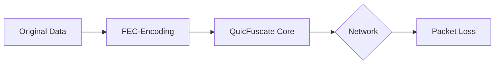
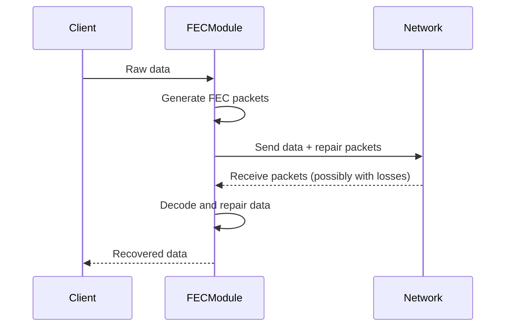

- SIMD-accelerated Galois field operations (NEON/AVX2/AVX512)
- Memory pool with 64-byte alignment for cache optimization
- Lock-free data structures for parallel processing
- Adaptive redundancy based on network metrics:
  - Packet loss rate
  - Latency
  - Throughput
  - Jitter

**Usage Example:**


**Stealth Integration:**
- Random timing variations for traffic patterns
- Dynamic redundancy adaptation for obfuscation
- Support for stealth mode

    uint64_t packets_recovered;
    uint64_t repair_packets_generated;
    uint64_t total_bytes_processed;
    double current_redundancy_ratio;
  };
  ```

**Usage in QUIC Stack:**


**Stealth Mode:**
- Random variation of redundancy
- Temporal randomization of packet transmissions
- Obfuscation of FEC metadata

