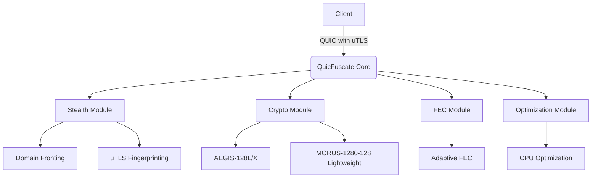

## Architecture Overview


### Project Structure
```
QuicFuscate/
├── cli/
│   ├── main.cpp
│   ├── options.hpp
│   ├── quicfuscate_cli.cpp
│   ├── quicfuscate_client.cpp
│   └── quicfuscate_server.cpp
├── core/
│   ├── error_handling.hpp
│   ├── quic_connection.hpp
│   ├── quic_connection_impl.cpp
│   ├── quic_core_types.hpp
│   ├── quic_integration_impl.cpp
│   ├── quic_packet.cpp
│   ├── quic_path_mtu_manager.hpp
│   └── quic_stream_impl.cpp
├── crypto/
│   ├── aegis128l.cpp
│   ├── aegis128l.hpp
│   ├── aegis128x.cpp
│   ├── aegis128x.hpp
│   ├── morus1280.cpp
│   ├── morus1280.hpp
│   ├── cipher_suite_selector.cpp
│   └── cipher_suite_selector.hpp
├── docs/
│   └── DOCUMENTATION.md
├── fec/
│   ├── FEC_Modul.cpp
│   └── FEC_Modul.hpp
├── libs/
│   └── quiche-patched/ (Patched QUIC implementation)
├── optimize/
│   ├── quic_stream_optimizer.cpp
│   └── unified_optimizations.hpp
├── stealth/
│   ├── DoH.cpp
│   ├── DoH.hpp
│   ├── DomainFronting.cpp
│   ├── DomainFronting.hpp
│   ├── FakeTLS.cpp
│   ├── FakeTLS.hpp
│   ├── HTTP3_Masquerading.cpp
│   ├── HTTP3_Masquerading.hpp
│   ├── QuicFuscate_Stealth.cpp
│   ├── QuicFuscate_Stealth.hpp
│   ├── XOR_Obfuscation.cpp
│   ├── XOR_Obfuscation.hpp
│   ├── anti_fingerprinting.hpp
│   ├── browser_profiles/
│   ├── stealth_gov.cpp
│   ├── stealth_gov.hpp
│   ├── uTLS.cpp
│   └── uTLS.hpp
└── ui/
    └── logo/
        ├── QuicFuscate_a.png
        └── QuicFuscate_b.png
```

