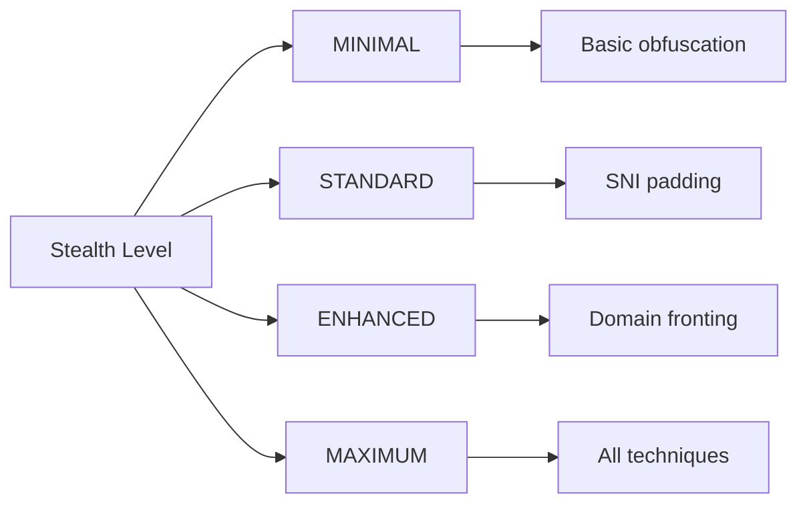

**Key Functionality:**
1. **Header Profile System**:
   - 14 predefined profiles
   - Support for browsers, mobile apps and VPN protocols
   - Custom headers possible
2. **HTTP Version Support**:
   - Full support for HTTP/1.1, HTTP/2 and HTTP/3
   - Automatic generation of version-specific headers
3. **QPACK Integration**:
   - Native support for HTTP/3 Header Compression
   - Compression according to RFC 9204 specification
4. **Traffic Masking**:
   - Injection of realistic headers into data packets
   - Removal of headers on reception
   - QUIC-specific optimizations

**Configuration Options:**
```mermaid
graph TB
    A[FakeHeadersConfig] --> B[profile_type]
    A --> C[base_url]
    A --> D[http_method]
### Stealth Governance
Defined in `stealth/stealth_gov.cpp`:

```cpp
class StealthManager {
public:
    enum class StealthLevel { MINIMAL, STANDARD, ENHANCED, MAXIMUM };

    explicit StealthManager(const StealthConfig& config);
    
    // Processes outgoing packets with stealth techniques
    std::vector<std::vector<uint8_t>> process_outgoing_packet(const std::vector<uint8_t>& packet);
    
    // Processes incoming packets
    std::vector<uint8_t> process_incoming_packet(const std::vector<uint8_t>& packet);
    
    // Handles TLS Client Hello packets
    std::vector<uint8_t> process_client_hello(const std::vector<uint8_t>& client_hello);
    
    // Obfuscates payload using XOR patterns
    std::vector<uint8_t> obfuscate_payload(const std::vector<uint8_t>& payload, uint64_t context_id);
    
    // Manages QUIC path migration
    bool migrate_to_path(const std::string& path_id);
};

struct StealthConfig {
    StealthLevel stealth_level = StealthLevel::ENHANCED;
    bool enable_path_migration = true;
    bool enable_xor_obfuscation = true;
    bool enable_quic_masquerading = true;
    // ... other configuration options
};
```

**Key Components:**
1. **Stealth Level System**:
   - 4 levels from MINIMAL to MAXIMUM
   - Automatic configuration of all components based on level
2. **Packet Processing Pipeline**:
   - Special handling of TLS Client Hello packets
   - HTTP/3 masking for QUIC packets
   - Fragmentation and timing randomization
3. **XOR Obfuscation**:
   - Payload obfuscation with context-specific keys
   - Header value obfuscation
   - FEC metadata obfuscation
4. **Path Migration**:
   - Dynamic switching between network paths
   - Performance-based path selection
   - Load distribution across multiple connections

**Stealth Level Configuration:**

