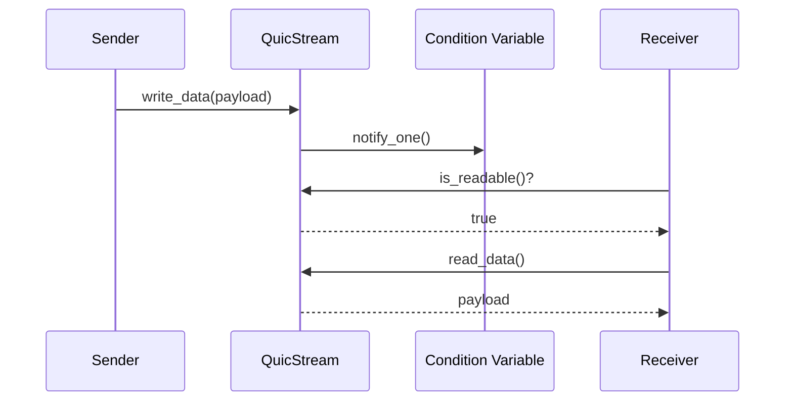
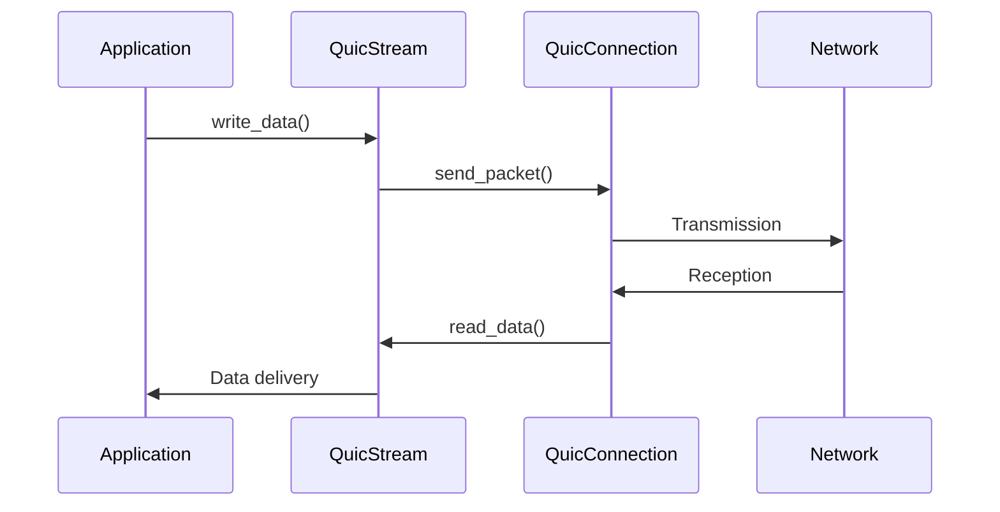

**Design Features:**
- Atomic operations for performance optimization
- Condition variable for efficient notification
- Move semantics to avoid data copies
- RAII mutex locks for exception safety

**Application Example:**

