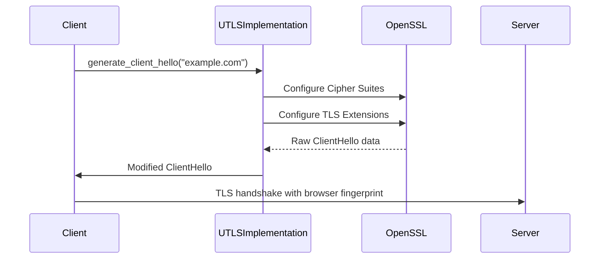

sequenceDiagram
    Client->>SniHiding: process_client_hello(tls_packet)
    SniHiding->>SniHiding: modify_sni(front_domain)
    SniHiding->>SniHiding: apply_sni_padding()
    SniHiding-->>Client: Modified TLS packet
    Client->>Front-Server: TLS handshake with disguised domain
    Front-Server->>Real-Server: Forwarding to real service

